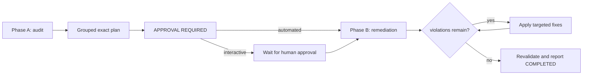

# Google Python Style audit

This skill runs a deterministic two-phase workflow: Phase A produces a grouped
audit plan and ends with `APPROVAL REQUIRED`; Phase B applies all fixes. In
automated agent operation Phase B begins immediately; in interactive use it waits
for explicit human approval. The skill never inspects, invokes, copies, imports,
or relies on an evaluation-only verifier or oracle script.



## Invocation boundary

Use only when the human explicitly requests this audit or invokes
`$audit-google-python-style`. Do not use it for ordinary reviews, linting, or
implementation tasks. Phase A invocation is read-only; editing is confined to
Phase B.

## Phase A: read-only audit and plan

Read repository instructions, configuration, generated-code policy, exceptions,
and working-tree state. Define the approved Python scope, including tests unless
explicitly excluded. Exclude dependencies, caches, build output, vendored or
generated code only with repository evidence. Run repository checks and then the
skill-owned supplemental checker:

```text
.agents/skills/audit-google-python-style/scripts/check_google_rules.py --root <root>
```

Derive `<root>` from `pyproject.toml`, `setup.py`, or the repository's top-level
Python source directory (`src/` if present, otherwise the repo root).

Use `pymake` wrappers when the repository provides them: `pymake lint`,
`pymake format dry_run=true`, and `pymake check_types`. If unavailable, report
that fact and use the repository's documented Ruff commands; never install
dependencies or claim an unavailable check passed.

The checker owns deterministic syntax, import, naming, markup, punctuation, and
documentation findings. The actor owns contextual judgment for exceptions,
resources, state, annotations, design, and consistency. Review these rule
families independently:

* Imports: one module or symbol per import statement; no wildcard imports;
  import the module, not an individual class, except from `typing`,
  `typing_extensions`, `collections.abc`, and `six.moves`.
* Naming: PascalCase classes; snake_case functions, methods, parameters, and
  variables; no `tmp_` bindings; preserve precise dunder/private names,
  uppercase constants, and exact AST visitor dispatch overrides.
* Function defaults: no mutable list, dict, or set literals, comprehensions, or
  built-in constructor calls. Constructor names that cannot be statically
  confirmed as built-ins require review rather than a hard violation.
* Type comments: `# type:` comments require conversion to inline annotations.
* Documentation and comments: no backticks or `:class:` markup; period-ending
  summaries and descriptions; every public and private module, class, function,
  and method has a descriptive docstring; complete applicable `Args:` entries
  for every parameter form, direct-scope `Returns:`/`Yields:`, and direct-scope
  `Raises:` descriptions. Value returns inferred from non-None annotations
  require `Returns:` too. Named or qualified exception names match by either
  equivalent leaf or qualified form. Dynamic/factory raises require exactly a
  non-empty, period-ended `Exception:` entry; unrelated named entries fail.
* Exclude comments before the first Python statement from supplemental comment
  checks. For later comments, check markup and punctuation except for exact
  fold, region, or symmetric separator markers.
* Standard Python patterns that trigger `review`-level mutable-state flags but
  are not style defects: module-level `__all__` and `__slots__` defined as list
  literals. Treat these as acceptable in the plan; do not propose changes in
  Phase B.

Produce a grouped remediation plan naming exact files, rule families, exact
edits, Ruff-assisted versus manual ownership, exclusions, behavior/API
safeguards, and post-fix validation commands. Do not edit, format-write, or
apply fixes. End the report exactly with `APPROVAL REQUIRED`.

## Phase B: automatic remediation

Re-run the supplemental checker with the same `--root` to confirm the approved
scope and findings match the Phase A plan; if they diverge, stop and report
CLARIFICATION REQUIRED. Apply only approved-scope style edits, preserving
executable behavior, tests, public APIs, dependencies, configuration, generated
sources, and unrelated user changes.

Apply fixes in this order:

1. Run Ruff formatter and safe fixes through the repository wrapper (`pymake lint`,
   `pymake format`), or the repository's documented Ruff commands, or — if
   neither is available — `ruff check --fix --extend-select UP,I,B,SIM <scope>`
   and `ruff format <scope>` directly. Use `--extend-select`, not `--select`,
   so the repository's own `pyproject.toml` Ruff configuration is respected and
   these groups are added on top. `UP` covers typing modernisation
   (`typing.Text` → `str`, legacy collection aliases); `I` enforces import
   ordering; `B` flags mutable defaults (B006) and other bugs; `SIM` flags
   simplification opportunities; `E731` (lambda assignment) and `E702`
   (semicolons) are already in Ruff's default E7 group and need no explicit
   selection. Enable all groups unconditionally. `B006`, naming-convention
   violations (N-rules), docstring content, and all comment findings are flagged
   by Ruff but never auto-fixed; those categories always require manual edits in
   step 3. Report any unavailable tool honestly; never claim a check passed that
   did not run.
2. Run `check_google_rules.py --root <root> --fix` to mechanically rewrite
   unambiguous `import-class-not-module` findings (a direct
   `from module import ClassName` instead of the module itself). It reports
   exactly which imports it rewrote and leaves every case it cannot safely
   resolve untouched, as an ordinary finding for step 3: a shadowed name, an
   `__init__.py` re-export surface, a class name referenced inside a string,
   a name collision with the module it would introduce, or a name never
   confirmed as a class by a constructor call or base-class usage elsewhere
   in the file (this last guard keeps a PascalCase module, such as Qt's
   `QtCore`, from being mistaken for a class). Rewriting two statements that
   import from the same module can leave duplicate module-import lines;
   step 1's Ruff pass, re-run in step 4, consolidates them.
3. Make targeted manual edits for remaining `violation`-level findings in this
   order:
   - *Imports*: resolve any `import-class-not-module` finding step 2 left
     unfixed; split multi-symbol import and from-import statements; replace
     wildcard imports with the explicit named symbols actually used in the file
     (scan for unqualified names not defined locally, then cross-reference with
     the imported module's `__all__` to confirm which symbols the wildcard
     provides); convert relative imports to absolute package paths (derive from
     `pyproject.toml`, `setup.py`, or directory layout). Ruff UP rules handle
     `typing.Text` → `str` automatically; only intervene manually if the
     checker still reports a `no-typing-text` finding after step 1.
   - *Naming*: rename classes to PascalCase; rename functions, methods,
     parameters, and bindings to snake_case; remove `tmp_` prefixes; add
     compatibility aliases for renamed public-API symbols, placed immediately
     after each renamed definition; for private `_`-prefixed renames (no
     alias), also update every call site and attribute access within the
     approved scope. Keyword parameters of public functions are part of the
     public API — update every keyword call site within scope, and issue
     PARTIALLY COMPLETED if external callers may be affected.
   - *Defaults*: replace confirmed-mutable default arguments (list, dict, or
     set literals) with a `None` sentinel guarded by
     `if arg is None: arg = <default>` in the function body; update any
     affected type annotation from `T` to `T | None`.
   - *Type comments*: convert `# type:` comments to inline annotations.
   - *Documentation*: add or rewrite module, class, function, and method
     docstrings; complete Args, Returns, Yields, and Raises sections with
     period-ended entries; remove backtick and `:class:` markup from docstrings.
   - *Comments*: remove backtick and `:class:` markup; add terminal periods to
     all non-header, non-marker inline comments.
4. Re-run the supplemental checker (without `--fix`, since steps 2 and 3
   already applied every rewrite this scope approves); apply targeted fixes
   for any remaining `violation`-level findings and repeat until the checker
   reports zero `violation`-level findings in the approved scope.

For residual `review`-level findings after all violations are resolved, apply a
fix only when the improvement is unambiguous:

- Narrow an overly broad `except` clause to a specific exception type.
- Extract a function exceeding the style-guide length limit into focused helpers.
- Replace a one-off lambda assigned to a name with a proper `def`.

Leave other `review`-level patterns unchanged when they are intentional or
acceptable under the Google Style Guide, and note the judgment in the Phase B
report.

As a final validation, re-run the repository checks and supplemental checker. If a test runner is
available, run the test suite scoped to the approved files (e.g.,
`pytest <module>`, `pymake test`), or the full suite otherwise; if tests fail,
the remediation altered behavior — revert the offending edit and rerun. If no
test runner is available, note the absence in the report and continue. If a
`violation`-level finding cannot be safely resolved without altering observable
behavior or requires information beyond the approved scope, document it and
issue PARTIALLY COMPLETED. Inspect the complete diff and report exact commands,
residual findings, changed files, and the verdict `COMPLETED`,
`PARTIALLY COMPLETED`, or `CLARIFICATION REQUIRED`. Include approved-scope
evidence from `git diff --name-only` and `git diff --check`.
