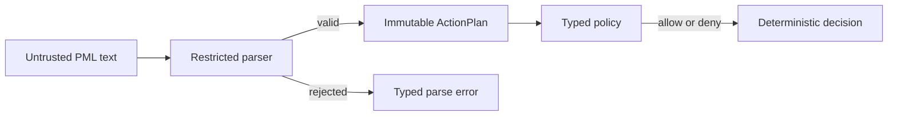

# Implementation Plan

### Status

`Build in progress — the selected dedicated-parser boundary is recorded in the design authority.`

Issue `#4`, [`Implement restricted PyMOL select-color plan core`](https://github.com/urban233/pymol-copilot/issues/4), is open and is the authoritative delivery request. It is high risk because it establishes the boundary that prevents untrusted model text from reaching a PyMOL dispatcher. The repository base is `80682b25f387d7c234bb9ec69b031a685ae5d126`; the only uncommitted item is unrelated `docs/codev/design/.DS_Store`.

The installed `codev` CLI was checked first: it supports issue creation/linking but has no command to read an existing issue. The exact issue body was therefore retrieved read-only from GitHub after establishing that limitation; no CoDev task state, branch, or source file was changed.

### Focus card

- **Change:** Add the shared-core restricted-plan representation, canonical renderer, dedicated restricted parser, and typed-operation default-deny policy for the initial native `.pml` `select` then `color` fixture.
- **Success:** The recorded positive fixture parses to an immutable plan, renders canonically and idempotently, passes typed policy, and every malformed, truncated, hostile, or out-of-scope input returns a typed rejection without dispatching to PyMOL.
- **Non-goals:** PyMOL execution, bridge/companion work, labels, general selection expressions, broad color syntax, grammar generation, model work, error-envelope execution failures, and command expansion.
- **Allowed scope:** `src/pmc_core/`, its Bazel target, and new contract/adversarial test targets under `tests/contract/` and `tests/adversarial/`.
- **Validation:** Bazel contract/adversarial tests, the existing subsystem-import test, Ruff, and Pyrefly.
- **Stop if:** The owner does not record the parser decision in `docs/codev/design/shared-core/plan-and-execution.md`; a test requires passing untrusted text to PyMOL; the fixture needs an undefined selection or color form; or the work needs execution/runtime changes.
- **Work style:** A bounded `builder` subagent implements only the accepted scope and returns an evidence receipt. A fresh `reviewer` subagent independently inspects the exact resulting snapshot and re-runs the reported validation; neither agent accepts, merges, or expands the change.

### Repository evidence

- GitHub issue `#4` (`https://github.com/urban233/pymol-copilot/issues/4`) requires the exact `select copilot_selection, chain A` then `color red, copilot_selection` fixture, immutable typed plan, canonical native `.pml` serialization, typed default-deny errors, and positive plus grammar-free adversarial tests.
- `docs/codev/delivery/design-readiness.md:55-68` defines `T-01` / issue `#4`: typed plan, canonical rendering, default-deny parsing and policy, with positive and grammar-free adversarial validation.
- `SPECIFICATION.md:29-34,86-88` requires deterministic typed parsing, default-deny enforcement, and zero denied commands reaching sidecar or live execution.
- `docs/codev/design/shared-core/plan-and-execution.md:105-137,183-193` requires a total parser, immutable plan, idempotent canonical form, no partial result, and policy on typed operations.
- `src/pmc_core/BUILD.bazel` currently exposes only `__init__.py`; `tests/contract/README.md` reserves that directory for shared-core evidence. `pyproject.toml` establishes Python `3.13.13`, `pytest`, Ruff, and strict Pyrefly.

### Design and file layout

The selected design is a dedicated restricted tokenizer/parser. It accepts only the recorded native `.pml` fixture and builds an immutable domain value; it does not delegate text interpretation to PyMOL. Policy receives only that domain value.

Proposed additions:

- `src/pmc_core/plan.py`: frozen plan and operation records plus canonical rendering.
- `src/pmc_core/parser.py`: total tokenizer/parser and typed parse-result/error contract.
- `src/pmc_core/policy.py`: deterministic allow/deny decision and stable reason codes over typed operations.
- `src/pmc_core/BUILD.bazel`: include the new modules in `pmc_core`.
- `tests/contract/`: round-trip, policy, and positive-fixture tests with a Bazel `py_test` target.
- `tests/adversarial/`: grammar-free rejection corpus and Bazel target for hostile, malformed, partial, and unsupported input.

The plan must keep the exact selection-expression and color-value boundary closed: only forms explicitly represented by the recorded fixtures can parse. Any request to broaden those forms returns to the shared-core design and security evidence process.

### Delegated Build and Review handoff

After the owner records the selected parser decision, start the linked CoDev task for issue `#4` and delegate the accepted delivery steps to the available `builder` subagent. Its brief must include the allowed paths, exact fixture, stop conditions, base snapshot, and required validation; it may edit and test only, then returns an evidence receipt with validation, deviations, and limitations.

Commit the builder result through the CoDev workflow, then invoke a fresh `reviewer` subagent on that exact committed snapshot. The reviewer must compare the diff with issue `#4` and this plan, independently re-run the stated checks, report one of `READY FOR HUMAN APPROVAL`, `CHANGES REQUIRED`, or `BLOCKED BY MISSING EVIDENCE`, and identify residual risks. Findings route back only through the bounded builder loop; human approval remains required for acceptance and any merge.

### Decision gate

The human selected the dedicated restricted parser. Before Build begins, record that decision in `docs/codev/design/shared-core/plan-and-execution.md` and resolve its blocking tokenization question. This makes the implementation plan ready without treating chat history as design authority.

# Validation

### Acceptance evidence

- The positive fixture from `docs/codev/delivery/design-readiness.md:29-35` parses and renders as the canonical two-command plan.
- Rendering an accepted plan, then reparsing and rerendering it, yields the same canonical bytes.
- Invalid input returns a typed parse failure with no partial `ActionPlan`.
- The policy evaluates typed operations only and denies every operation or argument outside recorded fixtures with deterministic reason codes.
- Adversarial cases run without grammar assistance and show that comments, continuations, quoting, case variation, unknown verbs, expression-like content, truncation, and extra commands cannot become an allowed plan.
- The existing `//tests/integration:subsystem_imports` target continues to pass, preserving the package boundary.

### Commands to run during Build

- `bazel test //tests/contract:all //tests/adversarial:all --lockfile_mode=error`
- `bazel test //tests/integration:subsystem_imports --lockfile_mode=error`
- `bazel run //tools/quality:ruff --lockfile_mode=error -- check .`
- `bazel run //tools/quality:ruff --lockfile_mode=error -- format --check .`
- `bazel run //tools/quality:pyrefly --lockfile_mode=error -- check`

### Residual risk

The initial fixture is intentionally narrow. It proves the safety boundary but does not establish general PyMOL language compatibility; new syntax requires an accepted fixture and security evidence before expansion.

# Delivery Steps

### ✓ Step 1: Define immutable plan contracts and canonical rendering
`pmc_core` represents the initial two-command plan as immutable typed operations and renders one canonical native `.pml` form.

- Add frozen typed plan and operation records in `src/pmc_core/plan.py` for the ordered `select` then `color` fixture.
- Implement canonical rendering that preserves the exact command order and produces an idempotent representation.
- Update `src/pmc_core/BUILD.bazel` to export the new core module without adding runtime, training, or PyMOL dependencies.
- Add contract tests under `tests/contract/` that demonstrate the accepted fixture and parse/render round-trip expectations.

### ✓ Step 2: Implement the total dedicated restricted parser
Untrusted `.pml` input becomes either one complete typed plan or a typed parse rejection, never a partial plan or a PyMOL call.

- Add `src/pmc_core/parser.py` with a dedicated tokenizer/parser that accepts only the recorded `select copilot_selection, chain A` followed by `color red, copilot_selection` fixture forms.
- Normalize only syntax explicitly covered by fixtures before constructing the immutable plan.
- Return indexed typed failures for malformed, incomplete, additional, or unsupported input.
- Add a Bazel-backed adversarial corpus in `tests/adversarial/` for unknown verbs, comments, quoting, continuations, case variation, expression-like content, and truncation; run it without grammar support.

### ✓ Step 3: Enforce typed default-deny policy and validate the boundary
Only reviewed typed operations receive an allow decision, with stable denial reasons for every out-of-scope operation or argument.

- Add `src/pmc_core/policy.py` with deterministic policy decisions over typed operations rather than raw text.
- Permit only the parser-produced initial `select` and `color` operations; deny all other command or argument combinations by default.
- Add contract tests proving allowed plans pass and hostile or structurally invalid plans do not reach any dispatcher boundary.
- Register the contract/adversarial Bazel test targets and run the focused suites, existing subsystem import test, Ruff checks, and Pyrefly.
- Return the exact base snapshot, commands and results, any deviations, and known limitations to the `builder` evidence receipt for the fresh `reviewer` handoff.