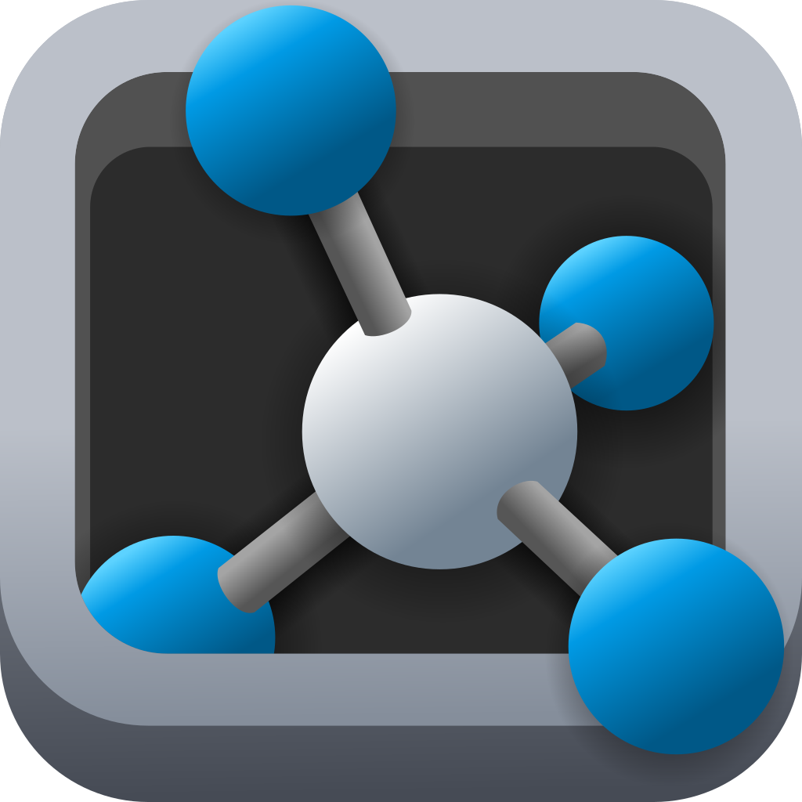
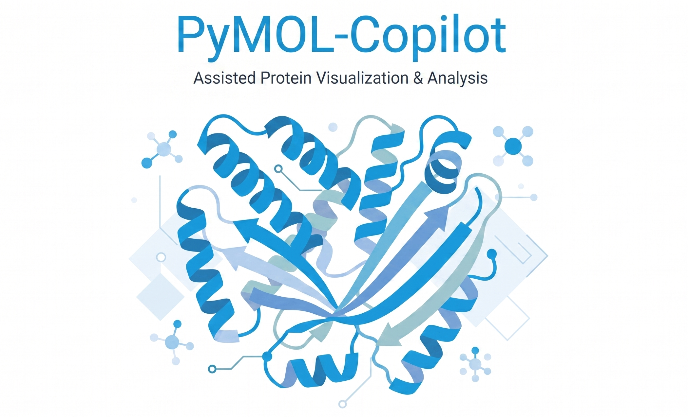

<p align="center">
  
</p>


<p align="center">
  <strong>A local AI assistant designed for structural biologists.</strong>
</p>

<p align="center">
  
</p>


[](http://www.gnu.org/licenses/gpl-3.0)
[](https://www.python.org)

PyMOL Copilot is a local AI companion designed for structural biologists. 
It translates natural language instructions into safe, reproducible PyMOL commands, 
turning complex visualization scripting into a simple conversation.

---

## 👁️‍🗨️ The Vision

Structural biology workflows require navigating dozens of precise PyMOL commands, 
complex selection algebra, and representation modes. 
PyMOL Copilot lowers this technical barrier for laboratory researchers. 
Instead of memorizing script syntax or spending time writing `.pml` scripts, 
you simply describe your experimental intent in plain language.


```

"Load the 1DPX protein, color chain A red, and measure the distance between residues 45 and 102."

```

### Key Highlights
* **100% Local & Private:** Your proprietary molecular data and research prompts never leave your machine. Inference runs locally using a highly optimized, lightweight AI model.
* **Human-in-the-Loop Safety:** The assistant never updates your workspace blindly. It generates a clear, step-by-step checklist of planned actions for you to review and approve before any execution happens.
* **Automates Workflows, Not Your Mouse:** The AI handles structural orchestration (loading, alignment, measurements, and representations) while leaving camera controls (zoom, rotation, and clipping) fully to your manual mouse movements.

---

## ✨ Features

| Feature | Description |
|:---|:---|
| **Structure Loading** | Fetch from the PDB or open local files seamlessly. |
| **Smart Representations** | Cleanly toggle cartoons, sticks, and custom color schemes without graphic artifacts. |
| **Automated Measurements** | Instantly find distances, angles, and contact points using plain English. |
| **Sequence Alignment** | Align structural variations reliably, even without perfect sequence identity. |
| **Session Export** | Save your generated scenes to standard `.pse` files to review or share later in your standalone PyMOL GUI. |

---

## 🛡️ Privacy and Constraints

* **Hardware Friendly:** Engineered specifically to run on modest hardware (like everyday laptops). It performs fast language processing directly on your CPU without requiring expensive graphics cards.
* **Offline Capability:** Designed for secure laboratory environments—no internet connection is required or used during execution.
* **Domain Focus:** The companion is optimized strictly for PyMOL visualization and scene building. It will explicitly decline out-of-scope requests such as molecular dynamics, docking simulations, or homology modeling.

---

## Development Setup

To develop or run PyMOL Copilot locally, you must create a `.env_path` file in the project root directory. This file should contain exactly one line: the absolute path to the root directory of the conda environment you wish to use.

### `.env_path` Examples

**Windows:**
```text
C:\Users\username\miniconda3\envs\pymol_copilot_dev
```

**macOS:**
```text
/Users/username/miniconda3/envs/pymol_copilot_dev
```

**Linux:**
```text
/home/username/miniconda3/envs/pymol_copilot_dev
```

## Development & Automation

PyMOL Copilot uses a standalone Python task runner called `pymake` to automate common development tasks. It provides a make-like experience using only the Python standard library.

### Running Tasks

Use the platform-specific wrapper scripts to run tasks:

- **Windows:** `.\pymake.bat <task> [args]`
- **Linux/macOS:** `./pymake.sh <task> [args]`

To see all available tasks and their options, run:
```bash
.\pymake.bat --help
```

### Available Tasks

| Task | Description                                                                 |
| :--- |:----------------------------------------------------------------------------|
| `format` | Format the Python codebase with Ruff.                                       |
| `lint` | Run static analysis (linting) on Python code with Ruff.                     |
| `check_types` | Run static type checking with `pyrefly`.                                    |
| `test` | Execute the test suite with `pytest`.                                       |
| `build_whl` | Build the wheel file directly using the Conda environment (cross-platform). |

Example: Run tests with verbose output:
```bash
.\pymake.bat test verbose=true
```

## Contributing
We welcome contributions! PyMOL Copilot is fully open source (BSD-3 Clause), 
and we encourage the community to:

- Report bugs and suggest features.
- Improve documentation.
- Submit code improvements.
- Write a plugin that solves a specific problem or integrates a specific tool.

See our [Contributing Guide](./CONTRIBUTING.md) for development setup, coding
standards, and how to submit pull requests.

---

## New Dataset Generation

This section documents how to run the full **NeMo Data Designer → Curator → SFT** pipeline on the **target training machine** (must have at least one NVIDIA GPU with ≥ 8 GB VRAM).

The pipeline produces a cleaned, deduplicated dataset of multi-step tool-call sequences that are used to fine-tune the LangGraph planner model.

---

### Architecture Overview

```
workflow.py          ← NeMo Data Designer: samples scenario parameters,
                        calls an LLM to paraphrase user prompts
        ↓
build_conversations.py  ← Deterministically synthesises the tool-call
                           sequences; validates every call against
                           tool_schemas.py JSON Schemas
        ↓
curate.py            ← NeMo Curator: exact + fuzzy dedup, train/val split
        ↓
output_clean/
  train.jsonl        ← Ready for fine-tuning
  val.jsonl
```

---

### Prerequisites

```bash
# Create and activate the training conda environment
conda create -n pymol_copilot_train python=3.11 -y
conda activate pymol_copilot_train

# Install CUDA-accelerated NeMo Curator and NeMo Data Designer
pip install nemo-curator[cuda12x]    # for CUDA 12.x; use cuda11x for older drivers
pip install nemo-datadesigner
pip install dask-cuda cudf-cu12      # GPU DataFrames (match your CUDA version)

# Install remaining training requirements
pip install -r pymol_copilot/ai/training/requirements.txt

# Set your OpenRouter API key (used by Data Designer for LLM inference)
export OPENROUTER_API_KEY="sk-or-..."
```

---

### Step 1 — Configure scale targets

Open [`training_config.py`](./pymol_copilot/ai/training/config/training_config.py) and confirm or adjust:

| Constant | Default | 100 k target |
|---|---|---|
| `MAX_SEQ_LENGTH` | `4096` | `4096` (unchanged) |
| `BATCH_SIZE_PER_PROMPT_FILE` | `50` | `50` (unchanged) |

Open [`generate_dataset.py`](./pymol_copilot/ai/training/generate_dataset.py) and note the `--n_*` arguments:

| Flag | Default (small run) | 100 k-scale run |
|---|---|---|
| `--n_positive` | `1400` | `60000` |
| `--n_deep` | `600` | `30000` |
| `--n_negative` | `800` | `10000` |
| `--n_context` | `400` | `0` (optional) |

---

### Step 2 — Generate prompt batch files

```bash
cd pymol_copilot/ai/training

python generate_dataset.py \
    --mode generate_prompts \
    --output_dir data \
    --n_positive 1400 \
    --n_deep 600 \
    --n_negative 800 \
    --n_context 400
```

This writes prompt files into `data/prompts/`:
- `batch_pos_NNN.txt` — standard tool-calling examples
- `batch_deep_NNN.txt` — deep workflow examples (10–25 tool calls each)
- `batch_neg_NNN.txt` — out-of-scope refusal examples

> **100 k scaling tip:** Increase `--n_positive 60000 --n_deep 30000 --n_negative 10000`.
> The batch files are small plain-text files; generation is fast (seconds).

---

### Step 3 — Run NeMo Data Designer inference

```bash
# From the training directory
python workflow.py
```

This uses `data_designer` to call the configured OpenRouter LLM endpoints
(by default `nvidia/nemotron-3-ultra-550b-a55b:free`) and writes raw rows to:

```
output_raw/cbiomol_pymol_sft.jsonl
```

> **100 k scaling tip:** In `workflow.py`, increase `max_parallel_requests`
> in each `ModelConfig` from `4` to `32` (or higher) to saturate the API.
> Use `hy3-grounded` or `gemma-fast` model aliases for cheaper inference
> on large batches; reserve `nemotron-ultra` for deep-workflow batches only.

---

### Step 4 — Synthesise and validate tool-call conversations

```bash
python build_conversations.py \
    --input  output_raw/cbiomol_pymol_sft.jsonl \
    --output output_raw/cbiomol_pymol_sft_conversations.jsonl \
    --rejects output_raw/rejects.jsonl
```

This step:
1. Reads each raw Data Designer row
2. Dispatches to the appropriate scenario builder (deterministic, seeded by `row_uid`)
3. Validates every tool call against `tool_schemas.TOOL_SCHEMAS_BY_NAME`
4. Writes valid records with a `conversations` field and a `dedup_text` field
5. Writes rejected rows with reasons to `--rejects`

Check the reject rate in the terminal output. A rate above 15% usually means
a sampler value doesn't map to a valid schema parameter — fix it in
`build_conversations.py` and re-run without touching the raw LLM output.

---

### Step 5 — Deduplicate with NeMo Curator (GPU required)

```bash
python curate.py
```

This runs:
1. **Exact deduplication** (hash on `dedup_text`) — catches literal repeats
2. **Fuzzy deduplication** (MinHash + LSH on `dedup_text`) — catches
   near-paraphrases from free-tier LLMs re-sampling the same scenario
3. **Train / val split** (95% / 5%) written to `output_clean/`

Output:
```
output_clean/train.jsonl   ← use for SFT fine-tuning
output_clean/val.jsonl     ← use for SFT evaluation
```

> **CPU fallback (no GPU):** Change `use_gpu=True` to `use_gpu=False` in
> the `run_gpu_sanitization_pipeline()` call at the bottom of `curate.py`.
> This uses the pandas backend — correct output, but ~10× slower.

> **100 k scaling tip:**
> - Provision a multi-GPU machine (e.g. 4× A100).
> - In `curate.py`, change `dask_cuda.LocalCUDACluster()` to
>   `dask_cuda.LocalCUDACluster(n_workers=4)`.
> - Raise `num_buckets=40` and `hashes_per_bucket=20` in
>   `FuzzyDuplicatesConfig` to tighten LSH recall at scale.
> - Point `cache_dir` to a fast NVMe mount (not the home directory).
> - Switch the final write from `to_json` to `to_parquet` for better I/O
>   throughput; update downstream loaders accordingly.

---

### Step 6 — Fine-tune the model

Run the standard SFT training script with the cleaned dataset:

```bash
python train.py \
    --model qwen2.5-1.5b \
    --train_file output_clean/train.jsonl \
    --val_file   output_clean/val.jsonl
```

All training hyperparameters are centralised in
[`training_config.py`](./pymol_copilot/ai/training/config/training_config.py).
The `MAX_SEQ_LENGTH = 4096` setting accommodates deep multi-step sequences
(up to 25 tool calls) within the RTX 4060 8 GB VRAM budget.

---

### End-to-end quick reference

```bash
# 1. Generate prompt files
python generate_dataset.py --mode generate_prompts --output_dir data \
    --n_positive 1400 --n_deep 600 --n_negative 800 --n_context 400

# 2. Run Data Designer LLM inference
python workflow.py

# 3. Build + validate conversations
python build_conversations.py \
    --input  output_raw/cbiomol_pymol_sft.jsonl \
    --output output_raw/cbiomol_pymol_sft_conversations.jsonl \
    --rejects output_raw/rejects.jsonl

# 4. Deduplicate + split
python curate.py

# 5. Fine-tune
python train.py --model qwen2.5-1.5b \
    --train_file output_clean/train.jsonl \
    --val_file   output_clean/val.jsonl
```

---

## Unsloth Training Pipeline (Alternative / Faster)

[`finetune_unsloth.py`](./pymol_copilot/ai/training/finetune_unsloth.py)
is a **drop-in replacement** for `finetune.py` that uses the
[Unsloth](https://github.com/unslothai/unsloth) backend instead of the
vanilla PEFT + TRL stack.  It reads the **exact same
`output_clean/train.jsonl` and `output_clean/val.jsonl`** files produced
by the NeMo Curator step — no extra conversion required.

### Why Unsloth?

| Metric | `finetune.py` (PEFT) | `finetune_unsloth.py` (Unsloth) |
|---|---|---|
| Peak VRAM (4096 ctx) | ~5.5 GB | ~3.2 GB |
| Throughput (RTX 4060) | ~240 tok/s | ~420 tok/s |
| Training time (3 epochs, 3 k examples) | ~2 h | ~70 min |
| Output format | HF adapter | HF adapter **+ optional GGUF** |
| LoRA quality | Standard | RSLoRA (better convergence) |
| Sequence packing | No | Yes (higher GPU utilisation) |

Unsloth patches the attention kernels and weight matrices of the Qwen2.5 /
Qwen3 model families with hand-written Triton / CUDA kernels.  It
falls back silently to the standard HuggingFace implementation for
unsupported model architectures, so the script is safe to run on any model.

---

### Prerequisites

Install the Unsloth stack into a **fresh conda environment** (do not mix
with the base training environment — Unsloth pins its own PyTorch/TRL):

```bash
conda create -n pymol_copilot_unsloth python=3.11 -y
conda activate pymol_copilot_unsloth

pip install -r pymol_copilot/ai/training/requirements_unsloth.txt
```

> **Windows note:** Triton and Flash-Attention are Linux-only.  On Windows
> the Unsloth kernels fall back to standard PyTorch ops.  Training will
> still be faster than the plain PEFT baseline due to Unsloth's other
> optimisations, but the full 2× speedup requires Linux (the training
> server).

---

### Usage

```bash
cd pymol_copilot/ai/training

# ── Registry path: registered model keys ──────────────────────────────────
# Uses the SUPPORTED_BASE_MODELS registry in training_config.py.
python finetune_unsloth.py \
    --data_dir output_clean/ \
    --output_dir checkpoints_unsloth/ \
    --model qwen2.5-1.5b

# ── Bypass path: any HuggingFace model ID ─────────────────────────────────
# --hf_model accepts any public HF repo or local path.
# Unsloth auto-detects the architecture; no registry entry needed.

# Llama 3.2 3B
python finetune_unsloth.py \
    --data_dir output_clean/ \
    --output_dir checkpoints_unsloth/ \
    --hf_model meta-llama/Llama-3.2-3B-Instruct

# Mistral 7B (larger — requires ≥ 16 GB VRAM without 4-bit)
python finetune_unsloth.py \
    --data_dir output_clean/ \
    --output_dir checkpoints_unsloth/ \
    --hf_model mistralai/Mistral-7B-Instruct-v0.3

# Gemma 3 4B
python finetune_unsloth.py \
    --data_dir output_clean/ \
    --output_dir checkpoints_unsloth/ \
    --hf_model google/gemma-3-4b-it

# Qwen2.5 7B (larger than the registered 1.5B — needs ≥ 10 GB VRAM)
python finetune_unsloth.py \
    --data_dir output_clean/ \
    --output_dir checkpoints_unsloth/ \
    --hf_model Qwen/Qwen2.5-7B-Instruct

# Local model directory (e.g. a model you downloaded manually)
python finetune_unsloth.py \
    --data_dir output_clean/ \
    --output_dir checkpoints_unsloth/ \
    --hf_model ./my_downloaded_model

# ── Custom LoRA target modules (for non-standard architectures) ────────────
# The default target modules are: q_proj k_proj v_proj o_proj
#   gate_proj up_proj down_proj  (covers Qwen/Llama/Mistral/Gemma)
# Override with --target_modules for architectures with different names.

# Falcon-style attention
python finetune_unsloth.py \
    --hf_model tiiuae/falcon-7b-instruct \
    --target_modules query_key_value dense dense_h_to_4h dense_4h_to_h \
    --data_dir output_clean/ \
    --output_dir checkpoints_unsloth/

# ── Train + export GGUF in one pass ──────────────────────────────────────
python finetune_unsloth.py \
    --data_dir output_clean/ \
    --output_dir checkpoints_unsloth/ \
    --hf_model meta-llama/Llama-3.2-3B-Instruct \
    --export_gguf \
    --quantization q4_k_m
```

> **`--hf_model` takes precedence over `--model`** when both are supplied.
> For any model in Unsloth's supported family list (Qwen, Llama, Mistral,
> Gemma, Phi, Falcon, …) the Triton kernel patches apply automatically.
> For unsupported architectures Unsloth falls back to standard PyTorch ops
> transparently — no error, just no kernel speedup.

All training hyperparameters (`LORA_R`, `LEARNING_RATE`, `NUM_TRAIN_EPOCHS`,
etc.) are read from
[`training_config.py`](./pymol_copilot/ai/training/config/training_config.py)
— the same constants used by `finetune.py` — so the two pipelines are
directly comparable.

---

### Data format compatibility

The script transparently accepts **both** data formats:

| Source | Key present | Handled by |
|---|---|---|
| `curate.py` (NeMo Curator) | `conversations` | `_normalise_record()` converts to `messages` on the fly |
| `generate_dataset.py` | `messages` | passed through directly |

No manual format conversion step is needed when switching between the two
pipelines.

---

### Output structure

```
checkpoints_unsloth/
  checkpoint-NNN/       ← periodic checkpoints (TRL saves)
  best/                 ← best adapter by eval_loss
    adapter_config.json
    adapter_model.safetensors
    tokenizer.json
    ...
  gguf/                 ← only when --export_gguf is passed
    unsloth.Q4_K_M.gguf
```

The `best/` adapter is identical in format to the output of `finetune.py`
and is compatible with both `export_gguf.py` (for an alternative GGUF
path) and `test_model.py`.

---

### Full pipeline with Unsloth (end-to-end)

```bash
# Steps 1–4 are identical to the NeMo pipeline above.
# Only Step 5 changes:

# 5. Fine-tune with Unsloth (faster, less VRAM, optional direct GGUF)
python finetune_unsloth.py \
    --data_dir output_clean/ \
    --output_dir checkpoints_unsloth/ \
    --model qwen2.5-1.5b \
    --export_gguf \
    --quantization q4_k_m
```

