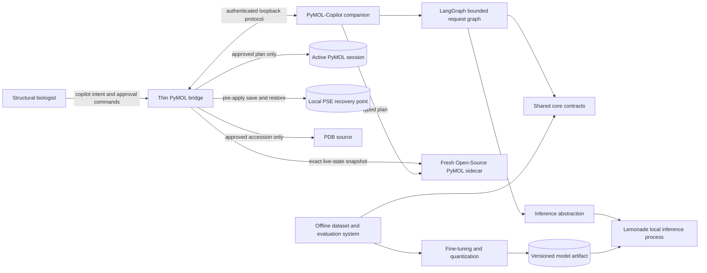

# PyMOL-Copilot Specification

**Status:** Accepted<br>
**Product frame:** Accepted<br>
**Technical design:** Accepted<br>
**Product owner:** Martin Urban (`urban233`)<br>
**Technical owner:** Martin Urban (`urban233`)<br>
**Required reviewers:** Hannah Kullik (`kullik01`, specification accepted 2026-08-19); structural-biology, model-execution security, ML data/evaluation, and licensing reviews are delivery/release gates<br>
**Last reviewed:** 2026-08-19<br>

## Executive summary

PyMOL-Copilot is a local companion application for structural biologists who
know the scientific operation they want to perform but do not reliably know the
corresponding PyMOL syntax or selection algebra. A user states an intent through
a PyMOL command. PyMOL-Copilot converts that intent into a bounded native PyMOL
plan, validates the plan against a disposable snapshot of the active structure,
shows the exact plan to the user, and applies it only after a second explicit
approval command.

V1 is deployed alongside Open-Source PyMOL and a local fine-tuned model. The
deployed application does not call a teacher model or transmit the user's
structure, intent, or plan. A thin bridge loaded into PyMOL communicates over
loopback with a separate companion process. The companion owns the LangGraph
state machine, shared safety contracts, and an abstraction over local inference;
Lemonade is the first inference engine. Runtime inference must work primarily on
laboratory computers using CPU and, where available, integrated GPU acceleration.

The model emits a restricted subset of native PyMOL command syntax. Deterministic
code parses it into a typed plan, enforces a default-deny command policy, and
validates it in a fresh sidecar process. Runtime validation establishes syntax,
permission, executability, and non-degenerate behavior; it does not establish
that the plan matches the user's scientific intent. The user remains the
authority for that judgment.

V1 includes a mandatory professional fine-tuning and evaluation pipeline.
Correctness-by-construction, a PyMOL-conformant oracle, decontaminated evaluation
splits, reproducible artifacts, strong baselines, measured variance, constrained
decoding, and post-quantization evaluation are product requirements rather than
optional research polish.

## Problem, users, and evidence

The primary users are structural biologists who can describe a desired
selection, visualization, orientation, or measurement in domain language but
would otherwise need to recall, look up, or debug PyMOL commands and selection
algebra. Their desired outcome is not a general conversation with an AI system;
it is to state an operation and safely apply a comprehensible plan to the current
PyMOL session.

The repository README and the product owner's direct experience establish the
initial problem hypothesis: routine structural-biology work is slowed by precise
command syntax, complex selection expressions, and the risk of applying the
wrong operation to an active session. Martin is the initial lead user and source
of representative workflows. Evidence for broader user frequency, usability,
and willingness to approve generated plans remains to be gathered before a
broad public-release claim is made.

Affected stakeholders include:

- structural biologists using the application;
- users whose proprietary or unpublished structures are loaded in PyMOL;
- maintainers of the PyMOL bridge, companion application, model, and datasets;
- reviewers responsible for command-execution security, scientific workflow
  validity, evaluation integrity, and licensing.

## Product vision and desired outcomes

PyMOL-Copilot should let a structural biologist express an operation in natural
language, understand the proposed PyMOL commands, and apply them with confidence
without sending session data away from the laboratory computer.

V1 changes the user's workflow from manually translating scientific intent into
PyMOL syntax to reviewing a locally generated, validated, and recoverable plan.
It should reduce syntax effort without encouraging users to treat executable
model output as scientifically verified.

The long-term product may provide a richer application panel and controlled
conversation, but V1 establishes the safe local execution, model, evaluation,
and recovery foundations first.

## Success measures and guardrails

| Measure | Baseline or baseline plan | Target/decision rule | Window | Source | Owner |
|---|---|---|---|---|---|
| Unapproved live-session mutation | Exercise every denial, failure, cancellation, expiry, and rejection path | Zero mutations outside an approved apply or rollback operation | Every release candidate | Session fingerprints and end-to-end tests | Hannah |
| Denied command execution | Adversarial command corpus with grammar disabled | Zero denied commands reach sidecar or live execution | Every release candidate | Parser/policy contract suite | Joint |
| Sidecar fidelity | Differential hashes over representative live objects and exported snapshots | Full validation is offered only for an exact relevant-state match; otherwise apply is unavailable | Every release candidate | Fidelity suite | Hannah |
| Oracle conformance | Random differential evaluation against pinned Open-Source PyMOL | At least 99% exact agreement overall and per material category; every disagreement explained | Before any oracle-labelled dataset release | Oracle conformance report | Martin |
| Fine-tuned model value | B0 template, B1 base, B2 retrieval-plus-grammar, and teacher baselines | Fine-tuned model materially exceeds the strongest deployable local baseline on the hardest uncontaminated split; the minimum margin is fixed after baseline uncertainty is known and before fine-tuning results are inspected | Model release | Offline evaluation report | Martin |
| Generalization | Two-axis held-out evaluation by structure family and task/template | `test_new_both` is the headline result, with per-category results and uncertainty; no aggregate may hide a material category collapse | Model release | Versioned evaluation suite | Martin |
| Label quality | Blind audit protocol fixed before sampling | Published error estimate and interval; an observed error rate above 5% blocks training until root causes are corrected | Dataset release | Dataset audit | Martin |
| Grammar benefit | Unconstrained, syntax-only, and structure-conditioned comparison | Shipping grammar lowers invalid or nonexistent-entity outputs without a material TaskSuccess regression | Model release | Grammar ablation | Martin |
| Runtime latency | Measure every stage on representative laboratory computers | A CPU/iGPU latency budget is fixed before deployment model selection; a platform is not supported if the approved budget cannot be met | Platform qualification and model release | Compatibility and latency reports | Hannah |
| Recovery fidelity | Save, mutate, restore, and compare complete sessions | Failed apply restores the pre-apply session; manual one-level rollback restores the same snapshot | Every supported platform and PyMOL version | Recovery suite | Hannah |
| User comprehension | Initial lead-user use, followed by representative-user sessions | Users can distinguish “runs safely” from “does what I scientifically meant” and can identify what will change before approval | Before broader V1 release | Usability protocol | Martin |

Training loss, syntax-only pass rate, and non-empty selection rate are diagnostic
signals, not product success measures.

## Essential scenarios

- With one suitable object loaded, the user runs `copilot <intent>`. The
  application snapshots relevant structure state, generates and validates a
  plan, prints numbered commands and warnings with a plan identifier, and makes
  no live-session change.
- The user runs `copilot_apply <plan-id>`. The bridge rejects stale or mismatched
  plans, creates a `.pse` recovery snapshot, and applies the exact approved plan.
- With no suitable object loaded and a PDB accession stated in the intent, the
  application proposes a controlled fetch. After explicit approval, the bridge
  fetches that accession, then prepares structure context and generates the
  remaining plan against the fetched object.
- When the request is ambiguous, the application emits a bounded clarification
  with choices grounded in the current structure. V1 does not maintain an
  open-ended chat history.
- When a plan contains unknown, denied, unsafe, or resource-excessive behavior,
  deterministic policy rejects it before sidecar execution. The user is told
  that nothing was applied.
- When exact sidecar fidelity cannot be established, the user may inspect or
  copy the plan, but cannot apply it through PyMOL-Copilot.
- When apply fails after one or more commands, execution stops and the bridge
  automatically restores the pre-apply `.pse` snapshot.
- After a successful apply, the user may run `copilot_rollback <plan-id>` to
  restore the one retained recovery point. The application warns that this
  replaces the whole current session and discards later changes.
- When Lemonade or the model is unavailable, the application fails locally with
  actionable diagnostics. It does not fall back to a remote or unconstrained
  model.
- A candidate operating system becomes supported only after its complete
  command bridge, inference, validation, recovery, and latency suites pass.

## V1 scope

### Included

- A local companion application deployed alongside Open-Source PyMOL and a
  local model.
- A thin PyMOL bridge exposing command entry through `cmd.extend()`.
- Explicit two-command approval using `copilot <intent>` followed by
  `copilot_apply <plan-id>`.
- Explicit rejection and one-level rollback commands.
- One active request, one pending plan, and one recovery point per PyMOL session.
- One explicitly resolved active molecular object for normal planning.
- Controlled PDB fetching as an approved preparation action.
- Non-destructive selections, representations, colors, constrained labels,
  view operations, safe settings, and geometric measurements.
- Native `.pml` model output lifted into a typed plan by deterministic code.
- LangGraph orchestration with bounded generation and repair.
- A disposable sidecar built from an exact snapshot of relevant live state.
- Default-deny parsing, command policy, path/resource limits, and mandatory
  approval.
- Lemonade as the first local inference adapter behind a narrow engine-neutral
  abstraction.
- A fine-tuned and quantized local model selected for CPU/iGPU deployment.
- Structure-conditioned grammar where measurements show that it helps.
- Reproducible dataset generation, curation, fine-tuning, and evaluation.
- Windows, macOS, and Linux as initial candidate operating-system families.
  Support may be removed when a documented showstopper prevents the complete
  qualification suite from passing.
- Open-Source PyMOL only. Schrödinger Incentive PyMOL is not a V1 target.

### Later possibilities

- A V2 PyMOL application panel, based in part on the existing hidden prototype.
- Plan editing followed by mandatory complete revalidation.
- Richer deterministic clarification and multi-turn interaction.
- Multi-object operations, alignment, structural mutation, export, and broader
  command coverage after separate safety review.
- Multiple rollback points or richer session-history management.
- Additional local inference engines.
- Broader Open-Source PyMOL and operating-system version coverage.

## Non-goals

- No PyMOL panel or conversational UI in V1.
- No open-ended autonomous act-observe-replan loop.
- No unattended, trusted, `--yes`, or approval-bypass mode.
- No claim that runtime validation determines scientific correctness or user
  intent.
- No arbitrary Python, shell, plugin, script, or unrestricted PyMOL extension
  execution.
- No model-generated network destination, file path, load, save, export,
  delete, extract, or molecular-data mutation.
- No model-generated `fetch`; fetching is a controlled application action.
- No general undo guarantee or multi-level history.
- No runtime teacher-model dependency, cloud-model fallback, or transmission of
  loaded structures and prompts.
- No dependence on a dedicated deployment GPU.
- No support commitment for Incentive PyMOL.
- No general-purpose structural-biology reasoning or replacement for scientific
  judgment.

## Constraints

- Runtime computation and model data remain local except for an explicitly
  approved PDB fetch or model-artifact download.
- V1 must run primarily on CPU and may use an iGPU when Lemonade supports it.
- Runtime dependencies must coexist with Open-Source PyMOL without importing the
  ML training stack into PyMOL's Python process.
- The companion process and inference process bind only to the local machine.
- The user must approve the exact immutable plan that is later applied.
- A recovery snapshot must be created before every apply.
- Fine-tuning, grammar integration, and professional evaluation are mandatory
  V1 outcomes even if a base-model baseline is strong.
- Development-time teacher services are separate from deployment. Runtime user
  data must never become training or teacher input.
- Platform support is evidence-based; cross-platform intent does not justify
  silently weakening safety or evaluation requirements.
- Dataset, model, teacher-output, PDB-derived-artifact, Lemonade, and PyMOL
  licensing must permit the intended distribution before public release.

## Assumptions and unresolved questions

| Item | Classification | Blocking | Owner | Evidence/action | Decision point |
|---|---|---|---|---|---|
| The problem and command workflow generalize beyond the lead user | Assumption | No | Martin | Observe representative structural biologists performing defined workflows | Before broad public V1 claims |
| Lemonade supplies required local grammar, CPU/iGPU, cancellation, and candidate-platform behavior | Assumption | No | Hannah | Run capability and compatibility probes against pinned Lemonade releases | Before qualifying each platform |
| Live Open-Source PyMOL state can be exported and reconstructed with sufficient fidelity for supported commands | Assumption | No | Hannah | Differential structure/state snapshot suite, including modified and multi-state objects | Before enabling apply |
| `.pse` save and restore is faithful and automatable on every supported platform | Assumption | No | Hannah | Differential recovery suite and deliberate partial-apply tests | Before qualifying each platform |
| Representative laboratory hardware can satisfy an interactive local-model budget | Open | No | Martin | Name a hardware sample and publish per-stage p50/p95 measurements | Before selecting deployment model size |
| Base model family, quantization, and license | Open | No | Martin | Evaluate candidate families for task quality, CPU/iGPU latency, distribution terms, and Lemonade compatibility | Before dataset-format freeze and model training |
| Teacher-output and generated-dataset distribution terms | Open | No | Martin | Licensing review with retained provenance | Before external dataset or model publication |
| Named independent specialist reviewers | Open | No | Martin | Fill structural-biology, security, ML evaluation, and licensing reviewer roles | Before document and release acceptance |
| Candidate OS and Open-Source PyMOL version entries | Open | No | Hannah | Establish reference configurations and execute the qualification matrix | Before claiming platform support |
| Final latency and memory thresholds | Open | No | Martin | Measure representative hardware and freeze thresholds before model selection | Before deployment model selection |

No item above blocks delivery planning. Each blocks the specific support,
training, publication, or release decision named in its decision point.

## Architectural context

The repository currently contains product framing and CoDev workflow material
but no product implementation, tests, or active build manifest. This
specification therefore defines a greenfield system rather than a migration of
existing product code. A hidden interface prototype may inform V2 but is not a
V1 dependency or source of truth.

External actors and systems are:

- the structural biologist using Open-Source PyMOL;
- the local Open-Source PyMOL process and its active session;
- the local PyMOL-Copilot companion process;
- the local Lemonade inference process and model artifact;
- fresh local Open-Source PyMOL sidecars used for validation;
- an approved PDB source used only by the controlled fetch flow;
- development-time public structure sources, teacher services, and training
  compute, all outside the deployed request path.

## System architecture



The PyMOL process contains only the bridge and the minimum code requiring direct
session access. LangGraph, model interaction, orchestration, and most validation
logic run in the companion process so their dependencies and failures do not
share PyMOL's Python process. The inference engine is another managed local
process behind an abstraction owned by the companion.

The shared core is deliberately independent of runtime UI, orchestration,
training frameworks, and inference vendors. It owns the contracts whose
divergence would otherwise create train/serve skew or a security bypass.

Offline model development consumes public, versioned structure data and the
same core contracts. It produces an immutable model artifact and evaluation
evidence. It never participates in deployed user requests.

## Components and ownership

| Component | Responsibility | Owner | Inputs | Outputs | Dependencies |
|---|---|---|---|---|---|
| PyMOL command bridge | Register V1 commands, read session state, perform controlled fetch, render plans, collect explicit command approval, save/restore sessions, and execute approved plans | Hannah | User commands, active PyMOL session, companion responses | Session snapshots, approvals, apply/rollback outcomes | Open-Source PyMOL, shared core protocol |
| Companion application | Own local lifecycle, request identity, configuration, diagnostics, and coordination outside PyMOL | Hannah | Bridge requests, local configuration, model metadata | Pending plans, errors, state transitions | LangGraph, shared core, inference abstraction |
| LangGraph request graph | Enforce bounded prepare, generate, validate, approval, apply-result, and terminal transitions | Hannah | Request state and deterministic node results | Auditable terminal or pending state | Companion, shared core |
| Shared core | Own structure-card, plan, parser, command policy, grammar, error, and executor contracts | Joint; Martin accountable | Structure metadata, model text, PyMOL outcomes | Versioned typed contracts and fixtures | Open-Source PyMOL semantics only where required |
| Inference abstraction | Manage engine capability discovery, bounded completion, cancellation, and errors | Hannah | Prompt, grammar, limits, model identity | Model text or typed engine failure | Lemonade adapter initially |
| Lemonade process | Perform local CPU/iGPU model inference | External; Hannah owns integration | Prompt, grammar, model | Completion or engine error | Local model artifact and supported hardware |
| Validation sidecar | Reconstruct exact relevant session state and execute a plan without touching the live session | Hannah | Session snapshot and typed plan | Validation report and resulting state evidence | Fresh Open-Source PyMOL process |
| Controlled fetch service | Resolve and load an explicitly approved PDB accession before planning | Hannah | Approved accession and configured source | Loaded object or fetch failure | PyMOL bridge and network policy |
| Dataset and oracle system | Create, verify, curate, version, and audit training/evaluation data | Martin | Public structure snapshot, templates, teacher outputs, core contracts | Versioned dataset and datasheet | Development-only teacher and PyMOL environments |
| Training and model evaluation | Fine-tune, evaluate, quantize, compare, and package the local model | Martin | Versioned dataset, model candidates, eval suite | Versioned model and evidence report | Development compute; deployment hardware benchmark |

## Domain model and state transitions

The important domain concepts are:

- **PyMOL session:** the live user-owned state. It is authoritative for what is
  currently loaded and must not be changed before approval except by a separately
  approved fetch or rollback.
- **Intent request:** immutable user text plus a session identity and creation
  time.
- **Relevant-state snapshot:** a canonical export and digest of the object,
  coordinates, states, and metadata needed to generate and validate the plan.
- **Structure card:** a compact, versioned deterministic representation derived
  from the relevant-state snapshot and used consistently in training and
  inference.
- **Action plan:** the typed, immutable interpretation of model-emitted `.pml`,
  including canonical serialization and policy decision.
- **Validation report:** evidence about parsing, policy, execution, selection
  counts, resource use, warnings, and sidecar fidelity. It contains no
  `verified-scientifically` state.
- **Pending plan:** a validated plan tied to a plan identifier, session identity,
  relevant-state digest, contract versions, and expiration. At most one exists
  per session.
- **Recovery point:** the one pre-apply `.pse` snapshot tied to the plan being
  applied or most recently applied.
- **Dataset artifact and model artifact:** immutable, content-addressed
  development outputs with provenance and compatibility metadata.

Normal request states are:

```text
received -> preparing -> generating -> validating -> pending_approval
pending_approval -> applying -> applied
pending_approval -> rejected | expired | superseded
applying -> restoring -> apply_failed_restored
applied -> restoring -> rolled_back
any pre-apply state -> ask | failed | cancelled
```

Preparation may enter `fetch_pending`. An approved fetch returns to preparation
after the object is loaded. Fetch rejection or failure is terminal and produces
no generated plan.

A pending plan becomes invalid when the session digest changes, its contracts or
model identity no longer match, the companion restarts, its expiry is reached,
or another request supersedes it. Approval never reuses or silently regenerates
a plan; the plan identifier denotes exact immutable commands.

## Data lifecycle and retention

### Runtime data

- Intent text, structure cards, plans, validation reports, session digests, and
  engine exchanges remain local.
- The bridge sends only the minimum session representation needed by the local
  companion and sidecar. It does not send session data to Lemonade beyond the
  prompt context required for inference.
- The local loopback protocol uses an ephemeral per-session credential and
  rejects requests from other origins.
- Raw intents, cards, and plans are not retained in telemetry by default.
  Users may explicitly export a diagnostic bundle after reviewing its contents.
- Sidecar snapshots and scratch files are removed at request termination.
- A `.pse` recovery point is retained only until it is replaced by the next
  apply, explicitly discarded, or the owning PyMOL session ends. It is stored
  with user-only permissions.
- Controlled fetch records the accession, source, and artifact checksum locally
  for reproducibility. No arbitrary URL is accepted from model output.

### Development data

- Training and evaluation use versioned public structure snapshots, generated
  samples, human-authored seeds, and development-time teacher outputs.
- Every sample records source structure identity, structure-card version,
  template or intent provenance, teacher/model identity where applicable,
  PyMOL version, random seed, assertions, and verification result.
- Teacher services are used only during development. Runtime requests and user
  structures are prohibited training inputs.
- Dataset artifacts are content-addressed and accompanied by a datasheet,
  manifest, license record, label audit, and regeneration configuration.
- Teacher responses required for reproducibility are cached only when terms
  permit it; otherwise prompts, hashes, model identity, and the reproducibility
  limitation are recorded explicitly.
- Test splits are immutable after inspection begins. Training data overlapping
  test structure clusters, behavior fingerprints, or near-duplicate intents is
  removed.
- Publication, retention, and deletion rules for generated artifacts follow the
  completed licensing review. Private or uncontrolled production data is never
  used for testing.

## APIs, protocols, and contracts

| Contract | Owner | Consumers | Shape/reference | Guarantees | Validation/errors/timeouts | Compatibility | Test/fixture |
|---|---|---|---|---|---|---|---|
| PyMOL command surface | Hannah | User | `copilot`, controlled fetch approval, `copilot_apply`, `copilot_reject`, `copilot_rollback` with plan identifiers | No implicit approval; exact plan identity; actionable terminal output | Invalid, stale, unknown, or mismatched identifiers fail without mutation | Additive commands within V1; behavior changes require release notes | Headless command fixtures and GUI-console smoke tests |
| Bridge-companion protocol | Hannah | Bridge and companion | Versioned local request/response messages over authenticated loopback | Local-only, bounded payloads, correlation by session/request/plan identity | Schema validation, cancellation, finite deadlines, closed on credential mismatch | Same-major compatibility; fail closed on unsupported version | Contract fixtures exercised from both processes |
| Structure snapshot and digest | Shared core | Bridge, sidecar, structure card | Versioned canonical relevant-state export plus digest | Equal digest means equality for all state defined as relevant to V1 validation | Export or comparison failure disables apply | Format changes require new version and model/eval impact review | Differential fixtures including moved atoms, altlocs, and multiple states |
| Structure card | Shared core | Dataset system, prompt builder, grammar | Versioned deterministic compact text/schema | Same implementation and bytes for equivalent snapshots | Unsupported structures produce explicit preparation failure or bounded omission marker | Version change requires dataset/model compatibility decision | Symbol identity plus byte-equality fixtures |
| Native plan and parser | Shared core | Model pipeline, companion, sidecar, bridge | Restricted `.pml` to typed `ActionPlan` and canonical serialization | Total default-deny parse; no raw-text execution; immutable canonical plan | Parse errors are versioned and repairable only within retry limits | Additive syntax only within a major version | Corpus round-trip, grammar-generation, fuzz, and adversarial fixtures |
| Command policy | Shared core | Dataset filter, grammar, companion, bridge | Versioned allowed verbs and argument-specific constraints | Default deny at all three generation/execution boundaries | Denial identifies rule and command index without exposing execution | Expansion requires security review, new probes, and model impact review | Shared adversarial corpus with grammar disabled |
| Grammar | Shared core | Dataset baselines and inference adapters | Syntax grammar plus measured structure-conditioned terminals | Never substitutes for parser/policy; current structure entities only where sound | Capability probe at engine startup; ignored grammar is a hard engine failure | Grammar version recorded with model/evaluation artifact | Accept/reject corpus and with/without ablation |
| Error envelope | Shared core | Executor, repair trajectories, runtime repair | Version, command index, verb, normalized category, normalized PyMOL message | Same normalization and placement in development and runtime | Unknown errors preserve bounded normalized text and category `unknown` | New major version requires regeneration/re-evaluation of repair data | Byte-equality fixtures from captured error corpus |
| Inference interface | Hannah | LangGraph and engine adapters | Bounded local completion with prompt, grammar, token/time limits, cancellation, model identity | No remote fallback; deterministic shipping configuration | Capability discovery, finite timeout, cancellation, typed engine errors | Adapters may vary; semantic contract remains stable | Fake adapter plus real Lemonade capability suite |
| Model artifact | Martin | Inference adapter and release process | Content hash, base identity/license, tokenizer, prompt/card/grammar/error versions, quantization, eval evidence | Only a compatible verified artifact may load | Hash and compatibility checked before readiness | Contract mismatch prevents startup | Artifact manifest and known-prompt canaries |
| Dataset sample and assertions | Martin | Generation, curation, training, evaluation | Versioned structure, context, intent, `.pml`, assertions, provenance, verification | Assertions are independently computable where claimed; source lineage retained | Schema rejection is explicit; oracle disagreement blocks labelling | Schema migration requires versioned regeneration or compatibility reader | Gold corpus, oracle conformance, manifest validator |

Timeout values and payload bounds are configuration values frozen from measured
evidence before release. They are not left unbounded or delegated to the model.

## Supported clients and interfaces

V1's human interface is the Open-Source PyMOL command surface registered through
`cmd.extend()`. It is part of the PyMOL-Copilot application integration, but the
product is the complete companion application rather than a standalone “plugin.”

`copilot <intent>` never applies commands. It prints:

- plan identifier and expiry;
- resolved object or proposed fetch accession;
- numbered canonical commands;
- selection counts and validation warnings where available;
- sidecar fidelity status;
- a concise statement of what was checked and what was not;
- the exact approval or rejection command.

Approval uses a second command so it is reliable in GUI and headless PyMOL
without blocking on stdin. V1 does not permit plan editing. A new request
supersedes the old pending plan.

The V2 panel is a later client over the same companion and core contracts. It
must not require weakening the V1 approval protocol.

## Component orchestration rules

1. The bridge establishes a session with the companion and authenticates every
   local request with an ephemeral credential.
2. The companion accepts at most one active request per PyMOL session. A new
   request cancels or supersedes prior pre-apply work.
3. Preparation resolves one target object. If none exists and the user supplied
   a valid PDB accession, preparation creates a controlled fetch proposal rather
   than calling the model.
4. After approved fetch, preparation restarts against the newly loaded object.
5. The bridge exports relevant live state. The structure card and grammar are
   computed once and remain immutable for the request.
6. LangGraph calls local inference and classifies clarification or no-op output
   before plan parsing.
7. Parsing and command policy run before every execution attempt. Denied
   commands receive at most one repair opportunity; traversal, arbitrary-code,
   or other hostile classes receive none.
8. Validation uses a fresh sidecar per attempt. An initial generation may be
   followed by at most two repair attempts using the shared error envelope.
9. Exact relevant-state fidelity is mandatory for `pending_approval`. Static
   validation may produce an inspectable plan but never an applicable plan.
10. Approval verifies plan identity, expiry, session identity, current digest,
    model identity, and contract versions again.
11. The bridge saves a plan-associated `.pse` recovery point before applying the
    immutable canonical plan through the same command dispatcher used by the
    sidecar.
12. Apply stops at the first failure. The bridge immediately restores the saved
    session and reports whether restoration itself passed differential checks.
13. A successful apply retains one recovery point. Manual rollback replaces the
    whole active session with that snapshot and then consumes it.

No model output determines authority, retries, target object, network
destination, policy, approval, or rollback behavior.

## Security, privacy, and abuse controls

The primary protected assets are the user's active and potentially unsaved
PyMOL session, unpublished structural data, local files, machine resources, and
execution privileges. Model output, user intent, fetched content, teacher
output, and generated training scripts are untrusted input.

Controls include:

- **Process isolation:** orchestration and inference run outside PyMOL; each
  validation attempt runs in a fresh sidecar.
- **Local authentication:** bridge-companion traffic is loopback-only and bound
  to an ephemeral session credential. Listening on non-loopback interfaces is a
  configuration error.
- **Default-deny parsing:** only typed plans produced by the canonical parser may
  reach a dispatcher. Raw model text is never passed to `cmd.do()` or dynamic
  attribute lookup.
- **Three enforcement layers:** prohibited behavior is excluded from development
  data, constrained in generation grammar, and rechecked before sidecar and live
  execution.
- **Restricted V1 commands:** safe selection, display, orientation, measurement,
  and explicitly reviewed setting forms only. Labels permit fixed literal and
  atom-property templates, not arbitrary expressions.
- **Controlled fetch:** accession syntax and configured source are validated;
  the user approves the exact accession; model output cannot select URLs or
  fetch destinations.
- **Explicit denials:** Python-evaluating forms, shell/system commands, script
  inclusion, plugins/extensions, arbitrary namespaces, unrestricted settings,
  file paths, load/save/export, destructive or molecular-data mutations, and
  anything unknown are denied.
- **Resource controls:** input, output, token, process, memory, wall-clock,
  selection-complexity, and repair limits are finite. Expensive rendering and
  file-producing commands are outside V1.
- **Human authority:** only an unexpired exact plan identifier can be approved.
  There is no bypass configuration.
- **Recovery:** a private local session snapshot precedes apply; failed apply is
  restored automatically and checked.
- **Privacy:** raw user requests and structure context are not transmitted or
  retained by default. No telemetry leaves the machine.
- **Artifact integrity:** application, core-contract, engine, and model versions
  are recorded; model artifacts are verified by content hash and compatibility
  manifest.
- **Supply chain:** exact dependencies and licenses are recorded, releases are
  reproducible, and high-risk dependency changes repeat the security and
  compatibility suites.

Security findings affecting command execution, local protocol exposure, model
artifact integrity, or recovery are release-blocking and require independent
review.

## Failure modes and resilience

| Failure | User/system effect | Detection | Containment/fallback | Recovery | Owner |
|---|---|---|---|---|---|
| Companion unavailable | Request cannot start | Bridge readiness check | No model or remote fallback; no mutation | Restart managed companion and retry request | Hannah |
| Lemonade unavailable or incompatible | Generation cannot start | Engine health and capability probe | Companion remains available for diagnostics; no unconstrained fallback | Restart engine, install compatible version, or reject platform | Hannah |
| Model artifact invalid or incompatible | Application not ready | Hash and manifest checks | Refuse model load | Install a compatible verified artifact | Martin |
| Controlled fetch rejected or fails | No object is loaded by Copilot | Approval outcome, network/PyMOL error | No generation and no partial plan | User retries or loads a structure independently | Hannah |
| Ambiguous target or intent | No plan is applied | Deterministic target resolution or model `ASK` | Show bounded alternatives | User submits clarified intent | Joint |
| Parse or execution error | Current attempt fails | Canonical parser or sidecar report | At most two bounded repairs; fresh sidecar each time | Produce a new validated plan or fail with nothing applied | Hannah |
| Denied or hostile command | Plan is rejected | Command policy and adversarial classification | Zero execution; at most one repair for ordinary denial, none for hostile classes | User revises intent; incident fixture retained without sensitive content | Joint |
| Snapshot export or digest mismatch | Full validation unavailable | Differential fidelity check | Apply command unavailable; plan may be copied only | Recreate a faithful snapshot or restart request | Hannah |
| Pending plan becomes stale | Approval rejected | Digest, version, identity, and expiry recheck | No mutation; plan invalidated | Submit a new request | Hannah |
| User rejects plan | No change | Explicit rejection command | Pending plan removed | Submit a new request if desired | Hannah |
| Apply command fails | Session may be partially changed briefly | Dispatcher exception and command index | Stop immediately; block further requests | Automatically restore and verify pre-apply `.pse` | Hannah |
| Automatic restore fails | Session state is uncertain | Restore exception or fingerprint mismatch | Halt Copilot operations and preserve recovery file | Give explicit manual recovery instructions; require investigation | Hannah |
| Manual rollback requested after later session change | Later changes would be lost | Current digest differs from post-apply digest | Warn and require exact rollback command; no silent restore | Replace whole session from retained snapshot | Hannah |
| Sidecar or inference timeout | Request fails or repairs stop | Managed deadlines | Kill child process; no live mutation | Retry as a new request after diagnosis | Hannah |
| Unsupported platform behavior | Platform cannot meet V1 contract | Qualification suite | Do not claim support; do not weaken invariants | Fix and requalify or document dropped support | Joint |
| Error-envelope skew | Repair rate collapses silently | Contract parity test and repair canaries | Block model/runtime pairing | Restore compatible artifacts or regenerate repair data | Martin |
| Structure-card or grammar skew | Accuracy silently degrades | Symbol/byte identity and integration-loss tests | Block model/runtime pairing | Restore compatible contracts and re-evaluate | Joint |

## Concurrency, capacity, performance, and cost

V1 is a single-user, local application. It does not need internet-scale
concurrency, queues, tenancy, or horizontal scaling.

- One companion instance serves one PyMOL process by default.
- Each session has at most one active request, one pending plan, one apply, and
  one recovery point.
- A new request supersedes prior pre-apply work; apply and rollback are mutually
  exclusive.
- Each validation attempt receives a fresh sidecar process. No sidecar pool is
  permitted until state-reset equivalence is proven, and no such optimization is
  required for V1.
- Generation is bounded by token, time, and attempt limits. The model receives
  at most one initial attempt and two repair attempts.
- CPU, iGPU, memory, and process use are measured on representative laboratory
  computers. Dedicated NVIDIA-class GPUs are not a deployment assumption.
- Model size and quantization are selected on a measured TaskSuccess-versus-
  latency frontier. Quantized artifacts receive the complete evaluation suite.
- Controlled fetch has a finite deadline and does not retry automatically after
  user-visible failure.
- Development teacher, data storage, and training costs are measured and owned
  by Martin. A budget is fixed before bulk generation; scale is determined by
  taxonomy coverage and learning curves rather than a predetermined sample
  count.

## Configuration and deployment topology

V1 consists of three local runtime processes or process roles:

1. Open-Source PyMOL with the thin command bridge;
2. the managed PyMOL-Copilot companion containing LangGraph and core clients;
3. the managed Lemonade inference process with the verified local model.

Validation starts additional short-lived Open-Source PyMOL sidecars. Training,
teacher access, dataset generation, and fine-tuning run in a separate
development environment and are absent from deployment.

Configuration precedence is command invocation for request-local values, then
validated user configuration, then versioned application defaults. Environment
variables may supply secrets or development overrides but cannot disable
approval, policy, artifact verification, fidelity checks, or recovery.

Candidate operating-system families are Windows, macOS, and Linux. Only
Open-Source PyMOL is considered. Each supported matrix entry names exact OS,
architecture, Open-Source PyMOL, Python, Lemonade, model, and core-contract
versions plus representative CPU/iGPU and memory. A candidate is promoted to
supported only after all qualification evidence passes; a showstopper may remove
it from V1 with an explicit report.

The companion owns inference-process startup, readiness, shutdown, and version
checks. It never silently connects to an arbitrary server. Model installation or
updates are explicit, content-verified operations. Runtime networking is denied
except authenticated loopback and an explicitly approved controlled fetch.

## Observability and operations

Observability exists to support a local user or maintainer action, not to collect
product analytics.

- Structured local diagnostics carry session, request, plan, component, model,
  and contract identifiers without raw structure data or intent text by default.
- Metrics cover stage latency, engine readiness, generation attempts, parse and
  policy outcomes, sidecar fidelity, repair outcomes, apply/restore outcomes,
  and resource use.
- The command surface exposes concise health and version diagnostics.
- A user-initiated export produces a reviewable, redacted support bundle.
- Dangerous failures—restore mismatch, denied-command escape, unexpected
  network binding, artifact mismatch, or live mutation on a non-approved path—
  halt Copilot operations and preserve local evidence.
- Runbooks cover companion/engine startup, model mismatch, failed snapshot,
  failed restore, unsupported platform, and safe deletion of local scratch and
  recovery data.
- There is no remote telemetry, centralized on-call promise, or cloud service in
  V1. Repository maintainers own issue triage and dependency maintenance.

Offline model-development reports record baselines, label audit, conformance,
split integrity, training seeds, ablations, TaskSuccess, IoU, abstention,
degeneracy, repair success, latency, quantization deltas, and negative results.

## Test and evaluation strategy

Deterministic and runtime evidence includes:

- unit tests for state transitions, identifiers, expiry, normalization, policy,
  and configuration invariants;
- bidirectional contract fixtures for the bridge-companion protocol;
- parser round-trip, property, fuzz, mutation, and adversarial tests;
- grammar-to-parser generated examples and capability probes;
- differential structure-card, snapshot, and error-envelope tests;
- real Lemonade integration tests, including ignored grammar and cancellation;
- fresh-sidecar isolation and state-leak tests;
- no-live-mutation tests over every rejection and failure path, including a
  sabotage test proving the suite detects mutation;
- `.pse` save/restore tests after deliberate partial application, with complete
  session comparison;
- end-to-end loaded-object, controlled-fetch, clarification, approval, stale
  plan, apply, automatic recovery, and manual rollback scenarios;
- the same full suite for every supported platform matrix entry;
- latency and memory tests on representative CPU/iGPU laboratory hardware.

Model and data evidence includes:

- a hand-authored gold set spanning the accepted V1 taxonomy;
- template, base model, retrieval-plus-grammar, and teacher baselines measured
  before fine-tuning conclusions;
- program-first data generation where scripts and independent assertions are
  mechanically computable;
- a separately validated oracle compared differentially with pinned
  Open-Source PyMOL before it labels data;
- human-authored domain intents and assertions for scientifically meaningful
  concepts the oracle cannot derive;
- real captured and normalized error trajectories, clarification, refusal, and
  no-op examples;
- behavioral deduplication and train/test separation by 30% sequence-identity
  clusters and task/template families;
- cross-split behavior and near-intent decontamination;
- a blind label audit with a protocol fixed before viewing results;
- completion-only supervised fine-tuning with tensor-level masking tests;
- a size and quantization Pareto comparison on deployment hardware;
- at least three seeds for material model comparisons, with mean and uncertainty
  reported;
- per-category results on all evaluation splits, with `test_new_both` as the
  headline;
- mandatory structure-card, grammar, model-size, and self-correction ablations;
- full post-quantization evaluation;
- integrated-agent TaskSuccess comparison against the standalone model to
  detect train/serve integration loss;
- a fixed canary and retention suite run throughout training;
- optional rejection-sampling or reinforcement learning only behind explicit
  verifier-coverage, headroom, anti-hacking, and negative-result gates.

Independent review is required for oracle conformance, split integrity,
decontamination, command security, recovery, and any reinforcement-learning
reward. Tests that enforce these properties must include mutation or sabotage
checks proving that the tests themselves can fail.

## Compatibility and migration

There is no existing production installation or persistent application schema to
migrate.

Compatibility is governed by explicit versions for the bridge protocol,
structure snapshot, structure card, action plan, command policy, grammar, error
envelope, dataset schema, model prompt format, tokenizer, and model artifact.

- Same-major bridge and companion versions may interoperate only when contract
  fixtures pass.
- A model loads only with compatible card, grammar, error, prompt, tokenizer,
  and policy versions.
- Command-policy expansion is additive only after security review and model
  evaluation; contraction invalidates pending plans immediately.
- Structure-card, grammar, or error-envelope changes trigger an explicit
  decision to regenerate affected data and retrain or to retain a compatibility
  adapter with complete parity evidence.
- Old and new model artifacts are retained long enough to roll back to the last
  supported application/model pairing.
- Candidate platform entries are independent. Passing on one OS does not imply
  support on another.

## Rollout, rollback, and cleanup

Safe release states are:

1. **Development only:** model and runtime tested against fixed fixtures; no
   claim of session safety.
2. **Reference-environment qualified:** all safety, recovery, model, and latency
   gates pass on one named Open-Source PyMOL environment.
3. **Candidate-platform qualified:** the same evidence passes independently for
   each advertised OS entry.
4. **Lead-user use:** Martin exercises representative real workflows with local
   diagnostics and explicit stop conditions.
5. **Limited external use:** required specialist reviews are complete, known
   limitations are documented, and users understand the approval claim.
6. **V1 supported release:** only qualified platform entries and compatible
   model/application artifacts are advertised.

Rollout stops on unapproved mutation, command-policy escape, incorrect or failed
restore, unexplained integration loss, contaminated evaluation, invalid model
license, unsupported external network behavior, or failure to meet the frozen
hardware budget.

Application/model rollback restores the last compatible content-addressed
pairing. Per-request rollback restores the one retained `.pse` recovery point.
Temporary sidecars and snapshots are deleted at request completion; obsolete
model artifacts, compatibility adapters, and recovery files have explicit local
cleanup actions. No exposure expansion or publication occurs without human
authorization.

## Alternatives and trade-offs

| Option | Benefits | Costs/risks | Decision and evidence |
|---|---|---|---|
| PyMOL panel in V1 | Better plan-review ergonomics | Adds GUI compatibility and accessibility scope before the runtime contract is proven | Deferred to V2; command surface selected for V1 |
| Blocking stdin approval | Simple interaction in a terminal | Unreliable inside GUI PyMOL and difficult to test cross-platform | Rejected; explicit plan-ID approval command selected |
| Run LangGraph in PyMOL | Fewer processes and no bridge protocol | Couples dependencies and failures to PyMOL's Python process | Rejected; thin bridge plus companion selected |
| Framework-neutral state machine | Smaller dependency surface | Does not establish the requested base for a future PyMOL agent | Rejected; LangGraph required from V1 |
| Training package owns runtime contracts | Direct reuse by data pipeline | Reverses dependency direction and risks training dependencies entering runtime | Rejected; independent shared core selected |
| Reload original structure file for validation | Cheap and simple | Does not represent in-memory coordinate or state changes | Rejected; exact live-state snapshot selected |
| Apply after degraded static validation | More requests remain usable | Can partially mutate a session based on evidence from the wrong state | Rejected; apply fails closed without fidelity |
| General command allowlist including destructive operations | Broader PyMOL capability | Partial failure can lose work and makes recovery correctness critical | Rejected for V1; non-destructive command surface selected |
| Model-generated `fetch` | Natural single-plan output | Generation occurs before structure context exists and permits model-directed network behavior | Rejected; controlled approved pre-fetch selected |
| No session recovery | Simpler apply path | A rare apply-time divergence leaves partial changes | Rejected; automatic restore and one-level rollback selected |
| JSON model output | Direct typed structure | More tokens, weaker small-model prior, brittle truncation | Rejected; native restricted `.pml` plus deterministic typed parser selected |
| Base model without mandatory fine-tuning | Lower development cost | Does not meet the accepted V1 objective of a professionally tuned local model | Rejected; fine-tuning is mandatory, with baselines retained as evidence |
| Cloud inference fallback | Higher availability and model capability | Violates local data boundary and changes security properties | Rejected |
| Direct Lemonade coupling | Less abstraction code | Prevents capability probes, controlled lifecycle, and later engine substitution | Rejected; Lemonade is first adapter behind a thin abstraction |
| Long-lived or pooled validation process | Lower process-start latency | Risks state leakage between plans and repair attempts | Rejected unless future evidence proves complete reset equivalence |

## Risks and open decisions

| Risk/decision | Impact | Blocking | Owner | Mitigation/evidence | Due/decision point |
|---|---|---|---|---|---|
| Lemonade lacks required grammar or candidate-platform capability | A platform or engine cannot meet V1 behavior | No | Hannah | Startup capability probe; real compatibility suite; preserve engine abstraction | Before platform qualification |
| Cross-platform Open-Source PyMOL semantics or packaging diverge | Silent plan differences or unsupported installs | No | Hannah | Named support matrix and differential contract suite | Before advertising each platform |
| Sidecar snapshot omits relevant live state | Validation gives evidence about the wrong session | No | Hannah | Define relevant-state contract conservatively; mutation and differential tests; fail closed | Before enabling apply |
| `.pse` restore is incomplete or fails after partial apply | User session may remain uncertain | No | Hannah | Recovery sabotage suite, manual recovery runbook, release-blocking restore gate | Before enabling apply |
| Local model cannot meet quality and CPU/iGPU latency together | V1 is not useful on laboratory hardware | No | Martin | Model-size/quantization Pareto sweep; structure grammar; fixed hardware budget | Before model selection |
| Fine-tuning data is semantically wrong | Model learns confidently incorrect behavior | No | Martin | Correctness-by-construction, validated oracle, blind audit, independent review | Before dataset release |
| Split or template contamination inflates results | Release evidence is misleading | No | Martin | Sequence-cluster/task split, immutable manifests, decontamination, independent review | Before training conclusions |
| Error, card, parser, or grammar train/serve skew | Silent runtime quality loss | No | Joint | Shared core, version manifests, byte/symbol parity, integrated-agent comparison | Before model/runtime pairing |
| Approval becomes a reflex | Human correctness authority becomes ineffective | No | Martin | Specific plan rendering, warnings, “not checked” statement, usability evidence | Before external release |
| Controlled fetch exposes accession or network metadata | Local-only expectation is misunderstood | No | Hannah | Explicit approval, configured PDB source, clear network indicator and documentation | Before enabling fetch |
| Model, teacher, PDB-derived data, or PyMOL license prevents distribution | Public release or artifact publication is blocked | No | Martin | Required licensing review before publication | Before external publication |
| Required specialist reviewers remain unfilled | Independent acceptance evidence is absent | No | Martin | Name reviewers and record exact artifact review | Before specification and release acceptance |
| Exact latency and memory thresholds remain unset | Model selection can be biased post hoc | No | Martin | Measure representative lab hardware and freeze thresholds before model comparison | Before deployment model selection |

## Source references

- [`README.md`](README.md) — repository product vision and target audience.
- Product and technical decisions accepted by Martin Urban during the CoDev
  specification interview on 2026-08-19.
- Supplied Claude-assisted dataset, runtime, dependency, implementation, and work
  planning notes — treated as non-authoritative debate inputs and intentionally
  not copied as parallel planning artifacts.
- [Open-Source PyMOL](https://github.com/schrodinger/pymol-open-source) — target
  host application and command semantics.
- [PyMOL command reference](https://pymol.org/dokuwiki/doku.php?id=command:reference)
  — command behavior requiring local verification against the pinned build.
- [LangGraph documentation](https://langchain-ai.github.io/langgraph/) — required
  orchestration framework.
- [Lemonade](https://github.com/lemonade-sdk/lemonade) — first local inference
  engine, subject to capability and compatibility evidence.
- [wwPDB](https://www.wwpdb.org/) — controlled structure source and public data
  ecosystem.
- [Datasheets for Datasets](https://arxiv.org/abs/1803.09010) — dataset
  documentation practice.
- [AlphaCode](https://arxiv.org/abs/2203.07814) and
  [AlphaGeometry](https://doi.org/10.1038/s41586-023-06747-5) — methodological
  references for execution filtering and program-first data generation; they do
  not imply comparable scale or organizational endorsement.

## Acceptance

- [x] Product frame accepted by the accountable product owner.
- [x] Material technical decisions resolved.
- [x] Required specification review complete; specialist delivery/release gates recorded.
- [x] No blocking unknown or decision remains for delivery planning.
- [x] Acceptance scenarios trace to contracts, tests, and rollout evidence.
- [x] Accountable human accepts delivery planning against this exact specification.
