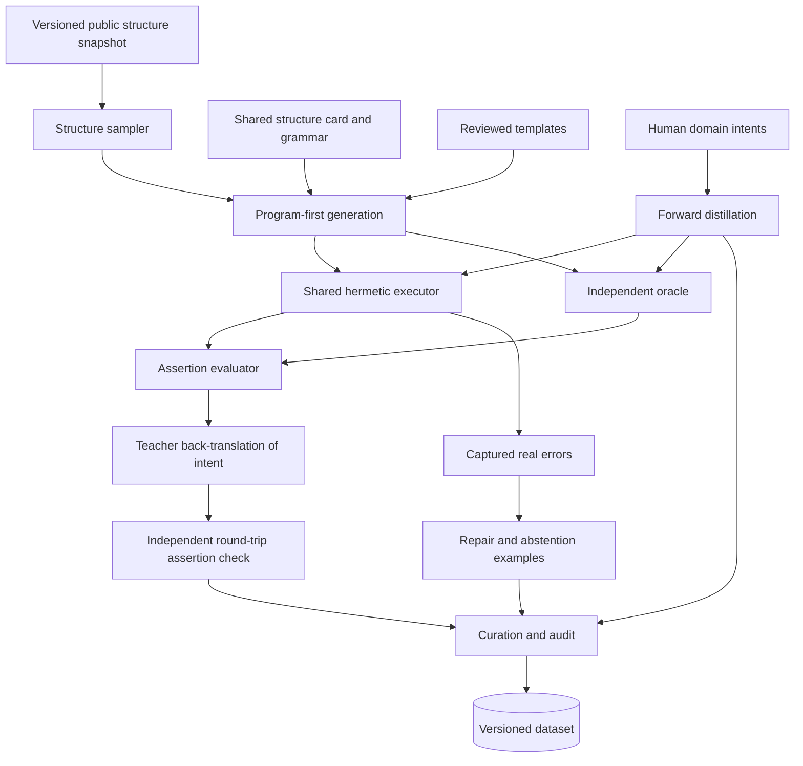

# Dataset and Oracle Design

**Status:** Draft
**Owner:** Martin Urban (`urban233`)
**Reviewers:** structural-biology reviewer (required); Hannah Kullik (`kullik01`)
**Brief:** [`SPECIFICATION.md`](../../../../SPECIFICATION.md)
**Parent design:** [Dataset, Model Training, and Evaluation Design](design.md)
**Last reviewed:** 2026-08-20

## Summary

This design generates and curates the training data for the local PyMOL
model, and builds the independent oracle that grades it -- the concrete
implementation of the [parent design's central engineering
principle](design.md#summary).

The recommended pipeline runs these stages, in order:

1. Define a structure- and task-diverse gold suite.
2. Validate an independent oracle -- ground truth computed without the model
   under test -- against pinned Open-Source PyMOL.
3. Generate most machine-checkable examples program-first.
4. Add human-domain phrasing and real repair/clarification data.
5. Curate decontaminated two-axis splits.

The output is a versioned, immutable dataset that
[Training and evaluation](training-and-evaluation.md) consumes; this design
does not cover fine-tuning, baselines, or quantization.

## Goals and non-goals

See the parent design's
[Goals and non-goals](design.md#goals-and-non-goals) for the goals and
non-goals that constrain more than one child. This design adds:

### Goals

- Produce a professionally engineered, reproducible dataset with explicit
  provenance, machine-checkable assertions, measured label noise, and a
  datasheet.

### Non-goals

- Training arbitrary Python, unrestricted PyMOL, file operations,
  destructive commands, or runtime-controlled fetch.
- Using user runtime prompts, loaded structures, plans, or diagnostics as
  training data.
- Treating teacher-generated text, script liveness, syntax pass rate, or
  non-empty selection rate as correctness.
- Committing to a fixed dataset size before coverage and learning-curve
  evidence.

## Current system and evidence

The repository has no active data or oracle implementation. See the parent
design's
[Current system and evidence](design.md#current-system-and-evidence) for
the accepted specification decisions this design must satisfy -- most
directly, program-first generation, a validated oracle, sequence-cluster
splits, and blind label audit.

## Proposed design

This section covers the nine components that generate and curate the
dataset, the diagram connecting them into one pipeline, and the five
contracts other designs depend on.

### Components and ownership

Martin owns every component below; the independent review column names
where domain or ML review is also required beyond the parent's structural-
biology reviewer.

| Component | Responsibility | Independent review |
|---|---|---|
| V1 taxonomy and gold suite | Define representative intents, command coverage, difficulty, and independently reviewed assertions | Structural-biology |
| Public structure snapshot | Provide content-addressed, versioned Open-Source PyMOL inputs and sequence-cluster metadata without generation-time network drift | -- |
| Hermetic generation executor | Execute typed plans through the shared protocol and capture real errors and state evidence | -- (owned by shared core; this design consumes it) |
| Oracle registry | Compute independent ground truth for supported semantic categories and report unsupported ones | ML/domain |
| Assertion evaluator | Compare execution outcomes with selection, visual, numeric, and absence assertions | -- |
| Program-first generator | Instantiate compatible correct plans from templates and back-translate them into natural intents | -- |
| Human-intent distillation | Expand domain phrasing from reviewed human seeds and oracle-gate generated candidate plans | -- |
| Recovery and abstention generator | Build real-error repair trajectories, clarification, refusal, and no-op examples | -- |
| Curation pipeline | Deduplicate behavior, split by structure/task axes, decontaminate, balance, audit, and package data | -- |

Every component in this table is new; none of it exists in the repository
today.

### Data and control flow

This diagram covers generation and curation only. It ends at the versioned
dataset that [Training and evaluation](training-and-evaluation.md) consumes
as its own starting point.

No sample reaches training merely because it parses or executes.
Program-first examples must agree with independently computed assertions.
Teacher-generated candidate plans must pass those assertions. Categories
without an independent oracle require reviewed human assertions and remain
visibly separate in provenance and metric reporting.

### Dataset representation and provenance

Each sample records:

- stable sample and split identifiers;
- structure artifact identity, snapshot date, checksum, and 30%
  sequence-cluster identity;
- structure snapshot/card and their contract versions;
- intent, intent source, task/template identity, category, and difficulty;
- restricted native plan and canonical typed-plan identity;
- assertion list and oracle/evaluator versions;
- provenance for templates, human authors, teacher model, prompts,
  generation parameters, random seeds, Open-Source PyMOL, and shared-core
  manifest;
- execution, error, repair, verification, timing, and state-fingerprint
  evidence;
- policy, grammar, and parser decisions.

Generated data is immutable after packaging. Corrections create a new
dataset artifact and preserve the superseded artifact's manifest and
affected-result record.

### Gold suite and taxonomy

The gold suite is authored before bulk generation and spans every accepted
V1 behavior: loaded-object selections, displays, constrained labels, views,
measurements, controlled-fetch intent handling, ambiguity, refusal, no-op,
and repair. It includes cases expected to be mechanically checkable and
cases that require expert assertions.

The taxonomy controls coverage rather than serving as post-hoc reporting
only. Every category has a definition, compatibility conditions, oracle
status, expected command-policy surface, and minimum evidence rule. Corpus
proportions are set after gold-suite and baseline failures show where
coverage is useful; they are not inherited from an arbitrary fixed total.

### Oracle and assertion model

The oracle is independent of model output and, where practical, independent
of the PyMOL command path under test. It computes atom sets, numeric
values, or expected state changes from structure data. Open-Source PyMOL
remains the final semantic authority when its behavior defines the
user-visible result.

Before labeling data, randomized differential conformance compares oracle
and pinned Open-Source PyMOL results across structures, categories, and
complexity levels. At least 99% exact agreement is required overall and per
material category, with every mismatch investigated. A category that
cannot meet the threshold is routed through a separately justified PyMOL
reference path or marked unsupported; its failures are not averaged away.

Assertions support at least:

- exact or thresholded atom-set equality or IoU (intersection over union);
- representation, visibility, and color state;
- numeric values such as distances, angles, areas, or RMSD (root-mean-square
  deviation) with explicit tolerances;
- absence of unintended changes outside the intended scope.

TaskSuccess means every required assertion passes. Mean IoU and execution
pass are diagnostics, not substitutes.
[Training and evaluation](training-and-evaluation.md) uses this same
TaskSuccess definition for baselines, checkpoint selection, and RL
(reinforcement learning) gates.

### Data generation paths

The three paths below cover machine-checkable generation, human-phrased
distillation, and the repair/refusal/no-op cases that come from real
failures rather than synthetic ones.

#### Program-first generation

The majority of machine-checkable data is generated by selecting a
compatible structure and parameterized reviewed template, creating the
correct plan first, executing it, computing independent assertions, and
asking a teacher only to describe the known behavior as a natural intent. A
second teacher call receives only structure context and intent; its
candidate must reproduce the assertions. Construction or round-trip
disagreement is treated as a template, oracle, or ambiguity finding rather
than silently filtered as ordinary model noise.

#### Human-intent forward distillation

Reviewed structural-biology intents provide phrasing and domain concepts
not well represented by templates. A teacher may propose multiple candidate
plans, but the oracle or reviewed human assertions gate every survivor.
Real PyMOL and policy failures may be returned for bounded repair.
Behavioral duplicates retain useful intent paraphrases separately while
only the preferred plan instance enters plan-level training.

#### Repair, clarification, refusal, and no-op

Repair trajectories use only errors captured and normalized by the shared
executor. Teacher-invented error strings are prohibited. Error classes are
sampled from observed candidate/model failures, with provenance retained.

Ambiguous and impossible requests produce the accepted single-line
clarification form grounded in actual structure context. Conversational
closers and unrelated inputs provide no-op examples. Their proportions are
tuned against false-abstention and repair metrics rather than fixed by
convention.

### Curation and split integrity

- Deduplicate on executed behavior/state fingerprints, not text similarity
  alone. Keep useful paraphrases without duplicating plan behavior.
- Split structures by 30% sequence-identity clusters, never accession
  alone.
- Split task/templates independently to materialize seen/new structure and
  seen/new task cells. `test_new_both` remains untouched and headline.
- Remove from training any behavior fingerprint present in test and any
  intent above the precommitted near-duplicate threshold.
- Freeze split and decontamination manifests before model results are
  inspected.
- Balance categories and difficulty from coverage and baseline evidence.
- Blind-audit a protocol-defined sample with verification fields hidden.
  Publish the observed error rate and confidence interval. More than 5%
  observed error blocks training pending root-cause correction.
- Package the dataset content-addressably with a datasheet, provenance
  manifest, regeneration configuration, and explicit licensing limitations.

### APIs and contracts

Martin owns every contract below.

| Contract | Consumers | Compatibility policy |
|---|---|---|
| Dataset sample schema | Generation, curation, training, evaluation | Major version for semantic changes; migration creates a new artifact |
| Oracle registry | Template generator, distillation gate, evaluation, optional optimization | Oracle version recorded per assertion and result |
| Assertion evaluator | Data gate, baselines, training validation, model evaluation | Versioned with dataset and result schemas |
| Generation record | Curation and audit | Prompt/template changes create new identities |
| Split/decontamination manifest | Training and evaluation | Version bump and complete result rerun for changes |

**Dataset sample schema**
- Guarantees: complete provenance and versioned assertions for every
  sample.
- Errors: invalid or incomplete samples are rejected, never default-filled
  silently.
- Test/fixture: gold samples, schema round-trip, missing-provenance tests.

**Oracle registry**
- Guarantees: explicit supported/unsupported categories and deterministic
  ground truth where claimed.
- Errors: an unsupported category is visible; computation has finite
  resource limits.
- Test/fixture: random Open-Source PyMOL conformance and semantic mutation
  suite.

**Assertion evaluator**
- Guarantees: per-assertion result, TaskSuccess, and partial diagnostics.
- Errors: missing expected state or an evaluator error invalidates the
  score.
- Test/fixture: exact, partial, disjoint, tolerance, and unintended-change
  fixtures.

**Generation record**
- Guarantees: teacher/template/prompt/seed/error/repair lineage is
  retained.
- Errors: a failed generation is recorded separately and cannot appear as
  verified.
- Test/fixture: replay fixture with cached response where licensing
  permits.

**Split/decontamination manifest**
- Guarantees: immutable sample-to-split mapping and zero forbidden
  overlap.
- Errors: any leak invalidates the affected result set.
- Test/fixture: injected cluster, behavior, and near-intent leak tests.

## Alternatives and trade-offs

| Option | Benefits | Costs/risks | Decision |
|---|---|---|---|
| Teacher-generated plans with liveness filtering | Simple pipeline and broad phrasing | Confidently wrong labels pass; reward hacking favors broad selections | Rejected as bulk method; retained only behind oracle/human assertions |
| Program-first generation | Correct plans and controllable coverage | Requires reviewed templates and a strong oracle; phrasing may be synthetic | Selected as the majority machine-checkable path |
| Fixed dataset size | Predictable cost and schedule | Scale can hide poor coverage or waste compute | Rejected; use coverage, audit, and learning curves |
| Split by PDB (Protein Data Bank) accession | Easy | Homolog leakage inflates results | Rejected; split by sequence cluster |
| Deduplicate by intent similarity only | Straightforward NLP tooling | Misses behaviorally identical scripts and overweights easy states | Rejected; behavioral fingerprint is primary |

## Quality and risk

- **Security/privacy:** Only public or explicitly licensed development
  structures enter the pipeline. Teacher output and generated plans are
  untrusted and execute only through the sandboxed shared protocol with no
  network, finite resources, and default-deny policy. Runtime user data is
  prohibited throughout, per the parent design.
- **Reliability/concurrency:** Every run has immutable input manifests,
  deterministic seeds where supported, bounded workers, resumable
  content-addressed outputs, and explicit failed-record handling.
  Shared-process PyMOL reset is not accepted as isolation.
- **Observability/capacity/cost:** Reports record generation acceptance,
  oracle disagreement, and template round-trip failure. They also record
  category balance, duplicates, contamination removal, and label noise.
  Teacher budget is fixed before bulk use.
- **Accessibility/internationalization:** Training intents should reflect
  realistic domain phrasing without relying on UI-specific wording. V1
  command syntax and numeric formatting remain locale-independent. Broader
  language support is not claimed without dedicated data and evaluation;
  Unicode inputs must not bypass executable grammar or policy.

## Test strategy

- Unit and property tests for schemas, provenance, templates, samplers, and
  manifest identity.
- Gold-suite review by a structural-biology reviewer before it calibrates
  model claims.
- Oracle semantic mutation tests and randomized differential conformance
  against pinned Open-Source PyMOL.
- Template construction checks that raise on assertion disagreement rather
  than silently filtering it.
- Teacher round-trip and oracle-gate tests with retained failure evidence.
- Error-provenance tests proving every repair envelope comes from the
  shared captured corpus.
- Behavioral dedup, sequence-cluster split, immutable-manifest, and
  injected-contamination tests.
- Blind audit tooling that hides verification and records a precommitted
  protocol.
- Sabotage tests that invert oracle semantics or leak a split, and prove
  the corresponding gate fails.

## Migration, rollout, rollback, and cleanup

Covered by the parent design's
[Migration, rollout, rollback, and cleanup](design.md#migration-rollout-rollback-and-cleanup),
since dataset promotion is one step in that shared, cross-subsystem
sequence.

## Open questions

Martin owns every question below.

| Question | Evidence needed | Blocking? |
|---|---|---|
| Which teacher service and terms permit the intended use, caching, provenance, and possible artifact publication? | Cost/quality pilot and licensing decision | Yes, before bulk teacher generation |
| Which V1 intents and scientifically meaningful categories belong in the reviewed gold suite? | Martin-authored workflows plus independent structural-biology review | Yes, before taxonomy and oracle acceptance |
| Which oracle categories can reach at least 99% exact conformance without circularly testing the same PyMOL path? | Category-level randomized conformance report | Yes, before those categories label training data |

## Acceptance

- [ ] Material decisions resolved.
- [ ] Structural-biology review complete.
- [ ] Accountable human accepts planning against this design.
