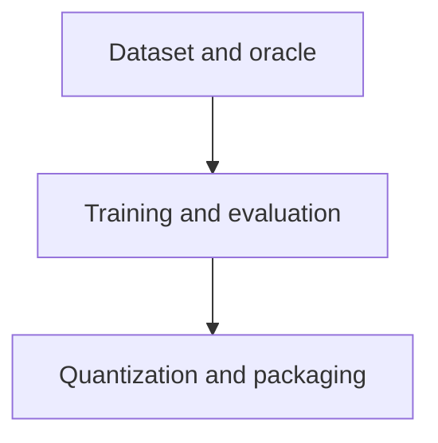

# Dataset, Model Training, and Evaluation Design

**Status:** Accepted
**Owner:** Martin Urban (`urban233`)
**Reviewers:** Hannah Kullik (`kullik01`)
**Brief:** [`SPECIFICATION.md`](../../../../SPECIFICATION.md)
**Last reviewed:** 2026-08-20

## Summary

The model-development subsystem produces the fine-tuned, quantized local model
required by V1 and the evidence needed to decide whether that model is useful,
safe to integrate, and compatible with the deployed application. Its central
engineering principle is that label correctness comes from independent,
executable evidence rather than teacher confidence or mere absence of PyMOL
errors.

This subsystem covers three independently reviewable stages, each with its
own design document:

1. [Dataset and oracle](dataset-and-oracle.md) -- generates and curates the
   training data, and builds the independent oracle that grades it.
2. [Training and evaluation](training-and-evaluation.md) -- fine-tunes the
   model on that dataset and measures whether it beats non-fine-tuned
   baselines.
3. [Quantization and packaging](quantization-and-packaging.md) -- exports,
   re-evaluates, and benchmarks the deployable artifact, and packages it
   with its compatibility and license manifest.

[Training and evaluation](training-and-evaluation.md) covers exactly which
improvements beyond supervised fine-tuning are mandatory versus
conditional, and the evidence gates that decide it.

The subsystem consumes, but does not reimplement, the contracts in
[`Shared Core and Contracts Design`](../shared-core/design.md). It hands a
content-addressed model and compatibility manifest to the
[`Runtime Application Design`](../runtime-application/design.md). Development
teacher services, mirrors, training frameworks, and GPUs are absent from the
deployed runtime.

## Goals and non-goals

These are the cross-cutting goals and non-goals that constrain more than one
child design. Each child design linked in the Summary states the goals and
non-goals specific to its own stage.

### Goals

- Reuse exactly the runtime structure-card, grammar, parser, policy, error,
  and execution contracts.
- Select model family, size, quantization, and inference configuration using
  reproducible quality, latency, memory, license, and Lemonade-compatibility
  evidence.
- Preserve negative and null results, including skipped RL (reinforcement
  learning) or rejected model sizes, as first-class project evidence.

### Non-goals

- A general structural-biology reasoner or replacement for scientific
  judgment.
- Owning runtime orchestration, approval, recovery, or local process
  management.
- ADR (Architecture Decision Record) creation or implementation-task
  planning.

## Current system and evidence

The repository has no active data, training, model, or evaluation
implementation. The accepted specification fixes the following decisions:

- a fine-tuned and quantized local model is mandatory for V1;
- deployment targets CPU and iGPU (integrated GPU) first on representative
  laboratory computers;
- native restricted `.pml`, structure card, and grammar are shared contracts;
- Lemonade is the first deployment inference engine;
- runtime data never enters teacher or training systems;
- program-first generation, a validated oracle, and behavioral deduplication
  are required;
- sequence-cluster splits, blind label audit, strong baselines, multiple
  seeds, required ablations, and post-quantization evaluation are required;
- `test_new_both` is the headline generalization split;
- Open-Source PyMOL is the semantic target;
- a model must materially exceed the strongest deployable baseline, with the
  minimum margin fixed before fine-tuning results are inspected.

Each child design cites the subset of these decisions it must satisfy. The
earlier planning notes propose useful mechanisms and initial numeric values,
but corpus size, model family, GPU configuration, teacher provider, and exact
quality/latency thresholds remain evidence-driven decisions. Published
research provides methodological precedents, not a claim that this project
has comparable scale or results.

## Proposed design

Each child design records its own components, data and control flow, APIs
and contracts, and alternatives -- see the linked document for that detail.
This section covers only how the three fit together.

### Components and ownership

Martin owns all three child designs below.

| Design | Scope | Required evidence |
|---|---|---|
| [Dataset and oracle](dataset-and-oracle.md) | Structure snapshot, gold suite, oracle, program-first and human-intent generation, curation | Gold-suite and oracle evidence |
| [Training and evaluation](training-and-evaluation.md) | Baselines, supervised fine-tuning, optional rejection sampling and gated RL | Evaluation evidence |
| [Quantization and packaging](quantization-and-packaging.md) | Quantized candidate evaluation, hardware benchmarking, model artifact manifest | License and compatibility evidence |

### Data and control flow

The diagram shows only the hand-off between the three child designs; each
has its own detailed data and control flow.

Neither hand-off admits a candidate by default: a sample must pass
independently computed assertions before it reaches training, and a
quantized artifact must pass the same kind of check before it reaches
packaging. [Dataset and oracle](dataset-and-oracle.md) and
[Quantization and packaging](quantization-and-packaging.md) each detail
how their own gate works.

## Alternatives and trade-offs

Each child design records the alternatives specific to its own stage: see
[Dataset and oracle](dataset-and-oracle.md#alternatives-and-trade-offs),
[Training and evaluation](training-and-evaluation.md#alternatives-and-trade-offs),
and
[Quantization and packaging](quantization-and-packaging.md#alternatives-and-trade-offs).

## Quality and risk

- **Security/privacy:** Runtime data never enters teacher or training
  systems anywhere in this subsystem, as recorded in Current system and
  evidence. [Dataset and oracle](dataset-and-oracle.md#quality-and-risk)
  details sandboxing and structure-licensing controls for generation;
  [Quantization and packaging](quantization-and-packaging.md#quality-and-risk)
  details the license review required before any artifact is published.
- **Reliability/concurrency:** Each child design covers its own pipeline's
  reliability and concurrency controls -- see
  [Dataset and oracle](dataset-and-oracle.md#quality-and-risk) and
  [Training and evaluation](training-and-evaluation.md#quality-and-risk).
- **Observability/capacity/cost:** Each child design reports its own
  stage's metrics and budget; see the linked designs.
- **Accessibility/internationalization:** Covered in
  [Dataset and oracle](dataset-and-oracle.md#quality-and-risk), where
  training-intent phrasing is generated.

## Test strategy

- Shared-core parser, policy, card, grammar, error, and executor suites run
  in the model-development environment without local substitutes -- every
  child design reuses these, and none re-tests them independently.

Each child design also has its own subsystem-specific test list.

## Migration, rollout, rollback, and cleanup

No prior production dataset or model exists to migrate. The gold suite,
taxonomy, shared contracts, oracle, and split policy must be reviewed before
bulk generation or model comparison -- see
[Dataset and oracle](dataset-and-oracle.md). A content-addressed dataset is
immutable; corrections create a new version and identify invalidated
training/evaluation results.

Model promotion proceeds through these stages, in order:

1. Baseline evidence ([Training and evaluation](training-and-evaluation.md)).
2. Supervised candidates ([Training and evaluation](training-and-evaluation.md)).
3. Optional evidence-gated improvement ([Training and evaluation](training-and-evaluation.md)).
4. Quantized candidates ([Quantization and packaging](quantization-and-packaging.md)).
5. Standalone evaluation ([Quantization and packaging](quantization-and-packaging.md)).
6. Full-agent evaluation ([Quantization and packaging](quantization-and-packaging.md)).
7. Reference-hardware qualification ([Quantization and packaging](quantization-and-packaging.md)).

A model is not a runtime candidate until its complete compatibility and
licensing manifest passes.

Rollback restores the last compatible application/core/model/Lemonade
pairing. Superseded models, teacher caches, raw generation failures,
scratch structures, and checkpoints have explicit retention and cleanup
rules based on reproducibility, license, privacy, and storage cost. Test
sets and result manifests are retained to explain past claims; they are not
silently regenerated after results are seen.

Public release of dataset or weights is independent of internal use and
waits for licensing review. A negative model result does not trigger
selective data or split changes; it returns to an explicitly versioned
data/model decision.

## Open questions

The question below blocks more than one child design. A question specific to
one stage is recorded in that child design instead. Martin owns the question
below.

| Question | Evidence needed | Blocking? |
|---|---|---|
| Which base-model families and licenses satisfy restricted-plan quality, fine-tuning feasibility, Lemonade support, and redistribution goals? | License compatibility evidence plus B1/B2 quality and Lemonade compatibility probes | Yes, before training configuration acceptance and packaging |

## Acceptance

- [x] Material cross-cutting decisions resolved.
- [x] [Dataset and oracle](dataset-and-oracle.md) is `Accepted`.
- [x] [Training and evaluation](training-and-evaluation.md) is `Accepted`.
- [x] [Quantization and packaging](quantization-and-packaging.md) is `Accepted`.
- [x] Accountable human accepts planning against this design.
