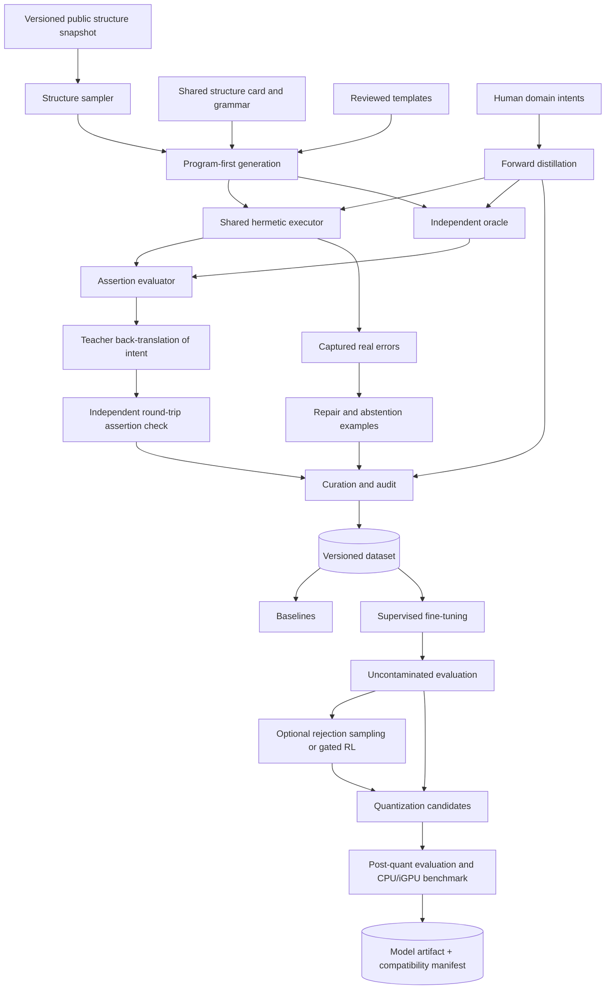

# Dataset, Model Training, and Evaluation Design

**Status:** Draft
**Owner:** Martin Urban (`urban233`)
**Reviewers:** Hannah Kullik (`kullik01`); structural-biology, ML-evaluation, and licensing reviewers to be named
**Brief:** [`SPECIFICATION.md`](../../../../SPECIFICATION.md)
**Last reviewed:** 2026-08-19

## Summary

The model-development subsystem produces the fine-tuned, quantized local model
required by V1 and the evidence needed to decide whether that model is useful,
safe to integrate, and compatible with the deployed application. Its central
engineering principle is that label correctness comes from independent,
executable evidence rather than teacher confidence or mere absence of PyMOL
errors.

The recommended pipeline establishes strong non-fine-tuned baselines first,
defines a structure- and task-diverse gold suite, validates an oracle against
pinned Open-Source PyMOL, generates most machine-checkable examples
program-first, adds human-domain phrasing and real repair/clarification data,
curates decontaminated two-axis splits, fine-tunes with completion-only loss,
and selects model size and quantization on a measured quality-versus-CPU/iGPU
frontier. Supervised fine-tuning and grammar-backed evaluation are mandatory.
Rejection-sampling and reinforcement learning remain conditional improvements
that run only when accepted evidence shows verifier coverage and search headroom.

The subsystem consumes, but does not reimplement, the contracts in
[`Shared Core and Contracts Design`](../shared-core/design.md). It hands a
content-addressed model and compatibility manifest to the
[`Runtime Application Design`](../runtime-application/design.md). Development
teacher services, mirrors, training frameworks, and GPUs are absent from the
deployed runtime.

## Goals and non-goals

### Goals

- Produce a professionally engineered, reproducible dataset with explicit
  provenance, machine-checkable assertions, measured label noise, and a
  datasheet.
- Train a local model that translates accepted V1 intents and structure context
  into restricted native PyMOL plans.
- Demonstrate generalization across both unseen structure families and unseen
  task/template families rather than accession memorization.
- Prove that fine-tuning adds value over template, base-model, retrieval-plus-
  grammar, and teacher baselines.
- Reuse exactly the runtime structure-card, grammar, parser, policy, error, and
  execution contracts.
- Select model family, size, quantization, and inference configuration using
  reproducible quality, latency, memory, license, and Lemonade-compatibility
  evidence.
- Preserve negative and null results, including skipped RL or rejected model
  sizes, as first-class project evidence.
- Package the model with every compatibility version required for fail-closed
  runtime loading.

### Non-goals

- A general structural-biology reasoner or replacement for scientific judgment.
- Training arbitrary Python, unrestricted PyMOL, file operations, destructive
  commands, or runtime-controlled fetch.
- Using user runtime prompts, loaded structures, plans, or diagnostics as
  training data.
- Treating teacher-generated text, script liveness, syntax pass rate, non-empty
  selection rate, or training loss as correctness.
- Committing to a fixed dataset size before coverage and learning-curve evidence.
- Assuming a specific base model size, family, quantization, or dedicated GPU at
  deployment.
- Making reinforcement learning mandatory or tuning rewards until a favorable
  result appears.
- Owning runtime orchestration, approval, recovery, or local process management.
- ADR creation or implementation-task planning.

## Current system and evidence

The repository has no active data, training, model, or evaluation implementation.
The accepted specification fixes the following decisions:

- a fine-tuned and quantized local model is mandatory for V1;
- deployment is CPU/iGPU-first on representative laboratory computers;
- native restricted `.pml`, structure card, and grammar are shared contracts;
- Lemonade is the first deployment inference engine;
- runtime data never enters teacher or training systems;
- program-first generation, a validated oracle, behavioral deduplication,
  sequence-cluster splits, blind label audit, strong baselines, multiple seeds,
  required ablations, and post-quantization evaluation are required;
- `test_new_both` is the headline generalization split;
- Open-Source PyMOL is the semantic target;
- a model must materially exceed the strongest deployable baseline, with the
  minimum margin fixed before fine-tuning results are inspected.

The earlier planning notes propose useful mechanisms and initial numeric values,
but corpus size, model family, GPU configuration, teacher provider, and exact
quality/latency thresholds remain evidence-driven decisions. Published research
provides methodological precedents, not a claim that this project has comparable
scale or results.

## Proposed design

### Components and ownership

| Component | Responsibility | Owner | Existing or new |
|---|---|---|---|
| V1 taxonomy and gold suite | Define representative intents, command coverage, difficulty, and independently reviewed assertions | Martin; structural-biology review required | New |
| Public structure snapshot | Provide content-addressed, versioned Open-Source PyMOL inputs and sequence-cluster metadata without generation-time network drift | Martin | New |
| Hermetic generation executor | Execute typed plans through the shared protocol and capture real errors and state evidence | Shared core; Martin consumes | New |
| Oracle registry | Compute independent ground truth for supported semantic categories and report unsupported ones | Martin; independent ML/domain review required | New |
| Assertion evaluator | Compare execution outcomes with selection, visual, numeric, and absence assertions | Martin | New |
| Program-first generator | Instantiate compatible correct plans from templates and back-translate them into natural intents | Martin | New |
| Human-intent distillation | Expand domain phrasing from reviewed human seeds and oracle-gate generated candidate plans | Martin | New |
| Recovery and abstention generator | Build real-error repair trajectories, clarification, refusal, and no-op examples | Martin | New |
| Curation pipeline | Deduplicate behavior, split by structure/task axes, decontaminate, balance, audit, and package data | Martin | New |
| Baseline and evaluation harness | Run B0–B3, full metrics, canaries, ablations, and integrated-agent comparison | Martin | New |
| Supervised fine-tuning pipeline | Train reproducibly with assistant-only loss and select checkpoints on validation TaskSuccess | Martin | New |
| Optional improvement pipeline | Run rejection sampling and, only behind accepted gates, verifiable-reward optimization | Martin; independent ML review required | New |
| Quantization and packaging | Export candidate local artifacts, fully re-evaluate them, benchmark runtime hardware, and emit a compatibility manifest | Martin | New |

### Data and control flow

No sample reaches training merely because it parses or executes. Program-first
examples must agree with independently computed assertions. Teacher-generated
candidate plans must pass those assertions. Categories without an independent
oracle require reviewed human assertions and remain visibly separate in
provenance and metric reporting.

### Dataset representation and provenance

Each sample records:

- stable sample and split identifiers;
- structure artifact identity, snapshot date, checksum, and 30% sequence-cluster
  identity;
- structure snapshot/card and their contract versions;
- intent, intent source, task/template identity, category, and difficulty;
- restricted native plan and canonical typed-plan identity;
- assertion list and oracle/evaluator versions;
- provenance for templates, human authors, teacher model, prompts, generation
  parameters, random seeds, Open-Source PyMOL, and shared-core manifest;
- execution, error, repair, verification, timing, and state-fingerprint evidence;
- policy, grammar, and parser decisions.

Generated data is immutable after packaging. Corrections create a new dataset
artifact and preserve the superseded artifact's manifest and affected-result
record.

### Gold suite and taxonomy

The gold suite is authored before bulk generation and spans every accepted V1
behavior: loaded-object selections, displays, constrained labels, views,
measurements, controlled-fetch intent handling, ambiguity, refusal, no-op, and
repair. It includes cases expected to be mechanically checkable and cases that
require expert assertions.

The taxonomy controls coverage rather than serving as post-hoc reporting only.
Every category has a definition, compatibility conditions, oracle status,
expected command-policy surface, and minimum evidence rule. Corpus proportions
are set after gold-suite and baseline failures show where coverage is useful;
they are not inherited from an arbitrary fixed total.

### Oracle and assertion model

The oracle is independent of model output and, where practical, independent of
the PyMOL command path under test. It computes atom sets, numeric values, or
expected state changes from structure data. Open-Source PyMOL remains the final
semantic authority when its behavior defines the user-visible result.

Before labeling data, randomized differential conformance compares oracle and
pinned Open-Source PyMOL results across structures, categories, and complexity
levels. At least 99% exact agreement is required overall and per material
category, with every mismatch investigated. A category that cannot meet the
threshold is routed through a separately justified PyMOL reference path or
marked unsupported; its failures are not averaged away.

Assertions support at least:

- exact or thresholded atom-set equality/IoU;
- representation, visibility, and color state;
- numeric values such as distances, angles, areas, or RMSD with explicit
  tolerances;
- absence of unintended changes outside the intended scope.

TaskSuccess means every required assertion passes. Mean IoU and execution pass
are diagnostics, not substitutes.

### Data generation paths

#### Program-first generation

The majority of machine-checkable data is generated by selecting a compatible
structure and parameterized reviewed template, creating the correct plan first,
executing it, computing independent assertions, and asking a teacher only to
describe the known behavior as a natural intent. A second teacher call receives
only structure context and intent; its candidate must reproduce the assertions.
Construction or round-trip disagreement is treated as a template, oracle, or
ambiguity finding rather than silently filtered as ordinary model noise.

#### Human-intent forward distillation

Reviewed structural-biology intents provide phrasing and domain concepts not
well represented by templates. A teacher may propose multiple candidate plans,
but the oracle or reviewed human assertions gate every survivor. Real PyMOL and
policy failures may be returned for bounded repair. Behavioral duplicates retain
useful intent paraphrases separately while only the preferred plan instance
enters plan-level training.

#### Repair, clarification, refusal, and no-op

Repair trajectories use only errors captured and normalized by the shared
executor. Teacher-invented error strings are prohibited. Error classes are
sampled from observed candidate/model failures, with provenance retained.

Ambiguous and impossible requests produce the accepted single-line
clarification form grounded in actual structure context. Conversational closers
and unrelated inputs provide no-op examples. Their proportions are tuned against
false-abstention and repair metrics rather than fixed by convention.

### Curation and split integrity

- Deduplicate on executed behavior/state fingerprints, not text similarity
  alone. Keep useful paraphrases without duplicating plan behavior.
- Split structures by 30% sequence-identity clusters, never accession alone.
- Split task/templates independently to materialize seen/new structure and
  seen/new task cells. `test_new_both` remains untouched and headline.
- Remove from training any behavior fingerprint present in test and any intent
  above the precommitted near-duplicate threshold.
- Freeze split and decontamination manifests before model results are inspected.
- Balance categories and difficulty from coverage and baseline evidence.
- Blind-audit a protocol-defined sample with verification fields hidden. Publish
  the observed error rate and confidence interval. More than 5% observed error
  blocks training pending root-cause correction.
- Package the dataset content-addressably with a datasheet, provenance manifest,
  regeneration configuration, and explicit licensing limitations.

### Baselines and model training

Baselines are measured before interpreting fine-tuning:

- **B0:** deterministic template/retrieval and slot filling without an LLM;
- **B1:** candidate base model with structure card;
- **B2:** base model with reviewed exemplars and grammar;
- **B3:** development teacher under the same task and assertion protocol.

The minimum fine-tuning improvement margin is fixed from baseline variance and
product relevance before fine-tuned test results are opened.

Supervised training uses a versioned base model and tokenizer, completion-only
loss on assistant plan tokens, reproducible seeds, immutable data manifests, and
checkpoint selection on validation TaskSuccess. Tensor-level tests verify that
prompt/card tokens are masked. Model family, size, adapters, optimizer, and
training precision are recorded configuration, not architectural constants.

Model-size comparisons use the same dataset, prompt, grammar, and evaluation
protocol. Material comparisons run at least three seeds and report mean and
uncertainty by split and category. Required ablations cover structure card,
grammar, model size, self-correction data, and material training choices whose
benefit is otherwise assumed.

### Optional improvement gates

Rejection-sampling fine-tuning may run after supervised training when the oracle
can score the relevant prompts. Correct completions are behaviorally
deduplicated and easy prompts are capped so they do not dominate.

Reinforcement learning is permitted only when all accepted gates pass:

- verifier coverage is high enough for the evaluated task set;
- rejection-sampling improvement has plateaued;
- pass@k shows meaningful correct behavior not present at pass@1;
- a scalar reward preserves assertion information and explicitly penalizes
  known degeneracy;
- independent ML review accepts reward tests and a per-round reward-audit
  protocol.

Rising reward with flat assertion quality, increased degeneracy, or failed
manual audits invalidates the run. Skipping RL is a valid recorded result.

### Quantization and model packaging

Every quantized candidate receives the complete evaluation suite, including
abstention, degeneracy, repair, retention, and per-category results. A faster
artifact is not selected when it causes a material quality or safety regression.
CPU/iGPU latency and peak memory are measured through Lemonade on named
laboratory hardware, not inferred from parameter count.

The packaged model includes a content hash, license, base and fine-tuning
identity, tokenizer and prompt format, quantization, shared-core contract
manifest, Lemonade compatibility, complete evaluation reference, and supported
hardware/platform evidence. Runtime refuses an incompatible artifact.

### APIs and contracts

| API/contract | Owner | Consumers | Guarantees | Errors/timeouts | Compatibility | Test/fixture |
|---|---|---|---|---|---|---|
| Dataset sample schema | Martin | Generation, curation, training, evaluation | Complete provenance and versioned assertions for every sample | Invalid/incomplete samples are rejected, never default-filled silently | Major version for semantic changes; migration creates a new artifact | Gold samples, schema round-trip, missing-provenance tests |
| Oracle registry | Martin | Template generator, distillation gate, evaluation, optional optimization | Explicit supported/unsupported categories and deterministic ground truth where claimed | Unsupported category is visible; computation has finite resource limits | Oracle version recorded per assertion and result | Random Open-Source PyMOL conformance and semantic mutation suite |
| Assertion evaluator | Martin | Data gate, baselines, training validation, model evaluation | Per-assertion result, TaskSuccess, and partial diagnostics | Missing expected state or evaluator error invalidates score | Versioned with dataset and result schemas | Exact, partial, disjoint, tolerance, and unintended-change fixtures |
| Generation record | Martin | Curation and audit | Teacher/template/prompt/seed/error/repair lineage retained | Failed generation is recorded separately and cannot appear as verified | Prompt/template changes create new identities | Replay fixture with cached response where licensing permits |
| Split/decontamination manifest | Martin | Training and evaluation | Immutable sample-to-split mapping and zero forbidden overlap | Any leak invalidates affected result set | Version bump and complete result rerun for changes | Injected cluster, behavior, and near-intent leak tests |
| Evaluation result schema | Martin | Model selection, runtime integration, final report | Model/data/contract/hardware identity plus per-split/category uncertainty | Incomplete identities reject comparison | Additive metrics allowed; changed metric semantics require new version | Synthetic known-score fixtures and reproducibility reruns |
| Model artifact manifest | Martin | Lemonade adapter, companion readiness, release process | Content and license identity plus exact runtime compatibility | Hash, license, engine, tokenizer, or contract mismatch blocks readiness | Explicit compatible version ranges only after fixtures | Valid/invalid artifact matrix and known-prompt canaries |
| Full-agent evaluation adapter | Joint; Martin accountable | Model evaluation and runtime integration | Same evaluation intents/assertions run through the deployed request path | Runtime failure remains distinct from model assertion failure | Runtime/model manifests recorded together | Standalone-versus-full-agent integration-loss comparison |

## Alternatives and trade-offs

| Option | Benefits | Costs/risks | Decision |
|---|---|---|---|
| Teacher-generated plans with liveness filtering | Simple pipeline and broad phrasing | Confidently wrong labels pass; reward hacking favors broad selections | Rejected as bulk method; retained only behind oracle/human assertions |
| Program-first generation | Correct plans and controllable coverage | Requires reviewed templates and a strong oracle; phrasing may be synthetic | Selected as the majority machine-checkable path |
| Fixed dataset size | Predictable cost and schedule | Scale can hide poor coverage or waste compute | Rejected; use coverage, audit, and learning curves |
| Split by PDB accession | Easy | Homolog leakage inflates results | Rejected; split by sequence cluster |
| Deduplicate by intent similarity only | Straightforward NLP tooling | Misses behaviorally identical scripts and overweights easy states | Rejected; behavioral fingerprint is primary |
| Fine-tuning optional if B2 is strong | Saves compute | Conflicts with accepted mandatory V1 fine-tuning objective | Rejected; baseline still calibrates value and claims |
| Assume one large model | Fewer experiments | May be unusable on CPU/iGPU and provides no Pareto evidence | Rejected; compare candidate sizes/families |
| Training loss for checkpoint selection | Cheap and smooth | Poor proxy for asserted task behavior | Rejected; use validation TaskSuccess |
| DPO from pass/fail pairs | Familiar preference-training stack | Discards available scalar assertion evidence | Rejected for verifiable optimization |
| Mandatory RL | Potential pass@1 improvement | High complexity and reward-hacking risk without guaranteed headroom | Rejected; explicit gates and valid skip result |
| Quantize and spot-check | Fast packaging | Can silently erase category, repair, or alignment gains | Rejected; complete post-quant evaluation |

## Quality and risk

- **Security/privacy:** Only public or explicitly licensed development structures
  enter the pipeline. Runtime user data is prohibited. Teacher output and
  generated plans are untrusted and execute only through the sandboxed shared
  protocol with no network, finite resources, and default-deny policy. Published
  artifacts require license review.
- **Reliability/concurrency:** Every run has immutable input manifests,
  deterministic seeds where supported, bounded workers, resumable content-
  addressed outputs, and explicit failed-record handling. Shared-process PyMOL
  reset is not accepted as isolation. Training retries cannot mutate frozen
  splits or test data.
- **Observability/capacity/cost:** Reports record generation acceptance, oracle
  disagreement, template round-trip failure, category balance, duplicates,
  contamination removal, label noise, training resource use, TaskSuccess,
  variance, degeneracy, abstention, repair, latency, memory, and negative
  results. Teacher and compute budgets are fixed before bulk use.
- **Accessibility/internationalization:** Training intents should reflect
  realistic domain phrasing without relying on UI-specific wording. V1 command
  syntax and numeric formatting remain locale-independent. Broader language
  support is not claimed without dedicated data and evaluation; Unicode inputs
  must not bypass executable grammar or policy.

## Test strategy

- Unit and property tests for schemas, provenance, templates, samplers, metrics,
  rewards, and manifest identity.
- Shared-core parser, policy, card, grammar, error, and executor suites run in the
  model-development environment without local substitutes.
- Gold-suite review by a structural-biology reviewer before it calibrates model
  claims.
- Oracle semantic mutation tests and randomized differential conformance against
  pinned Open-Source PyMOL.
- Template construction checks that raise on assertion disagreement rather than
  silently filtering it.
- Teacher round-trip and oracle-gate tests with retained failure evidence.
- Error-provenance tests proving every repair envelope comes from the shared
  captured corpus.
- Behavioral dedup, sequence-cluster split, immutable-manifest, and injected-
  contamination tests.
- Blind audit tooling that hides verification and records a precommitted protocol.
- Tensor-level completion-mask tests on real batches.
- Same-seed reproducibility checks and at least three seeds for material results.
- Fixed canary and capability-retention suites during training and optional
  optimization.
- Reward exploit fixtures, reward-versus-assertion divergence alerts, and
  independent manual audits if RL runs.
- Complete fp/quantized comparisons by split and category.
- Real Lemonade CPU/iGPU benchmark with model, engine, hardware, and thread
  identities.
- Full-agent versus standalone evaluation to detect integration loss from card,
  grammar, parser, prompt, or engine skew.
- Sabotage tests that invert oracle semantics, leak a split, corrupt masking, or
  weaken degeneracy penalties and prove the corresponding gate fails.

## Migration, rollout, rollback, and cleanup

There is no prior production dataset or model to migrate. The gold suite,
taxonomy, shared contracts, oracle, and split policy must be reviewed before
bulk generation or model comparison. A content-addressed dataset is immutable;
corrections create a new version and identify invalidated training/evaluation
results.

Model promotion proceeds from baseline evidence to supervised candidates,
optional evidence-gated improvement, quantized candidates, standalone
evaluation, full-agent evaluation, and reference-hardware qualification. A model
is not a runtime candidate until its complete compatibility and licensing
manifest passes.

Rollback restores the last compatible application/core/model/Lemonade pairing.
Superseded models, teacher caches, raw generation failures, scratch structures,
and checkpoints have explicit retention and cleanup rules based on reproducibility,
license, privacy, and storage cost. Test sets and result manifests are retained
to explain past claims; they are not silently regenerated after results are seen.

Public release of dataset or weights is independent of internal use and waits
for licensing review. A negative model result does not trigger selective data or
split changes; it returns to an explicitly versioned data/model decision.

## Open questions

| Question | Owner | Evidence needed | Blocking? |
|---|---|---|---|
| Which base-model families and licenses satisfy restricted-plan quality, fine-tuning feasibility, Lemonade support, and redistribution goals? | Martin | Candidate license review plus B1/B2 quality and Lemonade compatibility probes | Yes, before training configuration acceptance |
| Which teacher service and terms permit the intended use, caching, provenance, and possible artifact publication? | Martin | Cost/quality pilot and licensing decision | Yes, before bulk teacher generation |
| Which V1 intents and scientifically meaningful categories belong in the reviewed gold suite? | Martin | Martin-authored workflows plus independent structural-biology review | Yes, before taxonomy and oracle acceptance |
| Which oracle categories can reach at least 99% exact conformance without circularly testing the same PyMOL path? | Martin | Category-level randomized conformance report | Yes, before those categories label training data |
| What representative laboratory hardware and latency/memory budget govern the model Pareto decision? | Martin | Named hardware sample and integrated runtime measurements | Yes, before deployment model selection; not before dataset design |
| What minimum improvement over B2 is materially useful after accounting for baseline variance? | Martin | Pre-fine-tuning B0–B3 results and product-owner decision | Yes, before fine-tuned test results are inspected |
| What teacher, training, and storage budget is available for coverage and learning-curve decisions? | Martin | Cost pilot and explicit budget | No; required before bulk generation |
| Who are the independent structural-biology, ML-evaluation, and licensing reviewers? | Martin | Named reviewers and recorded availability | Yes, before the affected design sections are Accepted |

## Acceptance

- [ ] Material decisions resolved.
- [ ] Required domain reviews complete.
- [ ] Accountable human accepts planning against this design.
