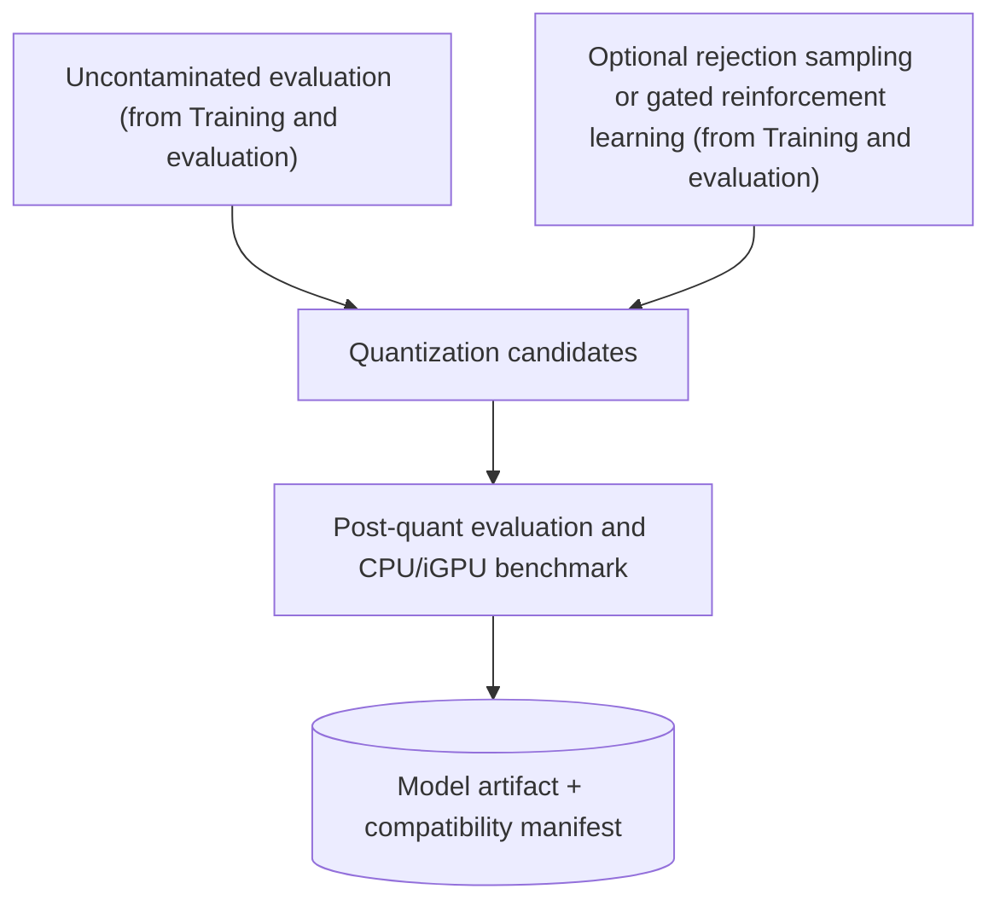

# Quantization and Packaging Design

**Status:** Draft
**Owner:** Martin Urban (`urban233`)
**Reviewers:** Hannah Kullik (`kullik01`)
**Brief:** [`SPECIFICATION.md`](../../../../SPECIFICATION.md)
**Parent design:** [Dataset, Model Training, and Evaluation Design](design.md)
**Last reviewed:** 2026-08-20

## Summary

This design exports quantized candidates from the checkpoint selected by
[Training and evaluation](training-and-evaluation.md), re-evaluates each
candidate with the complete evaluation suite, benchmarks it on
representative laboratory CPU and iGPU (integrated GPU) hardware through
Lemonade, and packages the selected artifact with its compatibility and
license manifest. This is the last stage before a model becomes a runtime
candidate.

## Goals and non-goals

See the parent design's
[Goals and non-goals](design.md#goals-and-non-goals) for the goals and
non-goals that constrain more than one child. This design adds:

### Goals

- Package the model with every compatibility version required for
  fail-closed runtime loading.

### Non-goals

- Assuming a specific quantization or dedicated GPU at deployment.

## Current system and evidence

The repository has no active quantization or packaging implementation. See
the parent design's
[Current system and evidence](design.md#current-system-and-evidence) for
the accepted specification decisions this design must satisfy -- most
directly, CPU/iGPU-first deployment on representative laboratory computers
and Lemonade as the first deployment inference engine.

## Proposed design

This section covers the single component that quantizes and packages the
model, the diagram connecting it to training and to the released artifact,
and the contracts other designs depend on.

### Components and ownership

Martin owns the one component below.

| Component | Responsibility |
|---|---|
| Quantization and packaging | Export candidate local artifacts, fully re-evaluate them, benchmark runtime hardware, and emit a compatibility manifest |

This component is new; it does not exist in the repository today.

### Data and control flow

This diagram starts from the outputs
[Training and evaluation](training-and-evaluation.md) produces and ends at
the packaged model artifact.

### Quantization and evaluation

Every quantized candidate receives the complete evaluation suite --
including abstention, degeneracy (defined in
[Training and evaluation](training-and-evaluation.md#optional-improvement-gates)),
repair, retention, and per-category results. A faster artifact is not
selected when it causes a material quality or safety regression. CPU and
iGPU latency and peak memory are measured through Lemonade on named
laboratory hardware, not inferred from parameter count.

The packaged model includes a content hash, license, base and fine-tuning
identity, tokenizer and prompt format, quantization, shared-core contract
manifest, Lemonade compatibility, complete evaluation reference, and
supported hardware/platform evidence. Runtime refuses an incompatible
artifact.

### APIs and contracts

Martin is accountable for the full-agent evaluation adapter, which is
jointly owned. Post-quantization results reuse the evaluation result
schema defined in
[Training and evaluation](training-and-evaluation.md#apis-and-contracts).

| Contract | Consumers | Compatibility policy |
|---|---|---|
| Model artifact manifest | Lemonade adapter, companion readiness, release process | Explicit compatible version ranges only after fixtures |
| Full-agent evaluation adapter | Model evaluation and runtime integration | Runtime/model manifests recorded together |

**Model artifact manifest**
- Guarantees: content and license identity plus exact runtime
  compatibility.
- Errors: a hash, license, engine, tokenizer, or contract mismatch blocks
  readiness.
- Test/fixture: valid/invalid artifact matrix and known-prompt canaries.

**Full-agent evaluation adapter**
- Guarantees: the same evaluation intents and assertions run through the
  deployed request path.
- Errors: a runtime failure stays distinct from a model assertion failure.
- Test/fixture: standalone-versus-full-agent integration-loss comparison.

## Alternatives and trade-offs

| Option | Benefits | Costs/risks | Decision |
|---|---|---|---|
| Assume one large model | Fewer experiments | May be unusable on CPU/iGPU and provides no Pareto evidence | Rejected; compare candidate sizes/families |
| Quantize and spot-check | Fast packaging | Can silently erase category, repair, or alignment gains | Rejected; complete post-quant evaluation |

## Quality and risk

- **Security/privacy:** Published artifacts require license verification.
- **Observability/capacity/cost:** Reports record latency and memory per
  candidate and hardware profile.

## Test strategy

- Complete fp/quantized comparisons by split and category.
- Real Lemonade CPU/iGPU benchmark with model, engine, hardware, and
  thread identities.
- Full-agent versus standalone evaluation to detect integration loss from
  card, grammar, parser, prompt, or engine skew.

## Migration, rollout, rollback, and cleanup

Covered by the parent design's
[Migration, rollout, rollback, and cleanup](design.md#migration-rollout-rollback-and-cleanup),
since quantization and packaging are the final steps in that shared,
cross-subsystem sequence.

## Open questions

Martin owns the question below.

| Question | Evidence needed | Blocking? |
|---|---|---|
| What representative laboratory hardware and latency/memory budget govern the model Pareto decision? | Named hardware sample and integrated runtime measurements | Yes, before deployment model selection; not before dataset design |

## Acceptance

- [ ] Material decisions resolved.
- [ ] License verification accepted.
- [ ] Accountable human accepts planning against this design.
