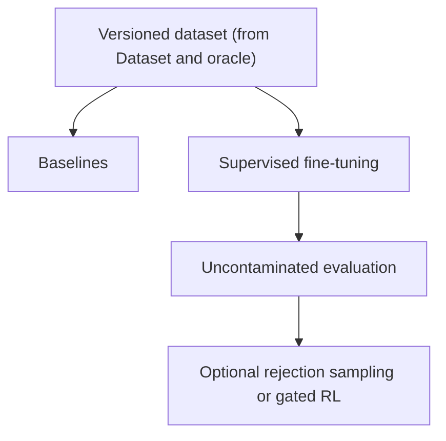

# Training and Evaluation Design

**Status:** Accepted
**Owner:** Martin Urban (`urban233`)
**Reviewers:** Hannah Kullik (`kullik01`)
**Brief:** [`SPECIFICATION.md`](../../../../SPECIFICATION.md)
**Parent design:** [Dataset, Model Training, and Evaluation Design](design.md)
**Last reviewed:** 2026-08-20

## Summary

This design measures non-fine-tuned baselines, fine-tunes the local model
with supervised training, and -- only when accepted evidence justifies it --
runs rejection sampling or gated reinforcement learning. It consumes the
versioned dataset produced by
[Dataset and oracle](dataset-and-oracle.md) and hands its selected
checkpoint to [Quantization and packaging](quantization-and-packaging.md).

Supervised fine-tuning and grammar-backed evaluation are mandatory.
Rejection-sampling and reinforcement learning are conditional improvements:
they run only when accepted evidence shows verifier coverage and search
headroom.

Every stage in this design selects on TaskSuccess -- every required
assertion for a sample passing, as defined in
[Dataset and oracle](dataset-and-oracle.md#oracle-and-assertion-model) --
never on training loss or execution alone.

## Goals and non-goals

See the parent design's
[Goals and non-goals](design.md#goals-and-non-goals) for the goals and
non-goals that constrain more than one child. This design adds:

### Goals

- Train a local model that translates accepted V1 intents and structure
  context into restricted native PyMOL plans.
- Demonstrate generalization across both unseen structure families and
  unseen task/template families rather than accession memorization.
- Prove that fine-tuning adds value over template, base-model,
  retrieval-plus-grammar, and teacher baselines.

### Non-goals

- Assuming a specific base model size or family before baseline and
  comparison evidence.
- Making reinforcement learning mandatory or tuning rewards until a
  favorable result appears.
- Treating training loss as a proxy for correctness.

## Current system and evidence

The repository has no active training or evaluation implementation. See the
parent design's
[Current system and evidence](design.md#current-system-and-evidence) for
the accepted specification decisions this design must satisfy -- most
directly, strong baselines, multiple seeds, required ablations, and the
`test_new_both` headline split.

## Proposed design

This section covers the three components that measure baselines and train
the model, the diagram connecting them to the dataset and to packaging,
and the one contract other designs depend on.

### Components and ownership

Martin owns every component below.

| Component | Responsibility |
|---|---|
| Baseline and evaluation harness | Run B0-B3, full metrics, canaries, ablations, and integrated-agent comparison |
| Supervised fine-tuning pipeline | Train reproducibly with assistant-only loss and select checkpoints on validation TaskSuccess |
| Optional improvement pipeline | Run rejection sampling and, only behind accepted gates, verifiable-reward optimization |

Every component in this table is new; none of it exists in the repository
today.

### Data and control flow

This diagram starts from the versioned dataset that
[Dataset and oracle](dataset-and-oracle.md) produces and ends at the
evaluated checkpoint that
[Quantization and packaging](quantization-and-packaging.md) consumes.

### Baselines and model training

Baselines are measured before interpreting fine-tuning:

- **B0:** deterministic template/retrieval and slot filling without an LLM;
- **B1:** candidate base model with structure card;
- **B2:** base model with reviewed exemplars and grammar;
- **B3:** development teacher under the same task and assertion protocol.

The margin itself is derived from baseline variance and product relevance;
see the parent design's
[Current system and evidence](design.md#current-system-and-evidence) for
when it must be fixed.

Supervised training uses a versioned base model and tokenizer,
completion-only loss on assistant plan tokens, reproducible seeds,
immutable data manifests, and checkpoint selection on validation
TaskSuccess. Tensor-level tests verify that prompt/card tokens are masked.
Model family, size, adapters, optimizer, and training precision are
recorded configuration, not architectural constants.

Model-size comparisons use the same dataset, prompt, grammar, and
evaluation protocol. Material comparisons run at least three seeds and
report mean and uncertainty by split and category. Required ablations
cover structure card, grammar, model size, self-correction data, and
material training choices whose benefit is otherwise assumed.

### Optional improvement gates

Rejection-sampling fine-tuning may run after supervised training when the
oracle can score the relevant prompts. Correct completions are
behaviorally deduplicated and easy prompts are capped so they do not
dominate.

Reinforcement learning is permitted only when all accepted gates pass:

- verifier coverage is high enough for the evaluated task set;
- rejection-sampling improvement has plateaued;
- pass@k (success within k sampled attempts) shows meaningful correct
  behavior not present at pass@1 (success on a single attempt);
- a scalar reward preserves assertion information and explicitly penalizes
  known degeneracy (repetitive or reward-gaming outputs that score well
  without being useful);
- accepted reward-test and per-round reward-audit evidence is available.

Rising reward with flat assertion quality, increased degeneracy, or failed
manual audits invalidates the run. Skipping RL is a valid recorded result.

### APIs and contracts

Martin owns the evaluation result schema below.
[Quantization and packaging](quantization-and-packaging.md) reuses it for
post-quantization, hardware-benchmarked results.

**Evaluation result schema**
- Consumers: model selection, runtime integration, final report.
- Guarantees: model/data/contract/hardware identity plus per-split/category
  uncertainty.
- Errors: incomplete identities reject the comparison.
- Compatibility: additive metrics allowed; changed metric semantics
  require a new version.
- Test/fixture: synthetic known-score fixtures and reproducibility reruns.

## Alternatives and trade-offs

| Option | Benefits | Costs/risks | Decision |
|---|---|---|---|
| Fine-tuning optional if B2 is strong | Saves compute | Conflicts with accepted mandatory V1 fine-tuning objective | Rejected; baseline still calibrates value and claims |
| Training loss for checkpoint selection | Cheap and smooth | Poor proxy for asserted task behavior | Rejected; use validation TaskSuccess |
| DPO (Direct Preference Optimization) from pass/fail pairs | Familiar preference-training stack | Discards available scalar assertion evidence | Rejected for verifiable optimization |
| Mandatory RL | Potential pass@1 improvement | High complexity and reward-hacking risk without guaranteed headroom | Rejected; explicit gates and valid skip result |

## Quality and risk

- **Reliability/concurrency:** Training retries cannot mutate frozen splits
  or test data.
- **Observability/capacity/cost:** Training reports cover resource use,
  TaskSuccess, variance, degeneracy, abstention, repair, and negative
  results. Compute budget is fixed before bulk use.

## Test strategy

- Unit and property tests for evaluation metrics and reward functions.
- Tensor-level completion-mask tests on real batches.
- Same-seed reproducibility checks and at least three seeds for material
  results.
- Fixed canary and capability-retention suites during training and
  optional optimization.
- Reward exploit fixtures, reward-versus-assertion divergence alerts, and
  independent manual audits if RL runs.
- Sabotage tests that corrupt masking or weaken degeneracy penalties, and
  prove the corresponding gate fails.

## Migration, rollout, rollback, and cleanup

Covered by the parent design's
[Migration, rollout, rollback, and cleanup](design.md#migration-rollout-rollback-and-cleanup),
since training promotion is one step in that shared, cross-subsystem
sequence.

## Open questions

Martin owns the question below.

| Question | Evidence needed | Blocking? |
|---|---|---|
| What minimum improvement over B2 is materially useful after accounting for baseline variance? | Pre-fine-tuning B0-B3 results and product-owner decision | Yes, before fine-tuned test results are inspected |

## Acceptance

- [x] Material decisions resolved.
- [x] Evaluation evidence accepted.
- [x] Accountable human accepts planning against this design.
