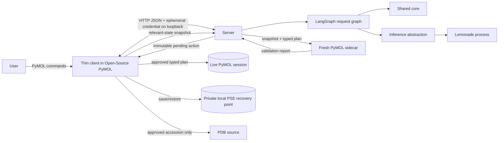
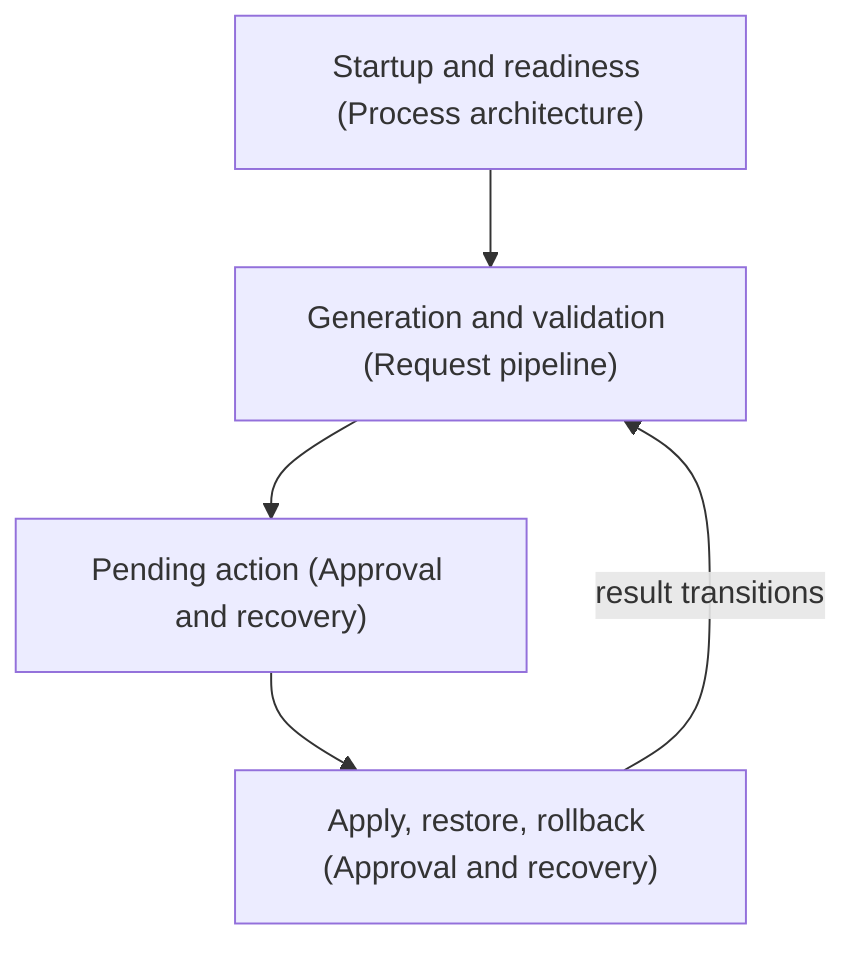

# Runtime Application and PyMOL Integration Design

**Status:** Draft — course-scope reconciliation pending re-acceptance
**Owner:** Hannah Kullik (`kullik01`)
**Reviewers:** Martin Urban (`urban233`)
**Brief:** [`SPECIFICATION.md`](../../../../SPECIFICATION.md)
**Last reviewed:** 2026-09-01

**Course-scope note (2026-09-01):** `SPECIFICATION.md`'s 2026-09-01 revision
rescoped V1 for a five-week, two-developer course deliverable: no formal
multi-platform qualification matrix (V1 runs on whichever machine(s) Martin
and Hannah use) and no external specialist review. The architecture below —
client, server, LangGraph, sidecar isolation, recovery — is unaffected;
only the qualification and review process changed. This document returns to
Draft until re-accepted against that revision.

## Summary

The V1 runtime is a local server application, not a monolithic PyMOL
plugin. A thin client loaded into Open-Source PyMOL exposes the command
interface and is the only component allowed to read or mutate the live
session. A separately managed server process owns LangGraph, request
state, shared-core clients, local inference orchestration, sidecar
validation, and diagnostics.

The runtime covers three independently reviewable areas, each with its own
design document:

1. [Process architecture](process-architecture.md) -- the client, the
   server lifecycle, the authenticated loopback transport between them,
   and the session and request registry. Needs cross-platform startup and
   isolation evidence.
2. [Request pipeline](request-pipeline.md) -- the LangGraph graph, local
   inference through Lemonade, and fresh-sidecar validation of every
   attempt. Needs real-engine conformance evidence.
3. [Approval and recovery](approval-and-recovery.md) -- pending actions,
   controlled PDB (Protein Data Bank) fetch, apply, automatic restore, and
   manual rollback.

This parent design owns what binds the three together: the process and trust
boundary, the no-live-mutation invariant, local diagnostics, and demo
readiness (see `SPECIFICATION.md`'s Demo readiness, rollback, and cleanup).

The single safety invariant behind all three is that no model output reaches
the live session before parser, policy, sidecar, session-freshness, and
user-approval checks all pass. The client is the sole live-session mutation
boundary, and it rechecks that invariant independently of the server.

This design consumes the contracts in
[`Shared Core and Contracts Design`](../shared-core/design.md) and does not
redefine them. The accepted specification remains authoritative for product
scope and safety invariants.

## Goals and non-goals

These are the cross-cutting goals and non-goals that constrain more than one
child design. Each child design linked in the Summary states the goals and
non-goals specific to its own area.

### Goals

- Ensure no model output reaches the live session before parser, policy,
  sidecar, session-freshness, and user-approval checks all pass.
- Produce actionable local diagnostics without remote telemetry or raw
  session data retention.

### Non-goals

- A V1 panel, editable plan, open-ended conversation, or token streaming.
- Supporting Incentive PyMOL.
- Multiple simultaneous requests, pending plans, or rollback points per
  PyMOL session.
- Deciding whether a plan matches the user's scientific intent.
- Defining shared plan, policy, card, grammar, error, or execution semantics.
- Cloud fallback or remote diagnostics.

## Current system and evidence

No runtime product code or test environment currently exists in the
repository. The accepted specification fixes these runtime decisions:

- a separate server process with a thin PyMOL client;
- LangGraph from V1;
- Lemonade as the first inference adapter;
- Open-Source PyMOL only;
- command-only V1 interaction through `cmd.extend()`;
- explicit plan-ID approval rather than blocking stdin;
- controlled pre-fetch rather than model-generated fetch;
- exact sidecar fidelity or fail-closed apply;
- automatic restore and one-level manual rollback; and
- CPU and iGPU (integrated GPU) first runtime on evidence-qualified candidate
  platforms.

Each child design cites the subset of these decisions it must satisfy.

Unverified repository assumptions remain around Lemonade grammar behavior,
PyMOL command-thread responsiveness, cross-platform process management,
live-state export, and `.pse` (PyMOL session file) restore fidelity. They are
design acceptance evidence, not implementation details to assume away.

## Proposed design

Each child design records its own components, flow, contracts, and
alternatives -- see the linked document for that detail. This section covers
the one cross-cutting component, the trust boundary between the three areas,
and how a request crosses them.

### Components and ownership

Hannah owns every runtime component, and every one of them is new. The apply
and recovery controller in [Approval and recovery](approval-and-recovery.md)
requires accepted safety evidence.

The cross-cutting component below belongs to no single child:

| Component | Responsibility |
|---|---|
| Local diagnostics | Record versions, stage timings, bounded reason codes, and redacted support evidence |

The child designs contribute the remaining twelve components:

| Design | Components |
|---|---|
| [Process architecture](process-architecture.md) | PyMOL client, server lifecycle manager, loopback protocol, session and request registry |
| [Request pipeline](request-pipeline.md) | LangGraph request graph, inference abstraction, Lemonade adapter, snapshot exporter, sidecar manager |
| [Approval and recovery](approval-and-recovery.md) | Pending-action renderer, controlled fetch controller, apply and recovery controller |

### Process and trust boundaries

The diagram shows which processes exist and which of them may touch the live
session. The detailed flow inside each area is in the linked child design.

The client trusts only version-compatible, authenticated server responses
and shared-core typed artifacts. The server treats user intent, model
output, engine output, snapshots, and sidecar output as untrusted until their
respective schemas and contracts pass. Lemonade never receives authority to
call tools or the client.

The client is the sole live-session mutation boundary. The server can
request that a typed approved operation be performed, but the client
independently rechecks session, plan, policy, manifest, and approval state.

### Data and control flow

One request crosses all three areas in a fixed order. Each child design
carries the numbered steps for its own part.

Apply and rollback are client-owned consequential operations outside the
model loop; their results are recorded back into server request state.

### APIs and contracts

The runtime defines ten contracts, all owned by Hannah, and each is
documented in the child design that owns it:

- [Process architecture](process-architecture.md#apis-and-contracts) --
   PyMOL command surface, client-server protocol, session registration.
- [Request pipeline](request-pipeline.md#apis-and-contracts) -- Copilot
  request, inference abstraction, sidecar invocation.
- [Approval and recovery](approval-and-recovery.md#apis-and-contracts) --
  pending action, controlled fetch action, apply result, recovery point.

## Alternatives and trade-offs

Each child design records the alternatives specific to its own area: see
[Process architecture](process-architecture.md#alternatives-and-trade-offs),
[Request pipeline](request-pipeline.md#alternatives-and-trade-offs), and
[Approval and recovery](approval-and-recovery.md#alternatives-and-trade-offs).

## Quality and risk

- **Security/privacy:** Diagnostics do not log raw intents or structure
  context by default. Each child design covers the controls for its own
  area; see
  [Process architecture](process-architecture.md#quality-and-risk),
  [Request pipeline](request-pipeline.md#quality-and-risk), and
  [Approval and recovery](approval-and-recovery.md#quality-and-risk).
- **Reliability/concurrency:** Every child process the runtime owns has
  finite readiness and request deadlines, explicit cancellation, and
  unconditional teardown.
- **Observability/capacity/cost:** Local structured events record
  correlation and contract/model versions, stage timings, state transitions,
  typed failures, and resource use without sensitive payloads. CPU, iGPU,
  memory, model, sidecar, and `.pse` costs are measured on named laboratory
  hardware before support claims.
- **Accessibility/internationalization:** V1 uses the PyMOL command console
  and therefore inherits its accessibility limits. Output must remain plain
  text, keyboard-operable, ordered, copyable, and free of color-only
  meaning. Commands and numeric syntax are locale-independent; user-facing
  explanation may retain Unicode. The V2 panel must consume the same
  contracts rather than replacing safety behavior.

## Test strategy

These suites span all three child areas. Each child design also has its own
area-specific test list.

- No-live-mutation property tests across parse, policy, model, sidecar,
  fetch rejection, cancellation, expiry, user rejection, and server
  failure paths.
- Sabotage tests proving the no-mutation suite detects live writes.

## Migration, rollout, rollback, and cleanup

No installed V1 runtime exists to migrate. The first thin vertical slice
ends at plan rendering without apply. Controlled fetch, apply, and rollback
remain unreachable until shared-core, sidecar-fidelity, and `.pse` recovery
evidence is accepted.

Runtime evidence is recorded per exact combination of operating system,
Open-Source PyMOL, Python, Lemonade, and model actually used for development
and the demo; there is no formal qualification matrix for this deliverable.
Failure on one developer's machine does not invalidate the other's. The
  server and model artifact are promoted as a compatible pair with their
shared-core manifest.
Runtime qualification proceeds per exact combination of operating system,
Open-Source PyMOL, Python, Lemonade, and model. Failure on one candidate does
not weaken another and may remove that platform from V1. The server and
model artifact are promoted as a compatible pair with their shared-core
manifest.

Application rollback restores the prior compatible client, server, shared
core, Lemonade configuration, and model set. Request rollback restores only
the one retained `.pse` recovery point. Server exit removes ephemeral
credentials, pending actions, sidecars, and scratch snapshots. Recovery files
are deleted when consumed, replaced, explicitly discarded, or the owning
PyMOL session ends.

No release step enables apply by configuration alone; apply availability is a
result of passing compatibility, security, sidecar, and recovery readiness
checks.

## Open questions

The question below blocks more than one child design. A question specific to
one area is recorded in that child design instead.

| Question | Owner | Evidence needed | Blocking? |
|---|---|---|---|
| What finite request, inference, sidecar, fetch, pending-action, and shutdown deadlines fit the measured laboratory-hardware envelope? | Hannah | Per-stage latency distribution and failure tests | No; values freeze before runtime release |

## Acceptance

- [ ] Material cross-cutting decisions resolved.
- [x] [Process architecture](process-architecture.md) is `Accepted`.
- [ ] [Request pipeline](request-pipeline.md) is `Accepted`.
- [x] [Approval and recovery](approval-and-recovery.md) is `Accepted`.
- [ ] Accountable human accepts planning against this revised design.
