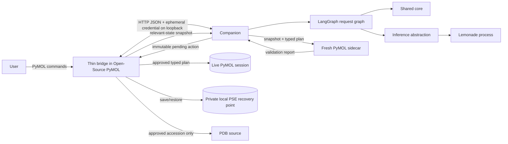

# Runtime Application and PyMOL Integration Design

**Status:** Draft
**Owner:** Hannah Kullik (`kullik01`)
**Reviewers:** Martin Urban (`urban233`); model-execution security reviewer to be named
**Brief:** [`SPECIFICATION.md`](../../../../SPECIFICATION.md)
**Last reviewed:** 2026-08-19

## Summary

The V1 runtime is a local companion application, not a monolithic PyMOL plugin.
A thin bridge loaded into Open-Source PyMOL exposes the command interface and is
the only component allowed to read or mutate the live session. A separately
managed companion process owns LangGraph, request state, shared-core clients,
local inference orchestration, sidecar validation, and diagnostics. Lemonade is
the first inference engine behind a narrow adapter and is itself managed as a
local process.

The recommended V1 process boundary is authenticated HTTP/JSON over an ephemeral
loopback port. It is portable across Windows, macOS, and Linux, keeps ML and
orchestration dependencies out of PyMOL's Python process, and permits contract
testing from both sides. The bridge starts one companion per PyMOL process and
uses an unguessable per-session credential delivered through the inherited
startup channel rather than a command-line argument or persistent file.

The runtime supports one active request, one immutable pending action, and one
`.pse` recovery point per PyMOL session. `copilot` never mutates the session.
`copilot_apply <id>` approves either a controlled fetch action or an already
validated plan. A fetch approval loads the requested accession and resumes the
original request, which still requires a second approval for its generated
plan. Apply creates a recovery snapshot, stops on the first command failure, and
automatically restores the snapshot. One explicit manual rollback remains
available after success.

This design consumes the contracts in
[`Shared Core and Contracts Design`](../shared-core/design.md) and does not
redefine them. The accepted specification remains authoritative for product
scope and safety invariants.

## Goals and non-goals

### Goals

- Keep LangGraph, inference, and most application dependencies outside the
  Open-Source PyMOL process.
- Provide a minimal cross-platform `cmd.extend()` bridge with an explicit,
  testable, two-command approval protocol.
- Manage Lemonade lifecycle and capability checks locally without remote or
  unconstrained fallback.
- Generate against one exact live-state snapshot and validate each attempt in a
  fresh disposable Open-Source PyMOL sidecar.
- Ensure no model output reaches the live session before parser, policy,
  sidecar, session-freshness, and user-approval checks all pass.
- Support controlled PDB fetching without allowing model-directed network
  destinations.
- Automatically restore the complete pre-apply `.pse` snapshot on partial apply
  failure and retain one manual rollback point after success.
- Produce actionable local diagnostics without remote telemetry or raw session
  data retention.

### Non-goals

- A V1 panel, editable plan, open-ended conversation, or token streaming.
- Running LangGraph or Lemonade inside PyMOL's Python process.
- Supporting Incentive PyMOL.
- Multiple simultaneous requests, pending plans, or rollback points per PyMOL
  session.
- Model-generated fetch, load, save, export, delete, extract, file paths, or
  molecular-data mutation.
- Deciding whether a plan matches the user's scientific intent.
- Defining shared plan, policy, card, grammar, error, or execution semantics.
- Cloud fallback or remote diagnostics.

## Current system and evidence

No runtime product code or test environment currently exists in the repository.
The accepted specification fixes these runtime decisions:

- a separate companion process with a thin PyMOL bridge;
- LangGraph from V1;
- Lemonade as the first inference adapter;
- Open-Source PyMOL only;
- command-only V1 interaction through `cmd.extend()`;
- explicit plan-ID approval rather than blocking stdin;
- controlled pre-fetch rather than model-generated fetch;
- exact sidecar fidelity or fail-closed apply;
- automatic restore and one-level manual rollback;
- CPU/iGPU-first runtime on evidence-qualified candidate platforms.

Unverified repository assumptions remain around Lemonade grammar behavior,
PyMOL command-thread responsiveness, cross-platform process management,
live-state export, and `.pse` restore fidelity. They are design acceptance
evidence, not implementation details to assume away.

## Proposed design

### Components and ownership

| Component | Responsibility | Owner | Existing or new |
|---|---|---|---|
| PyMOL bridge | Register commands, extract live state, render results, approve actions, execute typed plans, and save/restore sessions | Hannah | New |
| Companion lifecycle manager | Start, authenticate, health-check, and stop one companion for the owning PyMOL process | Hannah | New |
| Loopback protocol | Carry versioned local requests, results, cancellation, and apply outcomes between bridge and companion | Hannah | New |
| Session/request registry | Enforce one active request, one pending action, expiry, supersession, and contract identity | Hannah | New |
| LangGraph request graph | Coordinate deterministic preparation, bounded inference, parsing/policy, validation, repair, and terminal routing | Hannah | New |
| Inference abstraction | Expose capability discovery, bounded completion, cancellation, and typed local-engine errors | Hannah | New |
| Lemonade adapter | Manage the first local inference process and translate the engine protocol into the abstraction | Hannah | New |
| Snapshot exporter | Export relevant live state through the shared snapshot contract without model involvement | Hannah | New |
| Sidecar manager | Start a fresh Open-Source PyMOL process per attempt, load the snapshot, execute through the shared protocol, and terminate | Hannah | New |
| Pending-action renderer | Present exact fetch or plan actions, validation evidence, warnings, expiry, and approval commands | Hannah | New |
| Controlled fetch controller | Validate and apply an explicitly approved PDB accession before plan generation | Hannah | New |
| Apply/recovery controller | Recheck pending plan identity, save `.pse`, dispatch exact commands, auto-restore failure, and perform manual rollback | Hannah; security review required | New |
| Local diagnostics | Record versions, stage timings, bounded reason codes, and redacted support evidence | Hannah | New |

### Process and trust boundaries



The bridge trusts only version-compatible, authenticated companion responses and
shared-core typed artifacts. The companion treats user intent, model output,
engine output, snapshots, and sidecar output as untrusted until their respective
schemas and contracts pass. Lemonade never receives authority to call tools or
the bridge.

The bridge is the sole live-session mutation boundary. The companion can request
that a typed approved operation be performed, but the bridge independently
rechecks session, plan, policy, manifest, and approval state.

### Data and control flow

#### Startup and readiness

1. On first Copilot command, the bridge ensures that one companion exists for
   the current PyMOL process.
2. The bridge and companion establish an ephemeral credential through the
   inherited startup channel. The companion binds only to an ephemeral loopback
   address and reports its port through that channel.
3. The companion starts or connects only to its managed Lemonade child, verifies
   exact engine/model identity, and runs a grammar capability probe.
4. The bridge and companion exchange protocol and shared-contract manifests.
   Incompatibility leaves Copilot unavailable but does not affect PyMOL.

#### Loaded-object request

1. `copilot <intent>` resolves one target object deterministically. Ambiguity
   returns a non-mutating clarification.
2. The bridge exports the shared relevant-state snapshot and digest on the live
   PyMOL thread.
3. The companion creates immutable request state. LangGraph computes the card
   and grammar exactly once.
4. Inference produces restricted native plan text. Clarification and no-op forms
   are classified before parsing.
5. The shared parser and command policy produce an immutable allowed plan or a
   typed failure. Ordinary correctable failures may enter the bounded repair
   loop; hostile classes terminate immediately.
6. The sidecar manager starts a fresh PyMOL process, reconstructs the snapshot,
   checks fidelity, executes the typed plan, and returns validation evidence.
7. Only exact fidelity and a passing report can produce a pending plan. The
   companion assigns an opaque identifier and finite expiry. The bridge renders
   the canonical commands, counts, warnings, and what was not checked.
8. The live session remains unchanged.

#### Controlled fetch request

1. If no suitable object is loaded and the intent includes one syntactically
   valid PDB accession, preparation returns a pending fetch action containing
   only the accession and configured source identity.
2. `copilot_apply <fetch-id>` rechecks the pending action and displays that a
   network operation will occur. The bridge performs the fetch through the
   reviewed PyMOL API.
3. Fetch failure is terminal and produces no plan. Fetch success resumes the
   original request from target resolution with the loaded object.
4. The resulting generated plan receives a new plan identifier and requires a
   separate `copilot_apply` command.

#### Approval and apply

1. `copilot_apply <plan-id>` looks up exactly one immutable pending plan.
2. The bridge recomputes the relevant live digest and verifies session identity,
   expiry, model identity, contract manifest, and command policy. Any mismatch
   invalidates the plan without mutation.
3. The bridge writes a private, plan-associated `.pse` snapshot and verifies that
   the file exists and is readable before mutation begins.
4. The exact canonical typed plan is executed through the same shared dispatcher
   semantics used by the sidecar. No regeneration occurs.
5. On the first command failure, the bridge halts apply and restores the `.pse`.
   Copilot remains halted if restore or differential verification fails.
6. On success, the snapshot becomes the one manual recovery point. A subsequent
   successful apply replaces it.

#### Rejection, supersession, and rollback

- `copilot_reject <id>` consumes a matching pending action without mutation.
- A new `copilot` request cancels or supersedes prior pre-apply work and consumes
  the prior pending action.
- Companion restart, protocol change, model change, session change, or expiry
  invalidates pending actions.
- `copilot_rollback <plan-id>` is accepted only for the retained recovery point.
  It warns that the whole current session will be replaced and then restores and
  verifies the snapshot. Successful rollback consumes that recovery point.

### LangGraph state model

LangGraph contains only decisions that branch, terminate, or retry. Pure parsing,
policy, normalization, and rendering helpers remain ordinary shared-core or
runtime functions.

```text
received
  -> resolve_target
      -> fetch_pending | ask | snapshot
  -> prepare_context
  -> generate
      -> ask | noop | parse_and_policy
  -> validate_sidecar
      -> pending_plan
      -> repair -> generate
      -> failed
```

The graph permits one initial model call and at most two repair calls. An
ordinary denied command receives at most one repair; a hostile security class,
path/network escape, invalid manifest, or fidelity failure receives none. Apply
and rollback are bridge-owned consequential operations outside the model loop;
their result transitions are recorded back into companion request state.

### APIs and contracts

| API/contract | Owner | Consumers | Guarantees | Errors/timeouts | Compatibility | Test/fixture |
|---|---|---|---|---|---|---|
| PyMOL command surface | Hannah | User | `copilot` is non-mutating; apply/reject/rollback require exact opaque IDs | Unknown, stale, expired, or mismatched IDs fail without mutation | Additive command changes within V1; behavior change requires design review | Headless command fixtures and GUI-console smoke tests |
| Bridge-companion protocol | Hannah | Bridge, companion | Authenticated loopback-only JSON; request/session correlation; bounded payloads | Typed schema, auth, readiness, cancellation, and deadline failures | Same-major only after bidirectional fixtures; otherwise refuse readiness | Both-side contract suite plus wrong-token and version-mismatch probes |
| Session registration | Hannah | Bridge, companion | One bridge identity and one companion per PyMOL process | Duplicate or stale session rejected; no automatic cross-session reuse | Session protocol versioned with bridge protocol | Restart, duplicate, stale, and credential-rotation tests |
| Copilot request | Hannah | Bridge, LangGraph | Immutable intent, target hints, snapshot, contract manifest, and limits | Invalid snapshot/manifest/size fails before inference | Additive optional fields only with deterministic defaults | Golden loaded-object, ambiguity, no-object, and oversized requests |
| Pending action | Hannah | Companion, bridge | Opaque ID binds exact action, session digest, model/contracts, creation, and expiry | Lookup mismatch is terminal and consumes nothing else | Major change invalidates all outstanding actions | Stale session, restart, expiry, supersession, and tamper fixtures |
| Inference abstraction | Hannah | LangGraph, Lemonade adapter | Local bounded completion, grammar capability, cancellation, engine/model identity | Typed unavailable, timeout, cancelled, grammar-ignored, and malformed-response failures | Engine adapters may vary behind one semantic contract | Fake engine plus pinned Lemonade conformance suite |
| Sidecar invocation | Hannah | LangGraph, sidecar manager | Fresh process, exact snapshot reconstruction, shared execution protocol, unconditional termination | Spawn/load/fidelity/timeout/resource/execution failures; no internal retry | Shared snapshot/execution manifest must match | Process leak, state leak, fidelity, timeout, and forced-crash tests |
| Controlled fetch action | Hannah | Companion, bridge | Only validated accession and configured PDB source; separate approval | Rejection, timeout, not-found, checksum/load failure are terminal | Source-policy changes require privacy/security review | Known accession, malformed accession, wrong source, offline, and rejection tests |
| Apply result | Hannah | Bridge, companion | Exact command index outcomes; no command after first failure; restore status recorded | Apply failure triggers restore; restore failure halts Copilot | Must match pending-plan and execution contract versions | Successful apply, partial failure, restore success/failure, duplicate result tests |
| Recovery point | Hannah | Bridge, user | One private `.pse` bound to plan/session; automatic and manual restore semantics | Save/read/restore/digest errors are explicit; no silent continuation | PyMOL/version/platform-specific qualification required | Save/mutate/restore differentials on every supported matrix entry |

The protocol's exact HTTP paths are private implementation details. The message
schemas, guarantees, identity rules, and fixtures are architectural contracts.

## Alternatives and trade-offs

| Option | Benefits | Costs/risks | Decision |
|---|---|---|---|
| Run all runtime code inside PyMOL | Simplest communication and packaging | Dependency conflicts and failures share the user's PyMOL process | Rejected by specification; separate companion |
| Unix domain sockets | Filesystem permissions and no TCP listener | Inconsistent Windows behavior and cleanup | Rejected for V1 cross-platform baseline |
| Stdio for all bridge-companion traffic | No local listening socket | Harder persistent request correlation, cancellation, and recovery after stream corruption | Rejected; retain startup channel only |
| HTTP/JSON on loopback | Cross-platform libraries, inspectable fixtures, simple versioning | Requires authentication and strict bind checks | Recommended for V1 |
| User-managed model server | Less process-management code | Poor installation experience and uncontrolled endpoint/security properties | Rejected; companion manages Lemonade |
| Synchronous blocking `copilot` | Simple command semantics | May freeze PyMOL UI during CPU inference | Provisional V1 default pending reference-environment responsiveness evidence |
| Asynchronous request plus status command | Responsive UI and cancellation | Expands command protocol and PyMOL thread-safety surface | Fallback if synchronous command violates usability or platform behavior |
| Validate by reloading original file | Low serialization cost | Wrong for modified live objects | Rejected; exact live-state snapshot |
| Apply after static/degraded validation | Higher availability | Can act against untested state | Rejected; fail closed |
| Let model emit `fetch` | Natural-looking single plan | Model chooses network action before structure context exists | Rejected; deterministic separately approved fetch |
| No recovery snapshot | Less disk I/O | Partial apply can leave uncertain state | Rejected; `.pse` save and restore required |

## Quality and risk

- **Security/privacy:** The bridge is a high-trust component and must remain
  minimal. It accepts only authenticated, version-compatible typed artifacts and
  independently rechecks policy. The companion binds only to loopback, uses an
  ephemeral credential, never exposes a remote model fallback, and does not log
  raw intents or structure context by default. Fetch is the only ordinary
  external runtime network operation and requires separate approval.
- **Reliability/concurrency:** One active request and pending action prevent
  ordering ambiguity. Every child process has finite readiness and request
  deadlines, explicit cancellation, and unconditional teardown. Retries are
  bounded in LangGraph and never cross apply. Restore failure halts all further
  Copilot actions.
- **Observability/capacity/cost:** Local structured events record correlation and
  contract/model versions, stage timings, state transitions, typed failures, and
  resource use without sensitive payloads. CPU/iGPU, memory, model, sidecar, and
  `.pse` costs are measured on named laboratory hardware before support claims.
- **Accessibility/internationalization:** V1 uses the PyMOL command console and
  therefore inherits its accessibility limits. Output must remain plain text,
  keyboard-operable, ordered, copyable, and free of color-only meaning. Commands
  and numeric syntax are locale-independent; user-facing explanation may retain
  Unicode. The V2 panel must consume the same contracts rather than replacing
  safety behavior.

## Test strategy

- Unit tests for LangGraph routing, retry caps, state identity, expiry,
  supersession, cancellation, and restoration halt behavior.
- Bidirectional bridge-companion schema and compatibility fixtures.
- Wrong-token, non-loopback-bind, oversized-payload, replay, stale-session, and
  version-mismatch security tests.
- Fake-engine tests for every inference error and real Lemonade tests for model
  identity, grammar enforcement, timeout, cancellation, and malformed responses.
- Headless Open-Source PyMOL command tests for `copilot`, apply, reject, and
  rollback behavior.
- GUI-console smoke tests on each candidate platform, including command
  responsiveness during representative inference.
- Fresh-sidecar lifecycle, process-leak, state-leak, snapshot-fidelity, timeout,
  crash, and resource-bound tests.
- No-live-mutation property tests across parse, policy, model, sidecar, fetch
  rejection, cancellation, expiry, user rejection, and companion failure paths.
- End-to-end controlled fetch with approved accession and no generation before
  successful load.
- Deliberate partial apply followed by automatic `.pse` restore and complete
  session differential verification.
- Manual rollback after successful apply, including warning and later-session-
  change behavior.
- Sabotage tests proving the no-mutation and recovery suites detect live writes
  and incomplete restore.
- Per-stage p50/p95 and peak memory on every supported platform entry.

## Migration, rollout, rollback, and cleanup

There is no installed V1 runtime to migrate. The first thin vertical slice ends
at plan rendering without apply. Controlled fetch, apply, and rollback remain
unreachable until shared-core, sidecar-fidelity, and `.pse` recovery evidence is
accepted.

Runtime qualification proceeds per exact OS/Open-Source PyMOL/Python/Lemonade/
model combination. Failure on one candidate does not weaken another and may
remove that platform from V1. The companion and model artifact are promoted as
a compatible pair with their shared-core manifest.

Application rollback restores the prior compatible bridge, companion, shared
core, Lemonade configuration, and model set. Request rollback restores only the
one retained `.pse` recovery point. Companion exit removes ephemeral credentials,
pending actions, sidecars, and scratch snapshots. Recovery files are deleted
when consumed, replaced, explicitly discarded, or the owning PyMOL session ends.

No release step enables apply by configuration alone; apply availability is a
result of passing compatibility, security, sidecar, and recovery readiness
checks.

## Open questions

| Question | Owner | Evidence needed | Blocking? |
|---|---|---|---|
| Does Lemonade expose enforceable per-request grammar, cancellation, model identity, and CPU/iGPU behavior on the reference environment? | Hannah | Pinned real-engine conformance report | Yes, before Lemonade adapter acceptance |
| Is authenticated loopback HTTP available and sufficiently isolated in every candidate Open-Source PyMOL environment? | Hannah | Cross-platform startup, bind, credential, firewall, and teardown probes | Yes, before protocol acceptance |
| Can `copilot` wait synchronously without unacceptable GUI freezing or unsafe PyMOL threading behavior? | Hannah | GUI-console responsiveness tests with representative model latency | Yes, before command-flow acceptance; asynchronous status flow is the fallback |
| Which live-state serialization and reconstruction path passes exact fidelity on modified, multi-state, and altloc-bearing objects? | Hannah | Shared-core snapshot differential evidence | Yes, before sidecar design acceptance |
| Does `.pse` restore produce complete session equality after deliberate partial application on each candidate platform? | Hannah | Recovery differential and sabotage report | Yes, before apply/recovery design acceptance |
| What finite request, inference, sidecar, fetch, pending-action, and shutdown deadlines fit the measured laboratory-hardware envelope? | Hannah | Per-stage latency distribution and failure tests | No; values freeze before runtime release |
| Who is the independent model-execution security reviewer? | Martin | Named reviewer and recorded availability | Yes, before apply/recovery design is Accepted |

## Acceptance

- [ ] Material decisions resolved.
- [ ] Required domain reviews complete.
- [ ] Accountable human accepts planning against this design.
