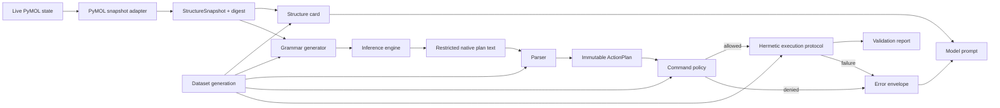

# Shared Core and Contracts Design

**Status:** Draft
**Owner:** Martin Urban (`urban233`), accountable; shared with Hannah Kullik (`kullik01`)
**Reviewers:** Hannah Kullik; model-execution security reviewer to be named
**Brief:** [`SPECIFICATION.md`](../../../../SPECIFICATION.md)
**Last reviewed:** 2026-08-19

## Summary

The shared core is the single lightweight authority for every representation and
rule whose divergence could create train/serve skew or a command-execution
bypass. It defines and implements the restricted native-plan language, typed
plan, default-deny command policy, structure snapshot and card, grammar, error
envelope, compatibility manifest, and contract fixtures. It also defines the
hermetic execution protocol consumed by both model development and the runtime,
without importing training frameworks, LangGraph, Lemonade, or user-interface
dependencies.

The recommended boundary is a runtime-safe shared package with pure contract
logic wherever possible and narrow Open-Source PyMOL adapters where semantics
must be observed from PyMOL. Martin is accountable for the core because model
data is invalid if its contracts drift; Hannah co-owns every runtime-facing
contract and independently reviews Martin-owned changes.

This design elaborates the accepted specification. If it conflicts with
`SPECIFICATION.md`, the specification wins and this design returns to Draft.

## Goals and non-goals

### Goals

- Give runtime and model-development code one importable implementation of all
  shared semantic and security contracts.
- Preserve native restricted `.pml` as model output while exposing an immutable
  typed plan for policy, display, validation, approval, and execution.
- Make default-deny command and argument policy deterministic and testable
  without invoking the model.
- Ensure equivalent structure state produces byte-identical cards and compatible
  grammars in data generation and runtime inference.
- Normalize real Open-Source PyMOL failures into a versioned model-facing error
  envelope shared by repair data and runtime repair.
- Define explicit compatibility metadata so an application cannot load an
  incompatible model, grammar, parser, card, error, or policy version.
- Supply contract and adversarial fixtures that let Martin and Hannah work in
  parallel without implementing local substitutes.

### Non-goals

- LangGraph orchestration, local process lifecycle, approval UX, fetch, apply,
  or rollback; these belong to the runtime design.
- Dataset generation, oracle category implementations, training loops, model
  selection, or quantization; these belong to the model-development design.
- A general PyMOL parser or command framework. Only the accepted V1 language is
  supported.
- A security policy expressed as a denylist. Unknown syntax and behavior are
  denied by default.
- Stable private classes, file layout, or implementation algorithms.
- ADR creation. Decisions local to these three subsystem designs remain here.

## Current system and evidence

The repository has no current product implementation, tests, package manifest,
or production compatibility burden. The accepted specification establishes:

- native restricted `.pml` plus deterministic typed parsing;
- one shared core independent of runtime and training frameworks;
- default-deny policy enforced in data, grammar, sidecar, and live apply paths;
- versioned structure snapshot, card, grammar, plan, policy, error, and model
  compatibility contracts;
- exact relevant-state fidelity as a precondition for apply;
- a normalized error envelope instead of unversioned raw exception strings;
- Open-Source PyMOL as the only PyMOL target;
- Windows, macOS, and Linux as candidate, not automatically supported,
  environments.

The supplied earlier planning notes contain useful hypotheses about card fields,
command coverage, parser behavior, PyMOL error handling, and oracle semantics,
but they are not repository authority. Every PyMOL-specific claim must be
re-established against a pinned Open-Source PyMOL build.

## Proposed design

### Components and ownership

| Component | Responsibility | Owner | Existing or new |
|---|---|---|---|
| Contract manifest | Record mutually compatible contract versions and expose a single compatibility decision | Martin | New |
| Restricted plan language | Define the V1 native command subset and canonical source representation | Martin | New |
| Parser and serializer | Convert native plan text to an immutable typed plan and back without semantic loss | Martin | New |
| Command policy | Decide whether each typed operation and argument is permitted, denied, or structurally invalid | Martin; security review required | New |
| Structure snapshot contract | Canonically describe plan-relevant live object state and the digest equality claim | Hannah | New |
| Structure card | Produce deterministic model context from a structure snapshot | Martin | New |
| Grammar generator | Produce syntax grammar and measured structure-conditioned restrictions from the same contracts | Hannah | New |
| Error envelope | Normalize parser, policy, PyMOL, timeout, and resource failures for repair and diagnostics | Martin | New |
| Execution protocol | Define command-by-command hermetic execution, limits, and validation report semantics | Martin | New |
| Contract fixture corpus | Supply positive, negative, adversarial, parity, and version-compatibility examples to every consumer | Joint | New |

Ownership of a component means responsibility for its semantics and compatibility
evidence, not permission to approve one's own change. The other subsystem owner
reviews every shared-contract change. Command-policy expansion additionally
requires the named security reviewer.

### Data and control flow

The PyMOL adapter extracts a snapshot; no consumer builds a structure card
directly from ad hoc PyMOL queries. The card and grammar are pure functions of a
versioned snapshot plus their configuration. Model text is untrusted until the
canonical parser and command policy accept it. Only typed plans enter the
executor. Every repair error is produced by the same envelope normalizer used to
build repair trajectories.

The shared core does not decide whether a validated plan may be applied. It
returns evidence and policy decisions to the runtime, which owns user authority
and session identity.

### Contract model

#### Contract manifest

Every model and application artifact carries a manifest with at least:

- manifest schema version;
- restricted-plan/parser version;
- command-policy version;
- structure-snapshot and structure-card versions;
- grammar version;
- error-envelope version;
- prompt/tokenizer identity where the model depends on them;
- minimum and maximum compatible consumer versions.

Compatibility is checked at application readiness, not after a request starts.
Unknown or incompatible versions fail closed with an actionable local error.

#### Structure snapshot and digest

The snapshot is the authoritative cross-process representation of the state
relevant to V1 selection, display, orientation, measurement, and validation. Its
schema must identify object and state identity, atom identity and coordinates,
chain/residue/atom metadata, altlocs, polymer and hetero classification, and any
additional field whose absence could change a supported command's result.

Digest equality guarantees equality only over the declared relevant-state
schema. Adding a supported command that depends on another field requires a
snapshot schema review before command-policy expansion. Export failure or an
unknown required field makes the snapshot inapplicable; it never produces a
weaker “exact” claim.

#### Structure card

The card is compact, deterministic model context generated from the snapshot.
Its stable field order and escaping are part of the model contract. Bounded
truncation must be explicit in the card so the model can clarify rather than
silently assume omitted content. Token size is measured but cannot justify
dropping fields required for correctness.

#### Restricted plan and typed action plan

The parser accepts only complete V1 commands and argument forms. It resolves
case, whitespace, quoting, continuation, comment, comma, and implicit-selection
semantics before policy evaluation. Parsed operations retain enough canonical
information to render exactly what will execute and to reproduce command-indexed
errors.

The parser is total over arbitrary text: it returns an action plan or a typed
parse error and never dispatches partial output. Canonical serialization is
idempotent. A truncated or partially valid plan is rejected rather than partly
executed.

#### Command policy

Policy is evaluated on typed operations, never raw substrings. The V1 policy
allows only reviewed non-destructive selection, display, orientation,
measurement, constrained-label, and safe-setting forms. Argument policy is as
important as verb policy: settings, label templates, paths, expressions,
dimensions, and namespaces are separately constrained.

Controlled PDB fetch is not part of the model plan policy. It is a runtime-owned
application action with its own approval and validation.

#### Grammar

The syntax grammar must generate only parser-recognized language. A
structure-conditioned specialization may restrict real chains, residue names,
and residue ranges only when the snapshot represents those values completely.
Grammar is a generation aid, not an authorization boundary. Parser and policy
remain authoritative when grammar is unavailable or bypassed; the shipping
runtime nevertheless refuses an engine that claims grammar support but ignores
the supplied grammar.

#### Error envelope

The envelope contains a version, source category, command index where
applicable, canonical verb, normalized error category, bounded normalized
Open-Source PyMOL message, and retry classification. It excludes unstable
process noise and paths. Human-facing diagnostics may add explanation outside
the model-facing envelope but cannot alter bytes used for repair.

#### Execution and validation report

The execution protocol accepts a compatible typed plan, exact snapshot, and
finite resource limits. It executes command by command through reviewed PyMOL
APIs in a fresh process and returns per-command outcomes, selection counts,
warnings, timing, resulting fingerprints, and a fidelity claim. It does not
claim that the plan matches scientific intent.

### APIs and contracts

| API/contract | Owner | Consumers | Guarantees | Errors/timeouts | Compatibility | Test/fixture |
|---|---|---|---|---|---|---|
| `ContractManifest` | Martin | Companion, model packager, dataset tooling | One deterministic compatibility verdict before use | Missing/unknown version is incompatible; no retry | Same-major only where fixtures prove it; otherwise exact version | Compatible/incompatible artifact matrix |
| `StructureSnapshotV1` and digest | Hannah | Card, grammar, sidecar, bridge | Canonical relevant state; digest equality has documented scope | Extraction or unsupported-state error; bounded export | Additive fields require canonical defaults; semantic field changes require major version | Moved-atom, altloc, state, hetero, and omission differentials |
| `structure_card(snapshot)` | Martin | Prompt builder, dataset generator | Deterministic, byte-stable card for equivalent snapshots | Explicit unsupported/truncated markers; no hidden omission | Format change requires version and model impact decision | Golden cards plus symbol/byte parity from both consumers |
| `grammar_for(snapshot, policy)` | Hannah | Lemonade adapter, baseline runner | Generated language is parser-compatible; conditioning uses complete fields only | Capability/unsupported-conditioning result; finite construction time | Version recorded in model/eval manifest | Grammar generation to parser property corpus |
| `parse(native_plan)` and canonical serialization | Martin | Companion, dataset filter, executor | Total parse; immutable typed plan; idempotent canonical form | Typed indexed parse error; no partial plan | Additive syntax only after fixtures and policy review | Round-trip, fuzz, truncation, comment, quoting, and comma corpus |
| `evaluate_policy(plan)` | Martin | Companion, sidecar, dataset filter | Default deny; deterministic per-operation decision and reason | Typed denial; never retry hostile classes | Expansion requires security review and new model evaluation | Shared adversarial corpus run with grammar disabled |
| `ErrorEnvelopeV1` | Martin | Runtime repair, repair-data generator | Same normalized model-facing bytes across development and runtime | Unknown category is bounded and explicit | Major change requires repair-data regeneration or proved adapter | Captured real-error byte parity fixtures |
| Hermetic execution protocol | Martin | Dataset/oracle system, runtime sidecar | Fresh process, finite resources, command-indexed outcomes, deterministic evidence where declared | Timeout/resource/PyMOL errors; process is terminated; no internal retry | Protocol version in manifest; report changes are additive only when safe | Isolation, repeatability, timeout, resource, and sabotage fixtures |

## Alternatives and trade-offs

| Option | Benefits | Costs/risks | Decision |
|---|---|---|---|
| Independent runtime and training implementations | Teams can move without shared package coordination | Silent train/serve skew and duplicated security bugs | Rejected; one shared core |
| Put shared contracts in the training package | Data tooling is their first consumer | Reverses runtime dependency and risks importing ML frameworks | Rejected; runtime-safe independent core |
| JSON as model output | Direct typed decoding | Larger token cost, weaker small-model prior, brittle truncation | Rejected by specification; native restricted `.pml` plus parser |
| Raw-text allow/deny checks | Easy initial implementation | Obfuscation and parser differential vulnerabilities | Rejected; policy consumes typed operations |
| Denylist with permissive unknown commands | Broad PyMOL coverage | Unknown PyMOL functionality becomes executable | Rejected; explicit default deny |
| Raw PyMOL exception text as repair contract | Maximum fidelity to one observed build | Unstable across contexts and versions; silent repair skew | Rejected; normalized versioned envelope retaining bounded real message |
| Reload original file for structure context | Simple and fast | Ignores in-memory edits and states | Rejected; live relevant-state snapshot |
| Grammar as security boundary | Reduces downstream checks | Engines can ignore grammar and grammars cannot express all semantic policy | Rejected; grammar supplements parser and policy |

## Quality and risk

- **Security/privacy:** All model and teacher output is untrusted. The parser is
  total, policy is default deny, and contract fixtures run without grammar.
  Snapshot and error fixtures must not retain unpublished user structures.
  Command expansion requires security review.
- **Reliability/concurrency:** Contract functions are deterministic and free of
  shared mutable request state. Version checks happen before requests. The
  executor protocol requires a fresh process per attempt and owns termination
  evidence. Retries are orchestration decisions outside the core.
- **Observability/capacity/cost:** Results expose bounded typed reasons, timings,
  and contract versions without raw sensitive payloads by default. Card and
  grammar construction budgets are measured on representative structures.
  Core import cost must remain appropriate for PyMOL and companion environments.
- **Accessibility/internationalization:** The core preserves Unicode intent only
  outside executable syntax. Plan rendering exposes canonical commands and
  stable reason codes so clients can provide accessible wording later. V1
  executable grammar is locale-independent.

## Test strategy

- Golden and property tests for every canonical representation.
- Differential tests against pinned Open-Source PyMOL for syntax and semantics
  the core claims to reproduce.
- Parser fuzzing, truncation, mutation, and resource-bound tests.
- Shared adversarial corpus covering Python-evaluating commands, namespaces,
  quoting, comments, line continuations, command case, label expressions, and
  unknown verbs.
- Grammar-generated plans parsed and policy-checked at scale.
- Snapshot and card parity across runtime and dataset call paths.
- Error-envelope byte parity over captured real Open-Source PyMOL errors.
- Executor repeatability, process-leak, state-leak, timeout, and memory-limit
  tests.
- Sabotage tests that disable policy, alter a card separator, invert a digest
  field, or corrupt an error category and prove the relevant suite fails.
- Compatibility-matrix tests for application/model manifests.

## Migration, rollout, rollback, and cleanup

There is no prior production contract to migrate. Initial contract versions
remain Draft until both consuming subsystems pass their fixtures. A contract may
be frozen for model-data production only after Martin and Hannah accept the
exact fixture corpus and the security reviewer accepts command policy.

Model-development and runtime consumers first integrate against fixtures, then
against the same package artifact. No duplicated stub namespace may survive
integration. Contract changes after data generation require an explicit impact
decision: regenerate affected data and models, provide a parity-proven adapter,
or reject the change.

Rollback pairs the last supported core package with its compatible application,
dataset, and model manifests. Obsolete adapters and fixtures are removed only
after no supported artifact references them. Test snapshots and captured errors
are deleted or minimized according to their provenance and privacy classification.

## Open questions

| Question | Owner | Evidence needed | Blocking? |
|---|---|---|---|
| Which Open-Source PyMOL tokenization/parsing facilities are safe to reuse, and where is a dedicated tokenizer required? | Martin | Spike against the accepted positive and adversarial syntax corpus | Yes, before parser design acceptance |
| What exact constrained-label forms avoid PyMOL expression evaluation while serving V1 workflows? | Martin | Real PyMOL behavior probes plus security review | Yes, before command-policy acceptance |
| Which serialization preserves every relevant field for modified, multi-state, and altloc-bearing objects across candidate platforms? | Hannah | Snapshot round-trip differential report | Yes, before snapshot-contract acceptance |
| Can structure-conditioned residue restrictions remain compact without rejecting insertion codes, gaps, or valid ranges? | Hannah | Grammar prototypes over representative structure fixtures | No; syntax-only grammar is the bounded fallback for unsupported conditioning |
| Who is the independent model-execution security reviewer? | Martin | Named reviewer and recorded availability | Yes, before command-policy and execution contracts are Accepted |

## Acceptance

- [ ] Material decisions resolved.
- [ ] Required domain reviews complete.
- [ ] Accountable human accepts planning against this design.
