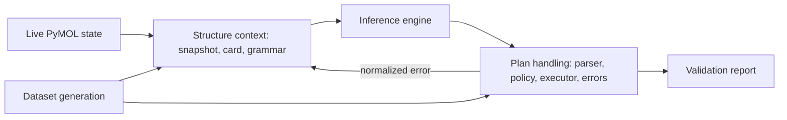

# Shared Core and Contracts Design

**Status:** Draft
**Owner:** Martin Urban (`urban233`), accountable; shared with Hannah Kullik (`kullik01`)
**Reviewers:** Hannah Kullik (`kullik01`)
**Brief:** [`SPECIFICATION.md`](../../../../SPECIFICATION.md)
**Last reviewed:** 2026-08-22

## Summary

The shared core is the single lightweight authority for every representation
and rule whose divergence could create train/serve skew or a
command-execution bypass. The recommended boundary is a runtime-safe shared
package that holds pure contract logic wherever possible and narrow
Open-Source PyMOL adapters only where semantics must be observed from PyMOL.
It imports no training framework, no LangGraph, no Lemonade, and no
user-interface dependency.

The core covers two independently reviewable contract areas, each with its
own design document:

1. [Plan language, policy, and execution](plan-and-execution.md) -- turns
   untrusted model text into an authorized typed plan, executes that plan
   under hermetic limits, and normalizes every failure.
2. [Structure context](structure-context.md) -- turns live PyMOL state into
   the deterministic model context and the generation grammar. Needs
   Hannah's PyMOL-fidelity evidence.

This parent design owns what binds the two together: the component map, the
end-to-end flow, the compatibility manifest that every artifact carries, and
the shared fixture corpus both children publish to.

Martin is accountable for the core because model data is invalid if its
contracts drift. Hannah co-owns every runtime-facing contract and
independently reviews Martin-owned changes.

This design elaborates the accepted specification. If it conflicts with
`SPECIFICATION.md`, the specification wins and this design returns to Draft.

## Goals and non-goals

These are the cross-cutting goals and non-goals that constrain both child
designs. Each child design linked in the Summary states the goals and
non-goals specific to its own contract area.

### Goals

- Give runtime and model-development code one importable implementation of
  all shared semantic and security contracts.
- Define explicit compatibility metadata so an application cannot load an
  incompatible model, grammar, parser, card, error, or policy version.
- Supply contract and adversarial fixtures that let Martin and Hannah work in
  parallel without implementing local substitutes.

### Non-goals

- LangGraph orchestration, local process lifecycle, approval user
  experience, fetch, apply, or rollback; these belong to the
  [`Runtime Application Design`](../runtime-application/design.md).
- Dataset generation, oracle category implementations, training loops, model
  selection, or quantization; these belong to the
  [`Dataset, Model Training, and Evaluation Design`](../model-development/design.md).
- Stable private classes, file layout, or implementation algorithms.
- ADR (Architecture Decision Record) creation. Decisions local to these three
  subsystem designs remain here.

## Current system and evidence

The repository has no current product implementation, tests, package
manifest, or production compatibility burden. The accepted specification
establishes:

- native restricted `.pml` plus deterministic typed parsing;
- one shared core independent of runtime and training frameworks;
- default-deny policy enforced in data, grammar, sidecar, and live apply
  paths;
- versioned structure snapshot, card, grammar, plan, policy, error, and model
  compatibility contracts;
- exact relevant-state fidelity as a precondition for apply;
- a normalized error envelope instead of unversioned raw exception strings;
- Open-Source PyMOL as the only PyMOL target; and
- Windows, macOS, and Linux as candidate, not automatically supported,
  environments.

Each child design cites the subset of these decisions it must satisfy.

The supplied earlier planning notes contain useful hypotheses about card
fields, command coverage, parser behavior, PyMOL error handling, and oracle
semantics, but they are not repository authority. Every PyMOL-specific claim
must be re-established against a pinned Open-Source PyMOL build.

## Proposed design

Each child design records its own components, flow, contracts, and
alternatives -- see the linked document for that detail. This section covers
the two cross-cutting components, how the child areas connect, and the
compatibility manifest they all carry.

### Components and ownership

Both components below are new; none of this exists in the repository today.
Martin owns the contract manifest, and Martin and Hannah jointly own the
fixture corpus.

| Component | Responsibility |
|---|---|
| Contract manifest | Record mutually compatible contract versions and expose a single compatibility decision |
| Contract fixture corpus | Supply positive, negative, adversarial, parity, and version-compatibility examples to every consumer |

The child designs contribute the remaining eight components:

| Design | Components | Required evidence |
|---|---|---|
| [Plan language, policy, and execution](plan-and-execution.md) | Restricted plan language, parser and serializer, command policy, error envelope, execution protocol | Command-policy safety evidence |
| [Structure context](structure-context.md) | Structure snapshot contract, structure card, grammar generator | PyMOL-fidelity evidence |

Ownership of a component means responsibility for its semantics and
compatibility evidence, not permission to approve one's own change. The other
subsystem owner reviews every shared-contract change.

### Data and control flow

The diagram shows only how the two child areas meet. Each child design
carries the detailed flow inside its own area.

Model text is untrusted until the canonical parser and command policy accept
it. The runtime and dataset generation call the same two areas over the same
contracts, which is what makes train/serve parity checkable rather than
assumed.

The shared core does not decide whether a validated plan may be applied. It
returns evidence and policy decisions to the runtime, which owns user
authority and session identity.

### Contract manifest

Every model and application artifact carries a manifest with at least:

- manifest schema version;
- restricted-plan and parser version;
- command-policy version;
- structure-snapshot and structure-card versions;
- grammar version;
- error-envelope version;
- prompt and tokenizer identity where the model depends on them; and
- minimum and maximum compatible consumer versions.

Compatibility is checked at application readiness, not after a request
starts. Unknown or incompatible versions fail closed with an actionable local
error.

### APIs and contracts

Martin owns the manifest contract below. Each child design documents the
contracts for its own area.

| Contract | Consumers | Compatibility policy |
|---|---|---|
| `ContractManifest` | Server, model packager, dataset tooling | Same-major only where fixtures prove it; otherwise exact version |

**`ContractManifest`**
- Guarantees: one deterministic compatibility verdict before use.
- Errors: a missing or unknown version is incompatible, with no retry.
- Test/fixture: compatible and incompatible artifact matrix.

## Alternatives and trade-offs

The options below concern the package boundary itself. Each child design
records the alternatives specific to its own area: see
[Plan language, policy, and execution](plan-and-execution.md#alternatives-and-trade-offs)
and [Structure context](structure-context.md#alternatives-and-trade-offs).

| Option | Benefits | Costs/risks | Decision |
|---|---|---|---|
| Independent runtime and training implementations | Teams can move without shared package coordination | Silent train/serve skew and duplicated security bugs | Rejected; one shared core |
| Put shared contracts in the training package | Data tooling is their first consumer | Reverses runtime dependency and risks importing ML frameworks | Rejected; runtime-safe independent core |

## Quality and risk

- **Security/privacy:** Snapshot and error fixtures must not retain
  unpublished user structures. Each child design covers the controls for its
  own area; see
  [Plan language, policy, and execution](plan-and-execution.md#quality-and-risk)
  and [Structure context](structure-context.md#quality-and-risk).
- **Reliability/concurrency:** Contract functions are deterministic and free
  of shared mutable request state. Version checks happen before requests.
- **Observability/capacity/cost:** Results expose bounded typed reasons,
  timings, and contract versions without raw sensitive payloads by default.
  Core import cost must remain appropriate for PyMOL and server
  environments.
- **Accessibility/internationalization:** Covered in
  [Plan language, policy, and execution](plan-and-execution.md#quality-and-risk),
  where executable syntax and plan rendering are defined.

## Test strategy

These suites span both child areas. Each child design also has its own
area-specific test list.

- Golden and property tests for every canonical representation.
- Differential tests against pinned Open-Source PyMOL for syntax and
  semantics the core claims to reproduce.
- Compatibility-matrix tests for application and model manifests.

## Migration, rollout, rollback, and cleanup

No prior production contract exists to migrate. Initial contract versions
remain Draft until both consuming subsystems pass their fixtures. A contract
may be frozen for model-data production only after Martin and Hannah accept
the exact fixture corpus and command-policy safety evidence.

Model-development and runtime consumers first integrate against fixtures,
then against the same package artifact. No duplicated stub namespace may
survive integration. A contract change after data generation requires an
explicit impact decision: regenerate the affected data and models, provide a
parity-proven adapter, or reject the change.

Rollback pairs the last supported core package with its compatible
application, dataset, and model manifests. Obsolete adapters and fixtures are
removed only after no supported artifact references them. Test snapshots and
captured errors are deleted or minimized according to their provenance and
privacy classification.

## Acceptance

- [ ] Material cross-cutting decisions resolved.
- [ ] [Plan language, policy, and execution](plan-and-execution.md) is `Accepted`.
- [ ] [Structure context](structure-context.md) is `Accepted`.
- [ ] Accountable human accepts planning against this design.
