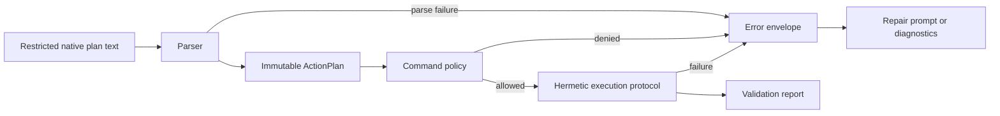

# Plan Language, Policy, and Execution Design

**Status:** Draft
**Owner:** Martin Urban (`urban233`)
**Reviewers:** Hannah Kullik (`kullik01`)
**Brief:** [`SPECIFICATION.md`](../../../../SPECIFICATION.md)
**Parent design:** [Shared Core and Contracts Design](design.md)
**Last reviewed:** 2026-09-09

**2026-09-09 reconciliation:** The parser and policy fixture are implemented,
but the shared fresh-process execution protocol is not. The existing
`pmc_data` verifier runs against a caller-supplied PyMOL process and cannot be
promoted into the runtime sidecar contract without an evidence-backed request,
report, limit, and teardown design. This document returns to `Draft` for that
bounded reconciliation.

## Summary

This design defines the path that untrusted model text takes to become an
executed, evidenced plan. It covers the restricted V1 command language, the
parser that turns text into an immutable typed plan, the default-deny command
policy that authorizes that plan, the hermetic protocol that executes it, and
the error envelope that normalizes every failure along the way.

Two rules carry most of the safety weight. The parser is total over arbitrary
text: it returns a typed plan or a typed parse error and never dispatches
partial output. Policy is evaluated on typed operations, never on raw
substrings, so obfuscation and parser differentials cannot reach the
executor.

This design consumes the structure context produced by
[Structure context](structure-context.md) and does not define it. Its
consumers are the runtime server, the runtime sidecar, and the
model-development dataset and oracle pipeline.

## Goals and non-goals

See the parent design's [Goals and non-goals](design.md#goals-and-non-goals)
for the goals and non-goals that constrain both children. This design adds:

### Goals

- Preserve native restricted `.pml` as model output while exposing an
  immutable typed plan for policy, display, validation, approval, and
  execution.
- Make default-deny command and argument policy deterministic and testable
  without invoking the model.
- Normalize real Open-Source PyMOL failures into a versioned model-facing
  error envelope shared by repair data and runtime repair.

### Non-goals

- A general PyMOL parser or command framework. Only the accepted V1 language
  is supported.
- A security policy expressed as a denylist. Unknown syntax and behavior are
  denied by default.

## Current system and evidence

The repository implements the restricted `select` and `color` plan, canonical
rendering, parser, and default-deny policy in `pmc_core`. `pmc_data` adds an
independent oracle and a caller-supplied real-PyMOL verifier. No shared
fresh-process executor, normalized execution-error envelope, resource-limit
contract, or sidecar report exists. See
the parent design's
[Current system and evidence](design.md#current-system-and-evidence) for the
accepted specification decisions this design must satisfy -- most directly,
native restricted `.pml` with deterministic typed parsing, default-deny
policy in every path, and a normalized error envelope in place of raw
exception strings.

## Proposed design

This section covers the five components between untrusted text and executed
evidence, the flow connecting them, and the four contracts other designs
depend on.

### Components and ownership

Martin owns every component below, and every one of them is new. Expanding
the command policy requires accepted security evidence.

| Component | Responsibility |
|---|---|
| Restricted plan language | Define the V1 native command subset and canonical source representation |
| Parser and serializer | Convert native plan text to an immutable typed plan and back without semantic loss |
| Command policy | Decide whether each typed operation and argument is permitted, denied, or structurally invalid |
| Error envelope | Normalize parser, policy, PyMOL, timeout, and resource failures for repair and diagnostics |
| Execution protocol | Define command-by-command hermetic execution, limits, and validation report semantics |

### Data and control flow

The diagram starts at the text an inference engine emits and ends at either a
validation report or a normalized error. It does not cover how the structure
card and grammar that shaped that text were built; see
[Structure context](structure-context.md#data-and-control-flow).



Only typed plans enter the executor. Every repair error is produced by the
same envelope normalizer used to build repair trajectories, which is what
lets a runtime repair loop and a training repair trajectory see identical
bytes.

### Restricted plan and typed action plan

The parser accepts only complete V1 commands and argument forms. It resolves
case, whitespace, quoting, continuation, comment, comma, and
implicit-selection semantics before policy evaluation. Parsed operations
retain enough canonical information to render exactly what will execute and
to reproduce command-indexed errors.

Canonical serialization is idempotent. A truncated or partially valid plan is
rejected rather than partly executed.

#### Initial implementation fixture

The initial implementation accepts native PyMOL `.pml` command syntax and
permits only `select` and `color`. A plan creates one named selection and then
applies one color to that selection. No other verb, label form, setting,
expression capability, or implicit execution behavior is part of this fixture.
The parser and policy reject every form outside the recorded fixture.

For the initial implementation, a dedicated restricted tokenizer and parser
owns this boundary; it does not delegate untrusted text to PyMOL parsing
facilities. It accepts only the exact selection expression `chain A` and
color value `red` recorded below, for the selection name
`copilot_selection`. Case variation, comments, quoting, continuations,
alternate whitespace forms, and all other expression or color syntax are
rejected. Any expansion requires accepted fixtures and security evidence.

The first accepted positive fixture is:

```pml
select copilot_selection, chain A
color red, copilot_selection
```

The parser canonicalizes this sequence, and the policy permits it. Any
additional command or argument form remains denied until it is added through
the ordinary contract process.

### Command policy

Policy is evaluated on typed operations, never raw substrings. The V1 policy
allows only reviewed non-destructive selection, display, orientation,
measurement, constrained-label, and safe-setting forms. Argument policy is as
important as verb policy: settings, label templates, paths, expressions,
dimensions, and namespaces are separately constrained.

Controlled PDB (Protein Data Bank) fetch is not part of the model plan
policy. It is a runtime-owned application action with its own approval and
validation.

### Error envelope

The envelope contains a version, source category, command index where
applicable, canonical verb, normalized error category, bounded normalized
Open-Source PyMOL message, and retry classification. It excludes unstable
process noise and paths.

Human-facing diagnostics may add explanation outside the model-facing
envelope but cannot alter the bytes used for repair.

### Execution and validation report

The execution protocol accepts a compatible typed plan, an exact structure
snapshot, and finite resource limits. It executes command by command through
reviewed PyMOL APIs in a fresh process and returns per-command outcomes,
selection counts, warnings, timing, resulting fingerprints, and a fidelity
claim.

The report does not claim that the plan matches scientific intent. That
judgment stays with the user, through the runtime's approval flow.

### APIs and contracts

Martin owns every contract below.

| Contract | Consumers | Compatibility policy |
|---|---|---|
| `parse(native_plan)` and canonical serialization | Server, dataset filter, executor | Additive syntax only after fixtures and accepted policy evidence |
| `evaluate_policy(plan)` | Server, sidecar, dataset filter | Expansion requires security evidence and new model evaluation |
| `ErrorEnvelopeV1` | Runtime repair, repair-data generator | A major change requires repair-data regeneration or a proved adapter |
| Hermetic execution protocol | Dataset and oracle system, runtime sidecar | Protocol version in manifest; report changes are additive only when safe |

**`parse(native_plan)` and canonical serialization**
- Guarantees: total parse, immutable typed plan, idempotent canonical form.
- Errors: typed indexed parse error; never a partial plan.
- Test/fixture: round-trip, fuzz, truncation, comment, quoting, and comma
  corpus.

**`evaluate_policy(plan)`**
- Guarantees: default deny with a deterministic per-operation decision and
  reason.
- Errors: typed denial; hostile classes are never retried.
- Test/fixture: shared adversarial corpus run with grammar disabled.

**`ErrorEnvelopeV1`**
- Guarantees: the same normalized model-facing bytes across development and
  runtime.
- Errors: an unknown category is bounded and explicit.
- Test/fixture: captured real-error byte parity fixtures.

**Hermetic execution protocol**
- Guarantees: fresh process, finite resources, command-indexed outcomes, and
  deterministic evidence where declared.
- Errors: timeout, resource, and PyMOL errors terminate the process with no
  internal retry.
- Test/fixture: isolation, repeatability, timeout, resource, and sabotage
  fixtures.

## Alternatives and trade-offs

| Option | Benefits | Costs/risks | Decision |
|---|---|---|---|
| JSON as model output | Direct typed decoding | Larger token cost, weaker small-model prior, brittle truncation | Rejected by specification; native restricted `.pml` plus parser |
| Raw-text allow/deny checks | Easy initial implementation | Obfuscation and parser differential vulnerabilities | Rejected; policy consumes typed operations |
| Denylist with permissive unknown commands | Broad PyMOL coverage | Unknown PyMOL functionality becomes executable | Rejected; explicit default deny |
| Raw PyMOL exception text as repair contract | Maximum fidelity to one observed build | Unstable across contexts and versions; silent repair skew | Rejected; normalized versioned envelope retaining a bounded real message |

## Quality and risk

- **Security/privacy:** All model and teacher output is untrusted. The parser
  is total, policy is default deny, and contract fixtures run without
  grammar. Error fixtures must not retain unpublished user structures.
  Command expansion requires security evidence.
- **Reliability/concurrency:** The executor protocol requires a fresh process
  per attempt and owns termination evidence. Retries are orchestration
  decisions outside the core.
- **Accessibility/internationalization:** The core preserves Unicode intent
  only outside executable syntax, and the V1 executable language is
  locale-independent. Plan rendering exposes canonical commands and stable
  reason codes so clients can provide accessible wording later.

## Test strategy

- Parser fuzzing, truncation, mutation, and resource-bound tests.
- Shared adversarial corpus covering Python-evaluating commands, namespaces,
  quoting, comments, line continuations, command case, label expressions, and
  unknown verbs.
- Error-envelope byte parity over captured real Open-Source PyMOL errors.
- Executor repeatability, process-leak, state-leak, timeout, and memory-limit
  tests.
- Sabotage tests that disable command policy or corrupt an error category,
  and prove the relevant suite fails.

## Migration, rollout, rollback, and cleanup

Covered by the parent design's
[Migration, rollout, rollback, and cleanup](design.md#migration-rollout-rollback-and-cleanup),
since these contracts are frozen and rolled back as one core package with the
rest.

## Open questions

Each question below is specific to this design. Martin owns every question
below.

| Question | Evidence needed | Blocking? |
|---|---|---|
| Which Open-Source PyMOL tokenization and parsing facilities are safe to reuse, and where is a dedicated tokenizer required? | Spike against the accepted positive and adversarial syntax corpus | Yes, before parser design acceptance |
| Which additional selection-expression and color-value forms belong in the initial `select`/`color` fixture? | Accepted positive and rejection examples in native `.pml` syntax | No; the first positive fixture is accepted |
| What exact constrained-label forms avoid PyMOL expression evaluation while serving V1 workflows? | Real PyMOL behavior probes plus security evidence | Yes, before command-policy acceptance |
| Which request, report, limit, and teardown contract supports one shared full-V1 executor? | Successful and forced-failure process runs with exact fixtures and cleanup evidence | Yes, before execution-protocol acceptance |

## Acceptance

- [ ] Material decisions resolved.
- [x] Command-policy safety evidence accepted.
- [ ] Accountable human accepts planning against this revised design.
