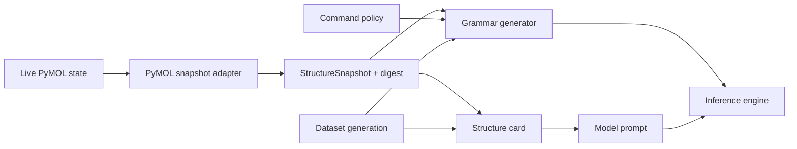

# Structure Context Design

**Status:** Draft
**Owner:** Hannah Kullik (`kullik01`) for the snapshot and grammar; Martin Urban (`urban233`) for the structure card
**Reviewers:** Hannah Kullik; Martin Urban; model-execution security reviewer for grammar-versus-policy boundaries
**Brief:** [`SPECIFICATION.md`](../../../../SPECIFICATION.md)
**Parent design:** [Shared Core and Contracts Design](design.md)
**Last reviewed:** 2026-08-22

## Summary

This design defines how live Open-Source PyMOL state becomes the context a
model generates against. It covers the structure snapshot and its digest, the
deterministic structure card built from that snapshot, and the grammar that
constrains generation.

The recommended boundary is a single PyMOL adapter that extracts a snapshot,
with the card and grammar as pure functions of that versioned snapshot plus
their own configuration. No consumer builds a structure card directly from
ad hoc PyMOL queries. This is what makes byte-identical cards in dataset
generation and runtime inference a checkable claim rather than an assumption.

Digest equality is deliberately narrow: it guarantees equality only over the
declared relevant-state schema, so extending the command policy in
[Plan language, policy, and execution](plan-and-execution.md) can require a
snapshot schema review first.

## Goals and non-goals

See the parent design's [Goals and non-goals](design.md#goals-and-non-goals)
for the goals and non-goals that constrain both children; they apply here
unchanged. This design adds one goal:

### Goals

- Ensure equivalent structure state produces byte-identical cards and
  compatible grammars in data generation and runtime inference.

## Current system and evidence

The repository has no active snapshot, card, or grammar implementation. See
the parent design's
[Current system and evidence](design.md#current-system-and-evidence) for the
accepted specification decisions this design must satisfy -- most directly,
versioned snapshot, card, and grammar contracts, exact relevant-state
fidelity as a precondition for apply, and Open-Source PyMOL as the only
PyMOL target.

## Proposed design

This section covers the three components that turn live state into model
context, the flow connecting them, and the three contracts other designs
depend on.

### Components and ownership

Every component below is new. Hannah owns the snapshot contract and the
grammar generator; Martin owns the structure card.

| Component | Responsibility |
|---|---|
| Structure snapshot contract | Canonically describe plan-relevant live object state and the digest equality claim |
| Structure card | Produce deterministic model context from a structure snapshot |
| Grammar generator | Produce syntax grammar and measured structure-conditioned restrictions from the same contracts |

### Data and control flow

The diagram starts at live PyMOL state and ends at the two artifacts an
inference request needs. What happens to the text the engine returns is
covered by
[Plan language, policy, and execution](plan-and-execution.md#data-and-control-flow).

Dataset generation and the runtime enter this flow at the same two points, so
a card or grammar difference between them is a contract violation rather than
an accepted variance.

### Structure snapshot and digest

The snapshot is the authoritative cross-process representation of the state
relevant to V1 selection, display, orientation, measurement, and validation.
Its schema must identify:

- object and state identity;
- atom identity and coordinates;
- chain, residue, and atom metadata;
- altlocs (alternate location indicators for atoms modeled in more than one
  position);
- polymer and hetero classification; and
- any additional field whose absence could change a supported command's
  result.

Digest equality guarantees equality only over the declared relevant-state
schema. Adding a supported command that depends on another field requires a
snapshot schema review before command-policy expansion. Export failure or an
unknown required field makes the snapshot inapplicable; it never produces a
weaker "exact" claim.

### Structure card

The card is compact, deterministic model context generated from the snapshot.
Its stable field order and escaping are part of the model contract.

Bounded truncation must be explicit in the card so the model can clarify
rather than silently assume omitted content. Token size is measured but
cannot justify dropping fields required for correctness.

### Grammar

The syntax grammar must generate only parser-recognized language. A
structure-conditioned specialization may restrict real chains, residue names,
and residue ranges only when the snapshot represents those values completely.

Grammar is a generation aid, not an authorization boundary. The parser and
command policy remain authoritative when grammar is unavailable or bypassed.
The shipping runtime nevertheless refuses an engine that claims grammar
support but ignores the supplied grammar.

### APIs and contracts

Hannah owns the snapshot and grammar contracts; Martin owns the card.

| Contract | Consumers | Compatibility policy |
|---|---|---|
| `StructureSnapshotV1` and digest | Card, grammar, sidecar, bridge | Additive fields require canonical defaults; a semantic field change requires a major version |
| `structure_card(snapshot)` | Prompt builder, dataset generator | A format change requires a version and a model impact decision |
| `grammar_for(snapshot, policy)` | Lemonade adapter, baseline runner | Version recorded in the model and evaluation manifest |

**`StructureSnapshotV1` and digest**
- Guarantees: canonical relevant state; digest equality has a documented
  scope.
- Errors: extraction or unsupported-state error; bounded export.
- Test/fixture: moved-atom, altloc, state, hetero, and omission
  differentials.

**`structure_card(snapshot)`**
- Guarantees: deterministic, byte-stable card for equivalent snapshots.
- Errors: explicit unsupported and truncated markers; no hidden omission.
- Test/fixture: golden cards plus symbol and byte parity from both consumers.

**`grammar_for(snapshot, policy)`**
- Guarantees: generated language is parser-compatible; conditioning uses
  complete fields only.
- Errors: capability or unsupported-conditioning result; finite construction
  time.
- Test/fixture: grammar generation to parser property corpus.

## Alternatives and trade-offs

| Option | Benefits | Costs/risks | Decision |
|---|---|---|---|
| Reload original file for structure context | Simple and fast | Ignores in-memory edits and states | Rejected; live relevant-state snapshot |
| Grammar as security boundary | Reduces downstream checks | Engines can ignore grammar, and grammars cannot express all semantic policy | Rejected; grammar supplements parser and policy |

## Quality and risk

- **Security/privacy:** Snapshot fixtures must not retain unpublished user
  structures.
- **Observability/capacity/cost:** Card and grammar construction budgets are
  measured on representative structures.

## Test strategy

- Snapshot and card parity across runtime and dataset call paths.
- Grammar-generated plans parsed and policy-checked at scale.
- Sabotage tests that alter a card separator or invert a digest field, and
  prove the relevant suite fails.

## Migration, rollout, rollback, and cleanup

Covered by the parent design's
[Migration, rollout, rollback, and cleanup](design.md#migration-rollout-rollback-and-cleanup),
since these contracts are frozen and rolled back as one core package with the
rest.

## Open questions

Each question below is specific to this design. Hannah owns both.

| Question | Evidence needed | Blocking? |
|---|---|---|
| Which serialization preserves every relevant field for modified, multi-state, and altloc-bearing objects across candidate platforms? | Snapshot round-trip differential report | Yes, before snapshot-contract acceptance |
| Can structure-conditioned residue restrictions remain compact without rejecting insertion codes, gaps, or valid ranges? | Grammar prototypes over representative structure fixtures | No; syntax-only grammar is the bounded fallback for unsupported conditioning |

## Acceptance

- [ ] Material decisions resolved.
- [ ] PyMOL-fidelity evidence accepted for snapshot, card, and grammar.
- [ ] Accountable human accepts planning against this design.
