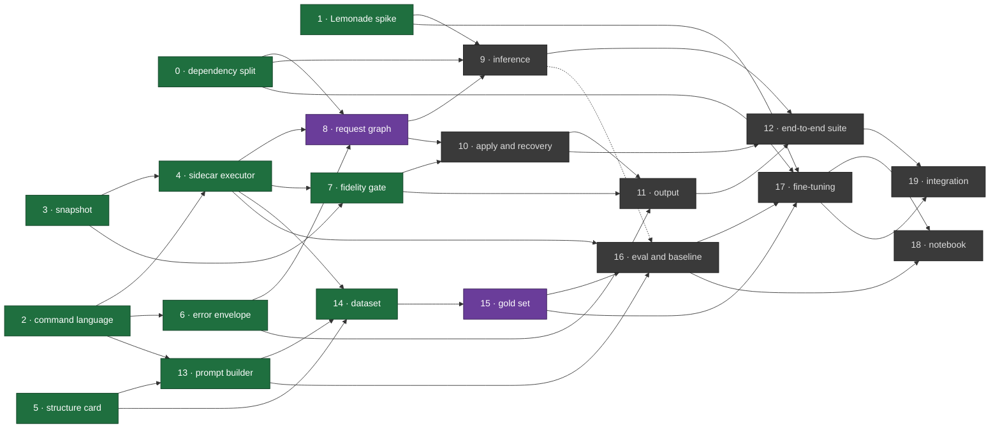

**Purpose:** the concrete sequence of work between the current code and V1, written as intents to hand to Claude Code sessions.

**Audience:** Martin Urban (urban233) and Hannah Kullik (kullik01).

**Authority:** [SPECIFICATION.md](https://github.com/urban233/pymol-copilot/blob/main/SPECIFICATION.md) defines V1. This document only sequences the work and sizes it.

**Written:** 2026-09-16

This plan assumes Opus for planning and Sonnet for implementation, with one developer owning the model and data half and the other owning the runtime half. Sizes are working days for one developer; they do not include calendar slack or review turnaround.

---

## Starting state

> **Note, 2026-09-19.** This section describes the repository on the day the
> plan was written. For what has landed since, see
> [State and dependency graph](#state-and-dependency-graph).

The repository implements one hard-coded fixture end to end — `select copilot_selection, chain A` followed by `color red, copilot_selection` — inside genuinely hardened safety scaffolding.

- **pmc_core** has a total parser, typed plan, default-deny policy and a strict wire protocol, but all of it is pinned to that one fixture. There is no general verb allowlist anywhere in the code.
- **pmc_client** and **pmc_server** run an authenticated loopback preview path that prints a plan and applies nothing. There is no `.pse`, no apply and no rollback.
- **pmc_data** has an independent oracle, a real-PyMOL verifier and a generator, covering two gold cases.
- **pmc_agent** and **pmc_train** are empty package boundaries.
- **tests/discovery/** holds working prototypes for the snapshot, the fresh-process executor and the structure card. They are prototypes by explicit policy, not production modules.
- The dependency closure is pytest, ruff, pyrefly, pymol-open-source-whl and numpy. There is no LangGraph, no Lemonade and no training stack.

---

## The session pattern

Two sessions per item. Opus plans, Sonnet builds, a fresh session each time.

**Opus** — plan mode, `shift+tab`:

```
<intent body from below>

Before planning: read the files I named and the tests around them.
Ask me about anything ambiguous instead of guessing.
Write the plan to plans/NN-name.md — numbered steps, the files each
step touches, and the test that proves each step works. Don't edit source.
```

**Sonnet** — fresh session:

```
Implement plans/NN-name.md exactly.
You may edit <paths> only. Stop and ask before touching anything else.
After each step run:
  bazel test //... && bazel run //tools/quality:ruff -- check . && bazel run //tools/quality:pyrefly -- check
A step isn't done until its test passes. If the plan turns out to be
wrong, stop and tell me — don't improvise around it.
```

**Cross-review** — the other developer, Sonnet, read-only:

```
Review this branch as a merge candidate: <branch>. Look for correctness
bugs, any path that could mutate the live PyMOL session without approval,
and tests that can't actually fail. Don't fix anything — just list findings
with file:line.
```

---

---

## State and dependency graph

**Written:** 2026-09-16 · **State as of:** 2026-09-21

Every item carries a **State**. The values are:

| State | Meaning |
| --- | --- |
| `done` | merged into `main` |
| `in review` | open pull request, CI green, not yet merged |
| `in progress` | branch exists, no pull request yet |
| `ready` | every prerequisite is `done`; nobody has started it |
| `blocked` | at least one prerequisite is not `done` yet |

### Blockers

`Blocked by` lists prerequisites; a check mark means that prerequisite is already `done`.

| # | Item | Owner | State | Blocked by | Blocks |
| --- | --- | --- | --- | --- | --- |
| 0 | Dependency split | Martin | **done** — PR #24 | — | 8, 9, 17 |
| 1 | Lemonade spike | Hannah | **done** — PR #25 | — | 9, 17 |
| 2 | Command language | Martin | **done** — PR #27 | — | 4, 6, 7, 8, 10, 13, 14 |
| 3 | Snapshot | Hannah | **done** — PR #28 | — | 4, 7, 10 |
| 4 | Sidecar executor | Hannah | **done** — PR #33 | 2 ✓, 3 ✓ | 7, 8, 14, 16 |
| 5 | Structure card | Martin | **done** — PR #29 | — | 13, 14 |
| 6 | Error envelope | Martin | **done** — PR #31 | 2 ✓ | 8, 11 |
| 7 | Live extraction and fidelity gate | Hannah | **done** — PR #37 | 3 ✓, 4 ✓ | 10, 11 |
| 8 | LangGraph request graph | Hannah | **in progress** | 0 ✓, 2 ✓, 4 ✓, 6 ✓ | 9, 10, 11, 12 |
| 9 | Inference abstraction and Lemonade | Hannah | **blocked** | 0 ✓, 1 ✓, 8 | 12, 16, 19 |
| 10 | Approval, apply, recovery | Hannah | **blocked** | 2 ✓, 3 ✓, 7 ✓, 8 | 11, 12 |
| 11 | Output and diagnostics | Hannah | **blocked** | 6 ✓, 7 ✓, 8, 10 | 12 |
| 12 | End-to-end suite | Hannah | **blocked** | 9, 10, 11 | 19 |
| 13 | Prompt builder | Martin | **done** — PR #41 | 2 ✓, 5 ✓ | 14, 16 |
| 14 | Dataset generation | Martin | **done** — PR #45 | 2 ✓, 4 ✓, 5 ✓, 13 ✓ | 15, 16 |
| 15 | Gold set, split, audit | Martin | **in progress** | 14 ✓ | 16, 17, 18 |
| 16 | Eval harness and untuned baseline | Martin | **blocked** | 4 ✓, 13 ✓, 14, 15, 9 | 17, 18 |
| 17 | Fine-tuning | Martin | **blocked** | 0 ✓, 1 ✓, 15, 16 | 18, 19 |
| 18 | Notebook | Martin | **blocked** | 14, 15, 16, 17 | — |
| 19 | Integration | Joint | **blocked** | 12, 17 | — |

### The graph



The dashed edge is soft: item 16 needs *some* way to run the untuned base model,
and item 9's engine interface is the obvious one, but item 16 could also drive
Lemonade directly and adopt the interface later. Every other edge is hard.

### What this graph says today

- **The shared core is finished.** Items 0 through 7 are all merged. That is
  every item both developers depend on: the command language, the snapshot,
  the sidecar executor, the structure card, the error envelope and the
  fidelity gate. Nothing in the remaining twelve items is waiting on a
  shared-core hand-off any more.
- **Item 8 is in progress on `feat/langgraph-request-graph`**, unblocked on
  every prerequisite. It gates items 9, 10, 11 and 12 — Hannah's entire
  remaining chain — so nothing on the runtime side can begin until it lands,
  which makes it the highest-value thing on the board. Its own engine
  interface and fake adapter (`src/pmc_agent/inference/`) already exist as
  part of it, ahead of item 9 — see item 9's own note.
- **Item 14 is Martin's, and it is the longest single item left.** At ~5
  days it is the biggest remaining piece of the model half, and items 15,
  16, 17 and 18 all sit behind it. It is also the first item to call the
  prompt builder's `build_for_data()` seam for real, rather than through the
  parity test that stands in for a caller today.
- **Nothing downstream of item 8 has merged.** `src/pmc_agent/runtime.py` is
  still the 66-line pass-through stub from the dependency split, not item 8's
  graph; `src/pmc_train/` holds only `__init__.py`; `tests/recovery/` holds
  only a readme.

### Cross-owner hand-offs

The week 1 note below is now more specific:

- **Hannah → Martin: settled.** Item 4 was the one hand-off blocking the
  entire data and model half, and it merged as PR #33. Item 13 is now merged
  too, so Martin's item 14 is ready; item 16 still waits on items 9, 14, and
  15.
- **Martin → Hannah: settled.** Items 2 and 6 are both delivered, so Hannah's
  items 8 and 11 are no longer waiting on anything of Martin's.
- **Martin → Hannah, delivered:** item 13 emits the grammar item 9's engine
  enforces at runtime — `pmc_core.grammar.build_grammar()`, GBNF, the form
  the Lemonade spike proved is enforced per request, with `GRAMMAR_VERSION`
  stamped into every prompt. Item 13 also ships `build_for_runtime()`, the
  seam items 8 and 9 call instead of assembling a prompt of their own. This
  is a hand-off rather
  than a prerequisite, and the reason is specific: item 9's contract takes an
  *optional grammar* as a parameter, so neither its adapters nor its startup
  capability probe need item 13's grammar in particular. The Lemonade spike
  proved enforcement with a grammar it wrote itself, `root ::= "Berlin"`, and
  item 9 can do the same. What item 13 supplies is the grammar item 9
  *carries* in production, not something item 9 needs in order to be finished.
- **Hannah → Martin, still open:** item 9's engine interface is what item 16
  runs the untuned baseline through — the dashed edge above. It is soft: item
  16 could drive Lemonade directly and adopt the interface later.

With both shared-core hand-offs closed, the only remaining coupling between
the two developers is items 13 → 9 and 9 → 16. Neither is a prerequisite, and
neither appears as an edge in the graph or in a `Blocked by` column, which is
what "soft" means here: an item on the receiving end can reach `done` while
the sending item is still open. Anything that could not would belong in the
table as a blocker instead.

### Risks carried out of week 1

The Lemonade spike answered its four questions; two answers constrain later
items and neither is a clean no.

- **Cancellation is partial** — streaming requests can be cancelled
  mid-generation, non-streaming ones cannot. Items 8 and 9 have to design
  around that rather than assume it away.
- **Integrated-GPU execution is unproven on this machine** — Docker on an
  Apple M2 Pro has no GPU passthrough into a Linux container. CPU execution is
  proven. This bears on item 17's base-model choice.

See [tests/discovery/lemonade/FINDINGS.md](../tests/discovery/lemonade/FINDINGS.md)
for the evidence behind both.

---

## Week 1 — everyone on the shared core

Nothing downstream is safe until these land. This is the one week that cannot be parallelized away.

### 0. Dependency split

**Owner:** Martin · **Size:** ~1 day · **State:** done (PR #24)

```
Split this repo's dependencies in two. Runtime: add langgraph and an HTTP
client to requirements.in and requirements_lock.txt so "bazel build //..."
and "bazel test //..." still pass on ubuntu-24.04, macos-15 and
windows-2025. Training: do NOT put torch, transformers or peft in the Bazel
closure — create a separate pinned requirements-train.txt plus a section in
docs/development_setup.md, and exclude src/pmc_train/ from the Bazel //...
closure and from pyrefly's project-includes. Verify CI is green on all three
operating systems before you stop.
```

### 1. Lemonade spike

**Owner:** Hannah · **Size:** ~1 day · **Do this on day one** · **State:** done (PR #25)

```
Throwaway spike, no production code. Install Lemonade locally, load any
small instruct model, and answer four questions in a markdown file: can it
enforce a supplied grammar per request, can a request be cancelled
mid-generation, does it report model identity, and does it run on CPU and on
this machine's integrated GPU. For grammar, prove it by supplying a grammar
that forbids a token the model would otherwise emit. If any answer is no,
say so plainly — I need to know now, not in week four.
```

This is the largest external unknown in the project. Find out before it is load-bearing.

### 2. Command language

**Owner:** Martin · **Size:** ~4–6 days · **Biggest single item** · **State:** done (PR #27)

```
Replace the fixture-literal plan language in src/pmc_core/plan.py,
parser.py and policy.py with a real restricted command language. Support
exactly these verbs: select, color, show, hide, orient. One typed operation
dataclass per verb; an explicit allowlist table mapping verb to permitted
argument forms; a total parser that never raises and returns either a typed
plan or a typed rejection carrying command index and category; and a
default-deny policy that re-checks the typed plan independently of the
parser.

Selection expressions: "chain X", "resi N" and "resi N-M", "resn XXX",
"name XX", "hetatm", "polymer", combined with and/or/not — nothing else.

Delete every FIXTURE_* constant. Keep render_pml() canonical and idempotent.
Add positive round-trip cases per verb, negative cases per rejection
category, and extend tests/adversarial/ with Python-evaluating forms, shell
metacharacters, file paths, load/save/fetch, and plugin invocations — every
one denied with zero execution. The existing policy sabotage test must still
pass.
```

### 3. Snapshot

**Owner:** Hannah · **Size:** ~3 days · **State:** done (PR #28)

```
Promote tests/discovery/h02/harness.py into src/pmc_core/snapshot.py as
production code: extract relevant live state from a PyMOL session into a
canonical structured snapshot, serialize deterministically, digest it,
reconstruct it in a fresh process. Candidate A is already the chosen
approach — don't re-litigate it. Carry the declared-unsupported set
(measurement objects, the polymer flag) forward as explicit markers, never
silent drops. Add a SNAPSHOT_VERSION constant. Move the differential tests
out of tests/discovery/ into a real test package, keeping their
real-PyMOL/exclusive Bazel tags.
```

### 4. Sidecar executor

**Owner:** Hannah · **Size:** ~3 days · **State:** done (PR #33)

```
Promote tests/discovery/h02/execution_boundary.py into
src/pmc_core/executor.py plus a server-side service. Contract: typed
ActionPlan plus canonical snapshot in, ValidationReport out. One fresh PyMOL
process per attempt, finite input size, finite wall-clock deadline, hard
kill and reap on timeout, scratch cleanup, no internal retry. Report
per-command outcome by index, resulting-state fingerprint, and selection
counts. Fail closed on malformed input, version mismatch, spawn failure,
crash, command failure and fidelity mismatch. Port the existing negative
tests — they're the valuable part of that prototype.
```

### 5. Structure card

**Owner:** Martin · **Size:** ~2 days · **State:** done (PR #29)

```
Promote tests/discovery/m02/card_candidate.py into src/pmc_core/card.py.
Keep it a pure function with no PyMOL import. Carry the golden-byte,
permutation-invariance, signed-zero, truncation and per-field-mutation tests
into tests/contract/. Add a CARD_VERSION constant that both the dataset
writer and the runtime prompt builder stamp into their output.
```

### 6. Error envelope

**Owner:** Martin · **Size:** ~2 days · **State:** done (PR #31)

```
Add src/pmc_core/errors.py: a normalizer turning a raw PyMOL execution
failure into a typed envelope — version, command index, verb, normalized
category, bounded normalized message — with "unknown" as a catch-all that
preserves bounded text rather than dropping it. Capture real error strings
by driving headless PyMOL with deliberately broken commands for each
supported verb, and check the captured corpus in as fixtures under
tests/data/. Add byte-equality tests so the same PyMOL failure normalizes
identically in the dataset pipeline and at runtime.
```

> **Caution.** Neither consumer of that byte-equality test exists yet — the
> dataset pipeline generalizes in item 14, the runtime path in item 8. The test
> is still writable today as a single-normalizer assertion over the captured
> fixture corpus, which is what makes it meaningful once both call sites land.
> Decide that up front rather than discovering it mid-implementation.

> **Hand-off after week 1.** Martin needs item 4 from Hannah before he can generate data. Hannah needs items 2 and 6 from Martin before her graph is meaningful. Everything after this runs in parallel. See [Cross-owner hand-offs](#cross-owner-hand-offs) for where those hand-offs actually stand.

---

## Hannah — the runtime

**Total:** ~18 days

### 7. Live extraction and fidelity gate

**Size:** ~3 days · **State:** done (PR #37)

```
In src/pmc_client/, extract the live PyMOL session into a canonical snapshot
via pmc_core.snapshot and send it with the plan request. Add a fidelity
check: reconstruct that snapshot in a sidecar, compare it against the live
session on the declared state scope, and record the outcome on the request.
If fidelity isn't exact, the request may still produce an inspectable plan,
but that plan must be marked non-applicable and copilot_apply must refuse
it. Test with modified coordinates, multiple states, alternate locations and
hetero atoms.
```

### 8. LangGraph request graph

**Size:** ~4 days · **State:** in progress — blocks 9, 10, 11, 12

```
Build the request graph in src/pmc_agent/ using LangGraph. States: received,
preparing, generating, validating, pending_approval, plus terminal rejected,
expired, superseded, failed, cancelled and ask. Enforce at most one active
request and one pending plan per session; a new request supersedes the
pending one; pending plans expire. Allow one initial generation plus at most
two repair attempts, each fed the error envelope and each validated in a
FRESH sidecar. No model output may influence retry count, target object,
policy or approval. Replace the hardcoded fixture lifecycle in
src/pmc_server/lifecycle.py with this graph. Test every transition and
terminal state against a fake inference adapter.
```

### 9. Inference abstraction and Lemonade

**Size:** ~4 days · **State:** blocked on 8

```
Add src/pmc_agent/inference/: a narrow engine interface — bounded completion
taking prompt, optional grammar, token limit, time limit, cancellation and
model identity — with two implementations, a fake adapter for tests and a
Lemonade adapter against a local Lemonade server. Probe capabilities at
startup using what the spike found; treat silently-ignored grammar as a hard
engine failure, not a warning. There is no remote fallback under any
condition. If the spike showed grammar can't be enforced, implement
syntax-only and record that limitation in the code and the readme rather
than pretending.
```

> **Note, 2026-09-21.** `src/pmc_agent/inference/`'s engine interface
> (`base.py`) and its fake adapter (`fake.py`) landed in item 8's own step
> 2, designed against the request graph as a real consumer rather than in
> the abstract. What remains here is `lemonade.py` and startup capability
> probing only.

### 10. Approval, apply, recovery — the safety centerpiece

**Size:** ~5 days · **State:** blocked on 8

```
Implement the approval path in src/pmc_client/: copilot_apply <plan-id>,
copilot_reject <plan-id>, copilot_rollback <plan-id>.

Apply re-verifies plan id, expiry, session id, current snapshot digest,
model identity and contract versions BEFORE doing anything. It saves a .pse
recovery point with user-only permissions before the first command executes,
then applies the canonical plan through the same dispatcher the sidecar
uses. It stops at the first failure, immediately restores the .pse, and
reports whether restoration itself compared clean; if restore fails, halt
Copilot and preserve the file. Rollback warns that it replaces the entire
session, then restores and consumes the snapshot.

Put the tests in tests/recovery/: a deliberate mid-plan failure restores
clean; every denial, expiry and rejection path makes zero live mutation; and
a deliberately injected mutation makes the no-mutation check fail.
```

### 11. Output and diagnostics

**Size:** ~2 days · **State:** blocked on 8, 10

```
Make copilot print what the specification promises: plan id and expiry,
resolved object, numbered canonical commands, selection counts, validation
warnings, fidelity status, an explicit statement of what was and wasn't
checked, and the exact approval and rejection commands to type. Add a health
command reporting server, engine, model and contract versions. Every failure
path must produce a bounded, actionable message — no tracebacks, no plan
text leaking through an error.
```

### 12. End-to-end suite

**Size:** ~3 days · **State:** blocked on 9, 10, 11

```
Write end-to-end scenarios against real headless PyMOL: one intent through
preview, approve and apply; one deliberate mid-apply failure through
automatic recovery; a stale plan rejected after the session changed; a
denied command rejected before any sidecar execution; the server
unavailable. Every path asserts zero unapproved mutation. Include a sabotage
test proving the suite detects a mutation. Record p50 latency per stage on
this machine.
```

---

## Martin — data and model

**Total:** ~20 days

### 13. Prompt builder

**Size:** ~2 days · **State:** done (PR #41)

```
Add the prompt builder that turns a structure card plus a user intent into
the model prompt, and emits the grammar for the engine. Stamp card version,
grammar version and policy version into every prompt. The dataset generator
and the runtime must call this same code — add a parity test that fails if
they ever diverge.
```

### 14. Dataset generation

**Size:** ~5 days · **State:** done (PR #45)

```
Generalize src/pmc_data/ from the one chain-A/red fixture to the full
supported command surface. Program-first for each verb: emit a canonical
plan, compute the expected result independently without PyMOL (extend
oracle.py), execute the plan through pmc_core.executor, and keep the sample
only if every assertion passes. Record per sample: source structure identity
and checksum, card version, plan, assertions, PyMOL version, seed,
verification result. Build controlled structures covering multiple chains,
hetero atoms, multiple states and alternate locations. Aim for a few
thousand verified samples. Report the rejection rate per category honestly —
any category the oracle can't grade stays marked unsupported rather than
guessed.
```

### 15. Gold set, split, audit

**Size:** ~3 days · **State:** in progress — plan in [plans/09-gold-set-split-audit.md](../plans/09-gold-set-split-audit.md)

```
Hand-author a gold set spanning every supported category, with
natural-language intents a structural biologist would actually type. Build a
held-out split by source structure so no test structure appears in training.
Decontaminate: drop training samples whose intent is a near-duplicate of a
test intent. Write the manifest and datasheet — content hash, provenance,
license record, regeneration config. Spot-check fifty random labels by hand
and report the observed error rate as a number.
```

**Result** (branch `feat/gold-set-split-audit`; see
[docs/dataset/DATASHEET.md](dataset/DATASHEET.md)):

- **Split version 2, `split-e4599620801af592`** — by source structure, 6
  of 24 specs held out: 2,389 train, 68 reviewed gold items (the test
  split), 842 held-out synthetic samples. Every `slice` sample (89) is
  excluded, after Martin judged the version 1 audit's only wrong label, a
  `slice` sample, and directed that all of them be dropped.
- **Observed label error rate, version 2: 0/50** (Wilson 95% interval
  0%–7.1%). Judged by Claude at Martin's request, calibrated to Martin's
  version 1 verdicts, so weaker independence than a hand check.
- **Version 1, judged by Martin: 1/50 = 2.0%** (Wilson 95% interval
  0.4%–10.5%); kept in `docs/dataset/history/`.
- Decontamination dropped 68 of 2,457 training candidates as
  near-duplicates of a gold intent.
- Item 16 evaluates on `test_gold.jsonl`, with `heldout_synthetic.jsonl`
  as a secondary structure-generalization figure. Item 17 trains on
  `train.jsonl` only.

### 16. Eval harness and untuned baseline

**Size:** ~3 days · **State:** blocked on 9, 14, 15

```
Build the offline eval harness: per sample, generate a plan, parse it,
policy-check it, execute it in a sidecar, grade against stored assertions.
Report TaskSuccess, syntax-valid rate, policy-denied rate, empty-selection
rate, abstention rate and repair success, broken out per category. Run it
against the UNTUNED BASE MODEL FIRST and commit those numbers before any
fine-tuning exists. That baseline is what the entire evaluation argument
rests on.
```

### 17. Fine-tuning

**Size:** ~5 days · **State:** blocked on 15, 16

```
Fine-tune in src/pmc_train/, in the separate virtual environment, outside
the Bazel closure. Completion-only supervised fine-tuning — include a test
that asserts at the tensor level that prompt tokens are masked out of the
loss. Choose a base model that will actually run on CPU and integrated GPU
through Lemonade and record why you picked it. Log seeds and configs.
Afterwards re-run the eval harness and compare per category against the
recorded baseline. If the fine-tune doesn't beat the baseline, report that
result — don't chase it.
```

### 18. Notebook

**Size:** ~3 days · **State:** blocked on 14, 15, 16, 17

```
Write the deliverable notebook: dataset generation, the oracle and its
conformance evidence, the label audit, the split, the untuned baseline, the
fine-tuning run, the per-category comparison, and the limits — every
deferred or unsupported category named, the exact operating system, PyMOL,
Python, Lemonade and model versions, and the licensing record. It has to
read standalone for someone who has never seen this repository.
```

---

## Joint

### 19. Integration

**Size:** ~3 days · **State:** blocked on 12, 17

```
Pair one trained model artifact with the runtime and run the end-to-end
suite against it. Measure integrated TaskSuccess against the offline number
and explain any gap rather than averaging it away. Then dry-run the demo:
one intent through apply, one deliberate failure through recovery, with the
other developer watching to check they can tell what's about to change
before apply is confirmed.
```

---

## Honest sizing

Nineteen items: about **30 working days for Martin** and about **28 for Hannah**. That is six weeks each of focused work; with five-day weeks and review turnaround it is seven or eight calendar weeks. If the course deadline is sooner than that, the schedule is short, and the lever is scope rather than speed.

**Already cut to reach this list** — all of which the specification permits reporting as deferred:

- the controlled PDB fetch flow
- the `label`, `set` and measurement command families
- quantization
- structure-conditioned grammar terminals
- multi-seed variance and ablations

**Not cuttable:**

- **Item 2, the real command language** — without it there is no product, only a hardcoded string.
- **Item 10, apply and recovery** — it *is* the safety story the presentation depends on.

If further compression is needed, the next cut is `orient`, `show` and `hide` from item 2, leaving `select` and `color`. That shrinks items 2, 14, 15 and 16 together, which is where the days actually are.
